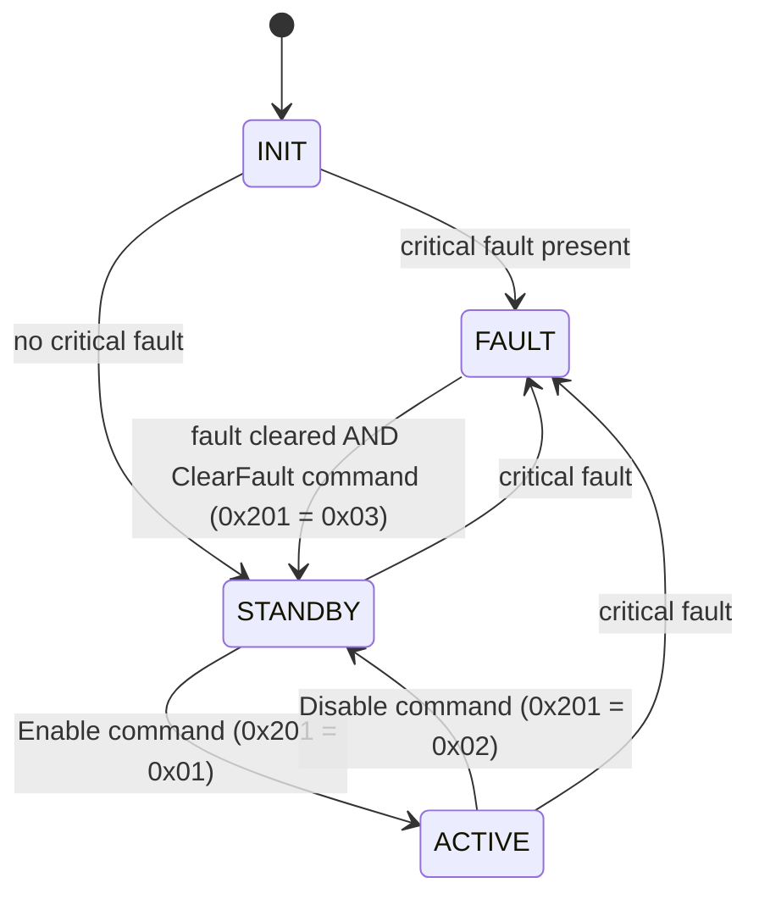

# BMS_demo — S32K344 Battery Management Controller

A bare-metal (no-OS) Battery Management System demo for the **NXP S32K344** (Cortex-M7), built on the
**S32K3 RTD 7.0.1** low-level IP drivers. It monitors three battery packs, decodes 16 cell voltages
from a CAN-based "virtual AFE", decodes pack current/voltage from a CAN-based "virtual ADBMS2950"
pack monitor, runs a precharge/contactor state machine per pack, estimates Pack 1 state-of-charge by
Coulomb counting (persisted to data flash), tracks faults, and publishes everything over CAN.

---

## 1. Platform

| Item | Value |
| --- | --- |
| MCU | S32K344, package `S32K344_172HDQFP`, core M7_0 |
| Toolchain | S32 Design Studio for S32 Platform 3.6.10 |
| Drivers | S32K3 RTD 7.0.1 (AUTOSAR 4.9.0), IP layer / SA mode |
| Config tool | NXP MCUXpresso Config Tools (`BMS_demo.mex`) |
| Build configs | `Debug_FLASH`, `Release_RAM` |
| Base tick | PIT0 CH0, 400 000 ticks @ 40 MHz AIPS_SLOW = **10 ms** |

Build from S32DS (Project → Build), or from PowerShell using the provided script:

```powershell
.\build.bat                    # Debug_FLASH, target "all" (default)
.\build.bat Release_RAM        # Release_RAM, target "all"
```

`build.bat` takes the config as the first argument and the make target as the second. **Avoid
`.\build.bat <config> clean`** — the Eclipse-generated makefile's `clean` target is `rm -rf ./*` inside
the config directory and also wipes the CDT-generated per-file `.args` response files that plain `make`
has no rule to regenerate (only the S32DS IDE can, via Project → Clean). Use `clean.bat` for a safe,
selective clean instead:

```powershell
.\clean.bat                    # clean Debug_FLASH (default)
.\clean.bat Release_RAM        # clean Release_RAM
```

`clean.bat` deletes only the actual build artifacts (`*.o *.d *.elf *.map *.siz`) and leaves the
`.args`/`.mk` files intact. If the `.args` files are ever lost anyway, recover in S32DS: right-click the
project → Refresh, then Project → Clean… (with "start a build immediately") for the affected config.

`build.bat` invokes `make` through the S32DS MSYS bash, since `make`/`arm-none-eabi-*` are not on the
plain Windows `PATH`. To run `make` directly yourself, use the same MSYS bash with the toolchain
prepended to `PATH`:

```powershell
& "C:\NXP\S32DS.3.6.10\S32DS\build_tools\msys32\usr\bin\bash.exe" -lc 'export PATH="/c/NXP/S32DS.3.6.10/S32DS/build_tools/gcc_v10.2/gcc-10.2-arm32-eabi/bin:$PATH" && cd /c/S32K344/workspace/BMS_demo/Debug_FLASH && make -j28 all'
```

Flash/debug launch configurations for SEGGER are in `Project_Settings/Debugger/` (use these from S32DS for
interactive debugging). To flash from the command line instead (J-Link probe connected, board powered):

```powershell
.\flash.bat   # flashes Debug_FLASH\BMS_demo.elf via J-Link and starts execution
```

`flash.bat` drives the S32DS-bundled `JLinkGDBServerCL.exe` + `arm-none-eabi-gdb.exe` non-interactively
(no separate SEGGER J-Link software install needed). It currently supports `Debug_FLASH` only — `Release_RAM`
needs a different load sequence and isn't wired up yet.

---

## 2. Repository layout

```
src/
  main.c                    Startup, peripheral init, scheduler task table
  app/
    Bms_App.*               Thin application wrapper around the battery monitor
    Bms_Scheduler.*         Table-driven cooperative scheduler (max 8 tasks)
    Bms_StateMachine.*      INIT / STANDBY / ACTIVE / FAULT supervisor
    Bms_Adc.*               ADC_SAR wrapper (unit 0 = bus V, unit 1 = pack V + NTC)
  battery/
    Battery_Monitor.*       Aggregates cell/pack/current/temperature data, applies thresholds
    Bms_Ntc.*               3-channel NTC (Beta equation) -> 0.1 degC
    Bms_Ntc_Cfg.h           NTC hardware constants
    Bms_Soc.*               Pack 1 state-of-charge, Coulomb counting + periodic NVM save
    Bms_Afe.*               Physical AFE stub (unused)
    vAFE/Bms_Vafe.*         Decodes 16 cell voltages from CAN1 frames 0x401-0x404
    vPACK/Bms_Vpack.*       Decodes pack current/voltage from CAN2 (virtual ADBMS2950) frames 0x410-0x411
  communication/
    Bms_Can.*               CAN0 (host) + CAN1 (vAFE) + CAN2 (vPACK): polled RX, blocking TX
    Bms_Can_Cfg.h           Instances, mailbox indices, all message IDs
    Bms_Spi.*               LPSPI1 wrapper
  control/
    Bms_Contactor.*         Per-pack contactor + precharge state machine
    Bms_Contactor_Cfg.h     Precharge timing / thresholds
  drivers/
    Bms_Gpio.*              SIUL2 DIO abstraction (logical pin IDs)
    Bms_Led.*               Active-low LED helpers
  safety/
    Fault_Manager.*         32-bit fault masks per pack + system, critical-fault mask, latched fault history
  storage/
    Bms_Nvm.*               SOC persistence in data flash (C40_Ip), sequence/checksum-guarded records

board/        Generated pin mux (SIUL2 / TSPC)
generate/     Generated RTD configs: Clock, ADC, FlexCAN, PIT, LPSPI, IntCtrl, OsIf
RTD/          NXP Real-Time Drivers source + headers
DBC/          BMS_demo.dbc  — CAN database for PCAN / CANalyzer
Project_Settings/  Linker scripts, startup code, debugger launches

Root tooling:  build.bat · clean.bat · flash.bat · debug_server.bat · debug_reset.bat ·
               debug_live.bat · fault_snapshot.bat · fault_decode.gdb  (see §1 and §10)
```

---

## 3. Startup and scheduling

`main()` initialises, in order: clocks → pins → LED off → interrupt controller → PIT0 → ADC (with
calibration) → NTC → CAN0/CAN1/CAN2 → LPSPI1 → fault manager → contactors → state machine → application →
vAFE → vPACK → battery monitor → NVM (scans data flash) → SOC estimator → scheduler → PIT start. Any
init failure traps with LED1 red on.

The PIT ISR only calls `Bms_Scheduler_TickFromIsr()`; all work runs from the main loop, which drains
accumulated ticks so no period is lost if the loop falls behind.

| Task | Period | Contents |
| --- | --- | --- |
| `Bms_MainFunction_10ms` | 10 ms | ADC acquisition, app main, contactor state machine, 1 Hz LED blink |
| `Bms_MainFunction_100ms` | 100 ms | NTC, CAN RX poll, vPACK comm-health check, battery monitor, SOC integration, state machine, TX of 0x300–0x30A and 0x400 |
| `Bms_MainFunction_1000ms` | 1000 ms | SOC persistence (`Bms_Soc_1sFunction`, saves to NVM when due/changed) |

---

## 4. BMS state machine



Entering `ACTIVE` requests all three packs to close; leaving it requests all packs to open. `FAULT`
is latched — the underlying condition must be gone *and* an explicit ClearFault command received.
LED3 (PTA31) is on while `ACTIVE`.

---

## 5. Contactor / precharge control

Each pack has three outputs: **negative**, **precharge**, **positive**.

```
OFF -> NEG_ON -> PRECHARGE -> POS_ON -> RUN
                                          \
        FAULT <-- critical/pack fault      -> OPENING -> OFF
```

| Constant | Value | Meaning |
| --- | --- | --- |
| `BMS_CONTACTOR_NEG_DELAY_MS` | 100 ms | Settle after closing the negative contactor |
| `BMS_PRECHARGE_TIMEOUT_MS` | 2000 ms | Max precharge duration |
| `BMS_PRECHARGE_COMPLETE_RATIO` | 0.90 | Bus V must reach 90 % of pack V |
| `BMS_CONTACTOR_POS_DELAY_MS` | 100 ms | Settle before opening precharge |
| `BMS_CONTACTOR_SIMULATION_MODE` | 1 | Skips the bus-voltage check, uses a fixed 100 ms precharge |

A critical or pack fault drives the pack to `FAULT` with all outputs off; it stays there until the
fault clears and an open request is received.

---

## 6. Fault manager

Faults are bits in a 32-bit mask, tracked per pack (`FAULT_PACK_1..3`) and system-wide. Besides the
live mask, `Fault_Manager` also keeps a latched "last fault" history mask per pack/system that is
only cleared explicitly (see `FaultManager_GetLastPackFaults` / `FaultManager_GetLastSystemFaults`),
reported on CAN 0x309/0x30A.

| Bit | Fault | Bit | Fault |
| --- | --- | --- | --- |
| 0 | `FAULT_PACK_OV` | 11 | `FAULT_CONTACTOR_WELD` |
| 1 | `FAULT_PACK_UV` | 12 | `FAULT_OVER_CURRENT` |
| 2 | `FAULT_CELL_OV` | 13 | `FAULT_TEMP_SENSOR` |
| 3 | `FAULT_CELL_UV` | 14 | `FAULT_TEMP_DELTA` |
| 4 | `FAULT_OVER_TEMP` | 15 | `FAULT_CELL_IMBALANCE` |
| 5 | `FAULT_UNDER_TEMP` | 16 | `FAULT_VPACK_COMM_TIMEOUT` |
| 6 | `FAULT_AFE_COMM` | 17 | `FAULT_VPACK_ALIVE_ERROR` |
| 7 | `FAULT_CAN_TIMEOUT` | 18 | `FAULT_VPACK_DEVICE_FAULT` |
| 8 | `FAULT_SPI_TIMEOUT` | 19 | `FAULT_PACK1_VOLTAGE_TIMEOUT` |
| 9 | `FAULT_PRECHARGE_TIMEOUT` | 20 | `FAULT_PACK_DISCHARGE_OC` |
| 10 | `FAULT_CONTACTOR_FEEDBACK` | 21 | `FAULT_PACK_CHARGE_OC` |

`FAULT_CRITICAL_MASK` = pack OV/UV, cell OV/UV, over-temp, temp sensor, AFE comm, precharge timeout,
contactor feedback, contactor weld, over-current, vPACK comm timeout/alive error/device fault, Pack 1
voltage timeout, and pack discharge/charge over-current. Any critical fault opens the contactors and
forces the supervisor into `FAULT`.

### Detection thresholds (hysteretic, `Battery_Monitor.c`)

| Condition | Set | Clear |
| --- | --- | --- |
| Cell over-voltage | 4250 mV | 4150 mV |
| Cell under-voltage | 2500 mV | 2700 mV |
| Over-temperature | 200.0 °C | 195.0 °C |
| Under-temperature | −20.0 °C | −15.0 °C |
| Pack temperature delta | 50.0 °C | 10.0 °C |
| Cell imbalance | 300 mV | 200 mV |
| Pack charge over-current | 80.0 A | 70.0 A |
| Pack discharge over-current | −100.0 A | −90.0 A |

Current sign convention (`Battery_Monitor.c`, from the vPACK/ADBMS2950 simulation): positive = charge,
negative = discharge.

---

## 7. Measurement chain

- **Cell voltages** — 16 cells, sourced over CAN1 from the virtual AFE. The AFE starts a measurement
  cycle with the header frame `0x405` (byte 0 = rolling measurement counter); it then sends the four
  voltage frames `0x401..0x404`, each carrying four `uint16` little-endian values at 1 mV/bit.
  `Bms_Vafe` only accepts the voltage frames while a cycle is active and sets `DataValid` once all
  four frames of one cycle have arrived (an incomplete previous cycle is discarded), then recomputes
  min/max/delta and the min/max cell indices. The header counter is exposed as
  `g_BmsVafeData.MeasurementCounter` with `HeaderValid` set when a header has been received.
- **Pack voltages** — Pack 1 comes from the CAN2 vPACK voltage frame (`0x411`); Pack 2/Pack 3 remain
  ADC1 channels, 14-bit, 3.3 V reference.
- **Pack current / power** — decoded over CAN2 from the virtual ADBMS2950 (`Bms_Vpack`): current
  frame `0x410` (current + shunt voltage), voltage frame `0x411` (pack + bus voltage), each with an
  alive counter checked for timeout/rollover (`BMS_VPACK_TIMEOUT_TICKS` = 1000 ms). `Battery_Monitor`
  derives `PackPower_W = PackCurrent_mA * PackV1 / 1000`.
- **State of charge** — `Bms_Soc` Coulomb-counts Pack 1 current (100 ms sample period) starting from
  a value restored from NVM at boot (or `BMS_SOC_INITIAL_PCT_X10` = 50.0 % if none saved), and saves
  to data flash at most once every `BMS_SOC_SAVE_PERIOD_MS` (60 s) or sooner if it changes by more
  than `BMS_SOC_SAVE_DELTA_X10` (0.1 %).
- **Temperatures** — three NTCs on ADC1, Beta equation (`R25 = 10 kΩ`, `Beta = 3435 K`,
  series 10 kΩ), reported in 0.1 °C over −40.0 … 125.0 °C.
- **Bus voltages** — ADC0 channels P0/P1/P3/P4 (bus 1/2/3 + spare), used for precharge completion.

---

## 8. CAN interface

CAN0 runs at **500 kbit/s**; CAN1 (virtual AFE) and CAN2 (virtual ADBMS2950 pack monitor) run at
**1 Mbit/s**. TX is `SendBlocking` with a 100 ms timeout on MB0; RX is polled from the 100 ms task.
Import `DBC/BMS_demo.dbc` into PCAN-Explorer/CANalyzer for decoding.

### CAN0 transmit (every 100 ms)

**0x300 `BMS_Status`**

| Byte | Content |
| --- | --- |
| 0 | BMS state: 0 = INIT, 1 = STANDBY, 2 = ACTIVE, 3 = FAULT |
| 1–2 | Pack1 temperature, `int16` LE, 0.1 °C |
| 3–4 | Pack2 temperature |
| 5–6 | Pack3 temperature |
| 7 | bit0 critical fault, bit1 any fault, bit2–4 pack1/2/3 temp valid |

**0x301 `BMS_PackStatus`**

| Byte | Content |
| --- | --- |
| 0–1 | Pack1 voltage, `uint16` LE, 0.1 V |
| 2–3 | Pack2 voltage |
| 4–5 | Pack3 voltage |
| 6 | bits 3:0 monitor status (0 OK, 1 INVALID, 2 OV, 3 UV, 4 MISMATCH); bits 7:4 alive counter |
| 7 | bit0 pack voltage valid |

**0x302 `BMS_ContactorStatus`**

| Byte | Content |
| --- | --- |
| 0–2 | Pack1/2/3 contactor state (0 OFF … 6 FAULT) |
| 3–5 | Pack1/2/3 outputs: bit0 negative, bit1 positive, bit2 precharge |
| 6 | bits 3:0 alive counter |

**0x303 `BMS_Pack12Fault`** — bytes 0–3 pack1 mask, bytes 4–7 pack2 mask (`uint32` LE).

**0x304 `BMS_Pack3SystemFault`** — bytes 0–3 pack3 mask, bytes 4–7 system mask (`uint32` LE).

**0x305 `BMS_CellSummary`**

| Byte | Content |
| --- | --- |
| 0–1 | Min cell voltage, `uint16` LE, 1 mV |
| 2–3 | Max cell voltage |
| 4–5 | Delta cell voltage |
| 6 | bits 3:0 min cell index, bits 7:4 max cell index |
| 7 | bit0 cell voltage valid, bit1 cell imbalance fault |

**0x310–0x313 `BMS_CellVoltage_01_04` … `BMS_CellVoltage_13_16`**

Each frame carries 4 cells × `uint16` LE at 1 mV/bit (all 16 cells every cycle).

| Frame | Cells | Bytes |
| --- | --- | --- |
| 0x310 | 1–4 | 0–1 cell1, 2–3 cell2, 4–5 cell3, 6–7 cell4 |
| 0x311 | 5–8 | 0–1 cell5, 2–3 cell6, 4–5 cell7, 6–7 cell8 |
| 0x312 | 9–12 | 0–1 cell9, 2–3 cell10, 4–5 cell11, 6–7 cell12 |
| 0x313 | 13–16 | 0–1 cell13, 2–3 cell14, 4–5 cell15, 6–7 cell16 |

**0x306 `BMS_PackCurrent`**

| Byte | Content |
| --- | --- |
| 0–1 | Pack1 current, `int16` LE, 0.1 A/bit (+charge / −discharge) |
| 2–3 | Pack2 current |
| 4–5 | Pack3 current |
| 6 | bit0/1/2 pack1/2/3 current valid |
| 7 | bits 3:0 alive counter |

**0x307 `BMS_PackPower`**

| Byte | Content |
| --- | --- |
| 0–3 | Pack1 power, `int32` LE, 1 W/bit (sign follows pack current: +charge / −discharge) |
| 4 | bit0 pack1 power valid |
| 5–6 | Reserved |
| 7 | bits 3:0 alive counter |

**0x308 `BMS_SocStatus`**

| Byte | Content |
| --- | --- |
| 0–1 | Pack1 SOC, `uint16` LE, 0.1 %/bit |
| 2 | bit0 SOC valid |
| 3–6 | Reserved |
| 7 | bits 3:0 alive counter |

**0x309 `BMS_LastFault12`** — bytes 0–3 latched pack1 fault history, bytes 4–7 latched pack2 fault
history (`uint32` LE).

**0x30A `BMS_LastFault3System`** — bytes 0–3 latched pack3 fault history, bytes 4–7 latched system
fault history (`uint32` LE).

### CAN0 receive

| ID | Mailbox | Byte 0 command |
| --- | --- | --- |
| 0x200 `BMS_DebugCommand` | MB1 | `0x00` NOP · `0x01` LED2 green on · `0x02` LED2 green off · `0x03` reset RX counter |
| 0x201 `BMS_ControlCommand` | MB2 | `0x00` NOP · `0x01` Enable · `0x02` Disable · `0x03` ClearFault · `0x04` ClearFaultHistory (clears latched 0x309/0x30A history only) |

### CAN1 (virtual AFE)

| ID | Direction | Content |
| --- | --- | --- |
| 0x400 | TX (MB0) | Test pattern, sent every 100 ms |
| 0x401 | RX (MB1) | Cells 1–4, `uint16` LE, 1 mV/bit |
| 0x402 | RX (MB2) | Cells 5–8 |
| 0x403 | RX (MB3) | Cells 9–12 |
| 0x404 | RX (MB4) | Cells 13–16 |
| 0x405 | RX (MB5) | `vAFE_Measurement_Header` — starts a new AFE measurement cycle; byte 0 = rolling counter, byte 1 = AFE status |

### CAN2 (virtual ADBMS2950 pack monitor, vPACK)

| ID | Direction | Content |
| --- | --- | --- |
| 0x410 | RX (MB1) | Pack current + shunt voltage |
| 0x411 | RX (MB2) | Pack voltage + bus voltage (also feeds `BatteryMonitor.PackV1`) |

Comm health uses an alive counter with a 1000 ms timeout (`BMS_VPACK_TIMEOUT_TICKS`); a stale/invalid
counter raises `FAULT_VPACK_COMM_TIMEOUT` / `FAULT_VPACK_ALIVE_ERROR`, and the device status byte can
raise `FAULT_VPACK_DEVICE_FAULT`. Signal layout beyond what `Bms_Vpack.c` decodes is not yet finalized
(see comments in `DBC/BMS_demo.dbc`).

### Quick bring-up

1. Connect a CAN tool to CAN0 (PTA6/PTA7) at 500 kbit/s, and the vAFE simulator to CAN1 (PTC8/PTC9)
   and the vPACK simulator to CAN2 (PTE24/PTE25), both at 1 Mbit/s.
2. Power up — LED1 red blinks at 1 Hz and 0x300–0x30A plus 0x310–0x313 appear every 100 ms.
3. Feed 0x405 (measurement header, byte 0 = counter) followed by 0x401–0x404 so
   `CellVoltageValid` in 0x305 goes to 1.
4. Feed 0x410/0x411 so pack current/voltage/SOC (0x306–0x308) go valid and Pack1 voltage tracks CAN2.
5. Send `0x201 / 0x01` to enable — state goes to ACTIVE, LED3 lights, contactors precharge and close.
6. Send `0x201 / 0x02` to disable, or `0x201 / 0x03` after a fault to reset.

---

## 9. Pin map

| Pin | Signal | Function |
| --- | --- | --- |
| PTA6 / PTA7 | CAN0_RX / CAN0_TX | Host CAN |
| PTC9 / PTC8 | CAN1_RX / CAN1_TX | vAFE CAN |
| PTE25 / PTE24 | CAN2_RX / CAN2_TX | vPACK CAN (virtual ADBMS2950) |
| PTA18/19/20/21 | LPSPI1 SOUT/SCK/SIN/PCS0 | SPI |
| PTD1, PTD0, PTE15, PTE16 | ADC0_P0/P1/P3/P4 | Bus1/2/3 + spare voltage |
| PTA29 | LED1_RED | 1 Hz heartbeat, solid on init failure |
| PTA30 | LED2_GREEN | Controlled over CAN 0x200 |
| PTA31 | LED3 | On while ACTIVE |

All LEDs are active-low (0 = on).

---

## 10. Debugging and fault-inspection tooling

All tooling below is `Debug_FLASH`-only (same scope as `flash.bat`) and uses the S32DS-bundled J-Link
software — no separate SEGGER J-Link install needed: `JLinkGDBServerCL.exe` +
`arm-none-eabi-gdb.exe` (the one under `S32DS\tools\gdb-arm\...`, **not** the gcc_v10.2 toolchain bin,
which has no gdb). Probe connected, board powered. Note that on this MCU/jlinkscript combo every fresh
GDB-server connection halts the core once at `_start` — that one-time reset is unavoidable and the
tooling below is designed around it.

### CMD #1 — `debug_server.bat` (J-Link GDB server)

Starts `JLinkGDBServerCL.exe` (S32K344, SWD, 4000 kHz, port 2331) in the foreground and blocks until
Ctrl+C. Run this first in one terminal, then one of the two modes below in a second terminal.

### CMD #2 — `debug_reset.bat` (reset debug)

`target remote` + `monitor halt`, landing at `_start` (reset vector) for stepping/breakpointing through
the boot sequence. Use this when you *want* a clean restart and don't care about transient runtime state.

### CMD #2 — `debug_live.bat` (live attach)

For inspecting a BMS that is already running (e.g. transient/latched faults) without wiping state via a
second reset. Uses `set mi-async on` + `continue&` so the target is already running when the `(gdb)`
prompt appears. It preloads breakpoints in a fixed order:

| # | Function | # | Function |
| --- | --- | --- | --- |
| 1 | `FaultManager_SetSystem` | 3 | `FaultManager_ClearSystem` |
| 2 | `FaultManager_SetPack` | 4 | `FaultManager_ClearPack` |

so gdb stops on its own the next time any fault is set **or** cleared — at the exact call site, with
accurate state. Once stopped:

```text
faultname fault        # decode the bitmask to FAULT_* names, e.g. FAULT_VPACK_COMM_TIMEOUT
bt                     # call chain that set/cleared it
faultdump              # full current + latched snapshot (system + packs 1-3), decoded
continue&              # resume
```

- Pause/resume with `interrupt` / `continue&` (repeatable). **Never use `monitor go` / `monitor halt`**
  here — GDB does not refresh its register/memory cache after those raw pass-through commands, so `p/x`
  reads can show stale data from the very first halt.
- A noisy fault can be filtered with a conditional breakpoint, e.g. `condition 1 fault == 0x80000`
  (bp 1 = SetSystem only stops for `FAULT_PACK1_VOLTAGE_TIMEOUT`); clear it again with `condition 1`.
- To catch a **direct write** to a fault mask from any code path (not just through the Set*/Clear* APIs),
  set a DWT watchpoint: `wsysfault` / `wsyslast` watch `g_SystemFaults` / `g_LastSystemFaults` and
  auto-print the decoded value + a short backtrace on every hit.
- `faultsnapshot` captures a one-shot record (host timestamp + PC + `faultdump` + full `bt`) — handy to
  paste into a bug report right after any breakpoint/watchpoint hit.

### `fault_decode.gdb` — GDB helper commands

Sourced by `debug_live.bat` (and `fault_snapshot.bat`). Pure GDB command language — the S32DS-bundled
gdb has **no Python support**, so this is a hand-written bit-table mirror of the `FAULT_*` `#define`s
in `src/safety/Fault_Manager.h` and must be kept in sync manually if fault bits change.

| Command | Purpose |
| --- | --- |
| `faultname <expr>` | Decode a fault mask to names, e.g. `faultname g_SystemFaults`, `faultname 0x30040` |
| `faultdump` | Snapshot of current + latched masks for system and packs 1-3, all decoded |
| `wsysfault` / `wsyslast` | DWT watchpoints on `g_SystemFaults` / `g_LastSystemFaults` |
| `faultsnapshot` | Timestamp + PC + `faultdump` + full backtrace |

### `fault_snapshot.bat` — non-interactive snapshot

Self-contained one-shot tool for HIL/periodic sampling or bug reports: starts and stops its own J-Link
GDB server per run (no `debug_server.bat` needed) and writes `fault_snapshot_<yyyyMMdd_HHmmss>.txt`
(PC + `faultdump` + full backtrace). Because gdb's async `continue&`/`interrupt` races in `-batch` mode,
it runs `monitor go` → host delay → `monitor halt` → **detach → reconnect** to the same still-running
server before reading anything — the reconnect forces gdb to re-read all state from scratch and,
crucially, does **not** reset the core (reset only happens on a server process's very first client
connection). Note a fresh `.bat` run still starts a new server process, so it costs that one-time reset.

---

## 11. Regenerating peripheral configuration

Open `BMS_demo.mex` with the S32 Configuration Tools inside S32DS, edit clocks/pins/peripherals, and
regenerate. Do not hand-edit anything under `generate/` or `board/` — those files are overwritten.
