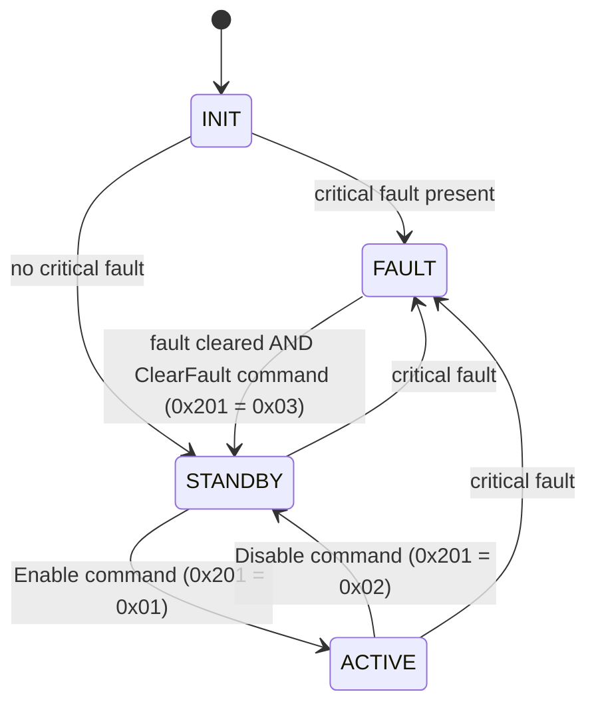

# BMS_demo — S32K344 Battery Management Controller

A bare-metal (no-OS) Battery Management System demo for the **NXP S32K344** (Cortex-M7), built on the
**S32K3 RTD 7.0.1** low-level IP drivers. It monitors three battery packs, decodes 16 cell voltages
from a CAN-based "virtual AFE", runs a precharge/contactor state machine per pack, tracks faults, and
publishes everything over CAN.

---

## 1. Platform

| Item | Value |
| --- | --- |
| MCU | S32K344, package `S32K344_172HDQFP`, core M7_0 |
| Toolchain | S32 Design Studio for S32 Platform 3.6.10 |
| Drivers | S32K3 RTD 7.0.1 (AUTOSAR 4.9.0), IP layer / SA mode |
| Config tool | NXP MCUXpresso Config Tools (`BMS_demo.mex`) |
| Build configs | `Debug_FLASH`, `Release_RAM` |
| Base tick | PIT0 CH0, 400 000 ticks @ 40 MHz AIPS_SLOW = **10 ms** |

Build from S32DS (Project → Build), or from a shell in the config folder:

```powershell
cd Debug_FLASH
make -j all
```

Flash/debug launch configurations for SEGGER are in `Project_Settings/Debugger/`.

---

## 2. Repository layout

```
src/
  main.c                    Startup, peripheral init, scheduler task table
  app/
    Bms_App.*               Thin application wrapper around the battery monitor
    Bms_Scheduler.*         Table-driven cooperative scheduler (max 8 tasks)
    Bms_StateMachine.*      INIT / STANDBY / ACTIVE / FAULT supervisor
    Bms_Adc.*               ADC_SAR wrapper (unit 0 = bus V, unit 1 = pack V + NTC)
  battery/
    Battery_Monitor.*       Aggregates cell/pack/temperature data, applies thresholds
    Bms_Ntc.*               3-channel NTC (Beta equation) -> 0.1 degC
    Bms_Ntc_Cfg.h           NTC hardware constants
    Bms_Afe.*               Physical AFE stub (unused)
    vAFE/Bms_Vafe.*         Decodes 16 cell voltages from CAN1 frames 0x401-0x404
  communication/
    Bms_Can.*               CAN0 (host) + CAN1 (vAFE): polled RX, blocking TX
    Bms_Can_Cfg.h           Instances, mailbox indices, all message IDs
    Bms_Spi.*               LPSPI1 wrapper
  control/
    Bms_Contactor.*         Per-pack contactor + precharge state machine
    Bms_Contactor_Cfg.h     Precharge timing / thresholds
  drivers/
    Bms_Gpio.*              SIUL2 DIO abstraction (logical pin IDs)
    Bms_Led.*               Active-low LED helpers
  safety/
    Fault_Manager.*         32-bit fault masks per pack + system, critical-fault mask

board/        Generated pin mux (SIUL2 / TSPC)
generate/     Generated RTD configs: Clock, ADC, FlexCAN, PIT, LPSPI, IntCtrl, OsIf
RTD/          NXP Real-Time Drivers source + headers
DBC/          BMS_demo.dbc  — CAN database for PCAN / CANalyzer
Project_Settings/  Linker scripts, startup code, debugger launches
```

---

## 3. Startup and scheduling

`main()` initialises, in order: clocks → pins → LED off → interrupt controller → PIT0 → ADC (with
calibration) → NTC → CAN0/CAN1 → LPSPI1 → fault manager → contactors → state machine → application →
vAFE → battery monitor → scheduler → PIT start. Any init failure traps with LED1 red on.

The PIT ISR only calls `Bms_Scheduler_TickFromIsr()`; all work runs from the main loop, which drains
accumulated ticks so no period is lost if the loop falls behind.

| Task | Period | Contents |
| --- | --- | --- |
| `Bms_MainFunction_10ms` | 10 ms | ADC acquisition, app main, contactor state machine, 1 Hz LED blink |
| `Bms_MainFunction_100ms` | 100 ms | NTC, battery monitor, CAN RX poll, state machine, TX of 0x300–0x305 and 0x400 |
| `Bms_MainFunction_1000ms` | 1000 ms | Reserved |

---

## 4. BMS state machine



Entering `ACTIVE` requests all three packs to close; leaving it requests all packs to open. `FAULT`
is latched — the underlying condition must be gone *and* an explicit ClearFault command received.
LED3 (PTA31) is on while `ACTIVE`.

---

## 5. Contactor / precharge control

Each pack has three outputs: **negative**, **precharge**, **positive**.

```
OFF -> NEG_ON -> PRECHARGE -> POS_ON -> RUN
                                          \
        FAULT <-- critical/pack fault      -> OPENING -> OFF
```

| Constant | Value | Meaning |
| --- | --- | --- |
| `BMS_CONTACTOR_NEG_DELAY_MS` | 100 ms | Settle after closing the negative contactor |
| `BMS_PRECHARGE_TIMEOUT_MS` | 2000 ms | Max precharge duration |
| `BMS_PRECHARGE_COMPLETE_RATIO` | 0.90 | Bus V must reach 90 % of pack V |
| `BMS_CONTACTOR_POS_DELAY_MS` | 100 ms | Settle before opening precharge |
| `BMS_CONTACTOR_SIMULATION_MODE` | 1 | Skips the bus-voltage check, uses a fixed 100 ms precharge |

A critical or pack fault drives the pack to `FAULT` with all outputs off; it stays there until the
fault clears and an open request is received.

---

## 6. Fault manager

Faults are bits in a 32-bit mask, tracked per pack (`FAULT_PACK_1..3`) and system-wide.

| Bit | Fault | Bit | Fault |
| --- | --- | --- | --- |
| 0 | `FAULT_PACK_OV` | 8 | `FAULT_SPI_TIMEOUT` |
| 1 | `FAULT_PACK_UV` | 9 | `FAULT_PRECHARGE_TIMEOUT` |
| 2 | `FAULT_CELL_OV` | 10 | `FAULT_CONTACTOR_FEEDBACK` |
| 3 | `FAULT_CELL_UV` | 11 | `FAULT_CONTACTOR_WELD` |
| 4 | `FAULT_OVER_TEMP` | 12 | `FAULT_OVER_CURRENT` |
| 5 | `FAULT_UNDER_TEMP` | 13 | `FAULT_TEMP_SENSOR` |
| 6 | `FAULT_AFE_COMM` | 14 | `FAULT_TEMP_DELTA` |
| 7 | `FAULT_CAN_TIMEOUT` | 15 | `FAULT_CELL_IMBALANCE` |

`FAULT_CRITICAL_MASK` = pack OV/UV, cell OV/UV, over-temp, temp sensor, AFE comm, precharge timeout,
contactor feedback, contactor weld, over-current. Any critical fault opens the contactors and forces
the supervisor into `FAULT`.

### Detection thresholds (hysteretic, `Battery_Monitor.c`)

| Condition | Set | Clear |
| --- | --- | --- |
| Cell over-voltage | 4250 mV | 4150 mV |
| Cell under-voltage | 2500 mV | 2700 mV |
| Over-temperature | 60.0 °C | 55.0 °C |
| Under-temperature | −20.0 °C | −15.0 °C |
| Pack temperature delta | 15.0 °C | 10.0 °C |
| Cell imbalance | 300 mV | 200 mV |

---

## 7. Measurement chain

- **Cell voltages** — 16 cells, sourced over CAN1 from the virtual AFE. Frames `0x401..0x404` each
  carry four `uint16` little-endian values at 1 mV/bit. `Bms_Vafe` sets `DataValid` only once all
  four frames have arrived, then recomputes min/max/delta and the min/max cell indices.
- **Pack voltages** — three ADC1 channels, 14-bit, 3.3 V reference.
- **Temperatures** — three NTCs on ADC1, Beta equation (`R25 = 10 kΩ`, `Beta = 3435 K`,
  series 10 kΩ), reported in 0.1 °C over −40.0 … 125.0 °C.
- **Bus voltages** — ADC0 channels P0/P1/P3/P4 (bus 1/2/3 + spare), used for precharge completion.

---

## 8. CAN interface

Both buses run at **500 kbit/s**. CAN0 talks to the host tool, CAN1 to the virtual AFE.
TX is `SendBlocking` with a 100 ms timeout on MB0; RX is polled from the 100 ms task.
Import `DBC/BMS_demo.dbc` (v0.6) into PCAN-Explorer/CANalyzer for decoding.

### CAN0 transmit (every 100 ms)

**0x300 `BMS_Status`**

| Byte | Content |
| --- | --- |
| 0 | BMS state: 0 = INIT, 1 = STANDBY, 2 = ACTIVE, 3 = FAULT |
| 1–2 | Pack1 temperature, `int16` LE, 0.1 °C |
| 3–4 | Pack2 temperature |
| 5–6 | Pack3 temperature |
| 7 | bit0 critical fault, bit1 any fault, bit2–4 pack1/2/3 temp valid |

**0x301 `BMS_PackStatus`**

| Byte | Content |
| --- | --- |
| 0–1 | Pack1 voltage, `uint16` LE, 0.1 V |
| 2–3 | Pack2 voltage |
| 4–5 | Pack3 voltage |
| 6 | bits 3:0 monitor status (0 OK, 1 INVALID, 2 OV, 3 UV, 4 MISMATCH); bits 7:4 alive counter |
| 7 | bit0 pack voltage valid |

**0x302 `BMS_ContactorStatus`**

| Byte | Content |
| --- | --- |
| 0–2 | Pack1/2/3 contactor state (0 OFF … 6 FAULT) |
| 3–5 | Pack1/2/3 outputs: bit0 negative, bit1 positive, bit2 precharge |
| 6 | bits 3:0 alive counter |

**0x303 `BMS_Pack12Fault`** — bytes 0–3 pack1 mask, bytes 4–7 pack2 mask (`uint32` LE).

**0x304 `BMS_Pack3SystemFault`** — bytes 0–3 pack3 mask, bytes 4–7 system mask (`uint32` LE).

**0x305 `BMS_CellSummary`**

| Byte | Content |
| --- | --- |
| 0–1 | Min cell voltage, `uint16` LE, 1 mV |
| 2–3 | Max cell voltage |
| 4–5 | Delta cell voltage |
| 6 | bits 3:0 min cell index, bits 7:4 max cell index |
| 7 | bit0 cell voltage valid, bit1 cell imbalance fault |

### CAN0 receive

| ID | Mailbox | Byte 0 command |
| --- | --- | --- |
| 0x200 `BMS_DebugCommand` | MB1 | `0x00` NOP · `0x01` LED2 green on · `0x02` LED2 green off · `0x03` reset RX counter |
| 0x201 `BMS_ControlCommand` | MB2 | `0x00` NOP · `0x01` Enable · `0x02` Disable · `0x03` ClearFault |

### CAN1 (virtual AFE)

| ID | Direction | Content |
| --- | --- | --- |
| 0x400 | TX (MB0) | Test pattern, sent every 100 ms |
| 0x401 | RX (MB1) | Cells 1–4, `uint16` LE, 1 mV/bit |
| 0x402 | RX (MB2) | Cells 5–8 |
| 0x403 | RX (MB3) | Cells 9–12 |
| 0x404 | RX (MB4) | Cells 13–16 |

### Quick bring-up

1. Connect a CAN tool to CAN0 (PTA6/PTA7) and the vAFE simulator to CAN1 (PTC8/PTC9) at 500 kbit/s.
2. Power up — LED1 red blinks at 1 Hz and 0x300–0x305 appear every 100 ms.
3. Feed 0x401–0x404 so `CellVoltageValid` in 0x305 goes to 1.
4. Send `0x201 / 0x01` to enable — state goes to ACTIVE, LED3 lights, contactors precharge and close.
5. Send `0x201 / 0x02` to disable, or `0x201 / 0x03` after a fault to reset.

---

## 9. Pin map

| Pin | Signal | Function |
| --- | --- | --- |
| PTA6 / PTA7 | CAN0_RX / CAN0_TX | Host CAN |
| PTC9 / PTC8 | CAN1_RX / CAN1_TX | vAFE CAN |
| PTA18/19/20/21 | LPSPI1 SOUT/SCK/SIN/PCS0 | SPI |
| PTD1, PTD0, PTE15, PTE16 | ADC0_P0/P1/P3/P4 | Bus1/2/3 + spare voltage |
| PTA29 | LED1_RED | 1 Hz heartbeat, solid on init failure |
| PTA30 | LED2_GREEN | Controlled over CAN 0x200 |
| PTA31 | LED3 | On while ACTIVE |

All LEDs are active-low (0 = on).

---

## 10. Regenerating peripheral configuration

Open `BMS_demo.mex` with the S32 Configuration Tools inside S32DS, edit clocks/pins/peripherals, and
regenerate. Do not hand-edit anything under `generate/` or `board/` — those files are overwritten.
