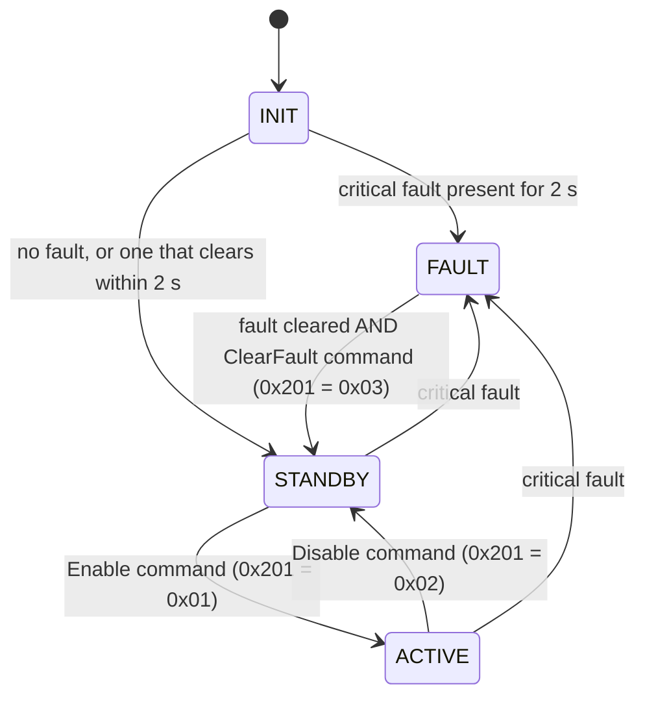

# BMS_demo — S32K344 Battery Management Controller

A bare-metal (no-OS) Battery Management System demo for the **NXP S32K344** (Cortex-M7), built on the
**S32K3 RTD 7.0.1** low-level IP drivers. It monitors three battery packs, decodes 16 cell voltages
from a CAN-based "virtual AFE", decodes pack current/voltage from a CAN-based "virtual ADBMS2950"
pack monitor, runs a precharge/contactor state machine for three packs (only Pack 1 has relays wired,
and precharge completion is timer-simulated — see §5), estimates Pack 1 state-of-charge by Coulomb
counting (persisted to data flash), computes Pack 1 current limits (state of power), tracks faults,
and publishes the measurements, state, SOC, SOP limits and fault masks over CAN0.

---

## 1. Platform

| Item | Value |
| --- | --- |
| MCU | S32K344, package `S32K344_172HDQFP`, core M7_0 |
| Toolchain | S32 Design Studio for S32 Platform 3.6.10 |
| Drivers | S32K3 RTD 7.0.1 (AUTOSAR 4.9.0), IP layer / SA mode |
| Config tool | NXP MCUXpresso Config Tools (`BMS_demo.mex`) |
| Build configs | `Debug_FLASH`, `Release_RAM` |
| Base tick | PIT0 CH0, 400 000 ticks @ 40 MHz AIPS_SLOW = **10 ms** |

Build from S32DS (Project → Build), or from PowerShell using the provided script:

```powershell
.\build.bat                    # Debug_FLASH, target "all" (default)
.\build.bat Release_RAM        # Release_RAM, target "all"
```

`build.bat` takes the config as the first argument and the make target as the second. **Avoid
`.\build.bat <config> clean`** — the Eclipse-generated makefile's `clean` target is `rm -rf ./*` inside
the config directory and also wipes the CDT-generated per-file `.args` response files that plain `make`
has no rule to regenerate (only the S32DS IDE can, via Project → Clean). Use `clean.bat` for a safe,
selective clean instead:

```powershell
.\clean.bat                    # clean Debug_FLASH (default)
.\clean.bat Release_RAM        # clean Release_RAM
```

`clean.bat` deletes only the actual build artifacts (`*.o *.d *.elf *.map *.siz`) and leaves the
`.args`/`.mk` files intact. Unlike `build.bat` it hardcodes the S32DS 3.6.10 install path, so it needs
a one-line edit if S32DS moves or another version is installed. If the `.args` files are ever lost
anyway, recover in S32DS: right-click the project → Refresh, then Project → Clean… (with "start a
build immediately") for the affected config.

The generated `makefile`/`subdir.mk` files also `-include ../makefile.defs` and
`../makefile.targets`; neither file is in this repository (the `-include` makes that silent).

`build.bat` invokes `make` through the S32DS MSYS bash, since `make`/`arm-none-eabi-*` are not on the
plain Windows `PATH`. It locates the installation itself: `S32DS_ROOT` if you have set it, otherwise
the newest `C:\NXP\S32DS.*\S32DS` that contains a `build_tools` folder. It then discovers the newest
`build_tools\gcc_v*\gcc-*-arm32-eabi\bin` inside it — no version number is hardcoded — converts both
paths with `cygpath -u`, and builds with `-j%NUMBER_OF_PROCESSORS%`. Nothing is pinned to one machine,
so the script survives an S32DS upgrade or a repo that has been copied elsewhere:

```powershell
set S32DS_ROOT=D:\path\to\S32DS      # optional; omit to auto-detect
.\build.bat
```

To drive `make` in that MSYS bash yourself, substitute your own install paths in the example below
(the `/c/...` form is MSYS notation; `build.bat` derives it at run time with `cygpath`):

```powershell
& "<S32DS>\build_tools\msys32\usr\bin\bash.exe" -lc 'export PATH="/c/NXP/S32DS.3.6.10/S32DS/build_tools/gcc_v10.2/gcc-10.2-arm32-eabi/bin:$PATH" && cd /c/S32K344/workspace/BMS_demo/Debug_FLASH && make all'
```

Add `-j<N>` to parallelise; `build.bat` passes `-j%NUMBER_OF_PROCESSORS%`.

One caveat the auto-detection does not cover: the per-folder `.args` response files carry absolute
paths baked in — the four SDK include roots and a `--sysroot` pinned to the `gcc_v10.2` folder under
`C:\NXP\S32DS.3.6.10`. The project therefore builds where `build.bat` finds that S32DS layout; a
different install root, S32DS version or RTD SDK location means updating the project's include/sysroot
settings in S32DS and rebuilding so the `.args` files are regenerated.

Flash/debug launch configurations for SEGGER are in `Project_Settings/Debugger/` (use these from S32DS for
interactive debugging). To flash from the command line instead (J-Link probe connected, board powered):

```powershell
.\flash.bat   # flashes Debug_FLASH\BMS_demo.elf via J-Link and starts execution
```

`flash.bat` drives the S32DS-bundled `JLinkGDBServerCL.exe` + `arm-none-eabi-gdb.exe` non-interactively
(no separate SEGGER J-Link software install needed): it starts its own server at 1000 kHz with
`-singlerun -strict -timeout 8000 -nogui`, then flashes with `monitor reset` → `load` → `monitor reset`
→ `monitor go` → `detach`. It currently supports `Debug_FLASH` only — `Release_RAM` needs a different
load sequence and isn't wired up yet. Every debug/flash script here hardcodes its absolute
`C:\NXP\S32DS.3.6.10\...` paths (GDB server, `.jlinkscript`, gdb, and for PEmicro the versioned plugin
folder), so a different S32DS install needs those lines edited.

---

## 2. Repository layout

```
src/
  main.c                    Startup, peripheral init, scheduler task table
  app/
    Bms_App.*               Thin application wrapper — forwards to BatteryMonitor_Init() / _MainFunction()
    Bms_Scheduler.*         Table-driven cooperative scheduler (max 8 tasks)
    Bms_StateMachine.*      INIT / STANDBY / ACTIVE / FAULT supervisor
    Bms_Adc.*               ADC_SAR wrapper (instance 0 = pack V + NTC + pot, instance 1 = bus V)
  battery/
    Battery_Monitor.*       Aggregates cell/pack/current/temperature data, applies thresholds
    Bms_BattCfg.*           Battery data: capacity, OCV curve, cell safety envelope, SOP limit maps
    Bms_Ntc.*               3-channel NTC (Beta equation) -> 0.1 degC
    Bms_Ntc_Cfg.h           NTC hardware constants
    Bms_Soc.*               Pack 1 state-of-charge: three cell-based estimators, OCV/NVM/default init
    Bms_Sop.*               Pack 1 state of power: discharge/regen/charge current limits (see §14)
    Bms_SleepTime.*         Elapsed power-off time provider for the SOC OCV reset (stubbed, no RTC yet)
    Bms_Afe.*               Physical AFE stub (unused)
    vAFE/Bms_Vafe.*         Decodes 16 cell voltages from CAN1 frames 0x401-0x404
    vPACK/Bms_Vpack.*       Decodes pack current/voltage from CAN2 (virtual ADBMS2950) frames 0x410-0x411
    SOC_DESIGN.md           SOC design, validation plan and known limitations
    SOP_DESIGN.md           SOP + Bms_BattCfg design, validation plan and known limitations
  common/
    Lib_Interp.*            1-D and 2-D table interpolation (OCV curve, SOP limit maps)
  communication/
    Bms_Can.*               CAN0 (host) + CAN1 (vAFE) + CAN2 (vPACK): polled RX, blocking TX
    Bms_Can_Cfg.h           Instances, mailbox indices, all message IDs
    Bms_Spi.*               LPSPI1 wrapper
    xcp/Xcp.*               XCP protocol command processing (CONNECT/GET_STATUS/SET_MTA/UPLOAD/
                            SHORT_UPLOAD/DOWNLOAD), transport-agnostic
    xcp/Xcp_Can.*           CAN5 transport layer for XCP (own FlexCAN instance, polled RX, TX responses)
    xcp/Xcp_Cfg.h           XCP CAN5 IDs/baudrate + protocol constants + RAM whitelist
  control/
    Bms_Contactor.*         Per-pack contactor + precharge state machine (only Pack 1 has relay
                            outputs; simulation mode is defined in the .c)
    Bms_Contactor_Cfg.h     Task period, precharge timing, Pack 1 relay pins / drive polarity
  drivers/
    Bms_Gpio.*              SIUL2 DIO abstraction — shadow-state stub, no hardware access yet
    Bms_Led.*               Active-low LED helpers (red PTA29, green PTA30, blue PTA31, yellow PTB18)
  safety/
    Fault_Manager.*         32-bit fault masks per pack + system, critical-fault mask, latched fault history
  storage/
    Bms_Nvm.*               SOC persistence in data flash (C40_Ip), sequence/checksum-guarded records

board/        Generated pin mux (SIUL2 / TSPC)
generate/     Generated RTD configs: Clock, ADC, FlexCAN, PIT, LPSPI, IntCtrl, OsIf, C40 (data
              flash), SIUL2 port / IGF, cache, plus the device and module headers
RTD/          NXP Real-Time Drivers: include/ (IP driver headers) + src/ (implementation)
DBC/          BMS_demo.dbc + BMS_demo.sym — CAN database for PCAN / CANalyzer
Project_Settings/  Linker scripts, startup code, debugger launches
sil/          Software-in-the-loop test platform: tests/ suites, python/ ctypes harness, fakes/ for
              the RTD driver layer, per-feature reports/ (see §15)
hil/          Hardware-in-the-loop SOP tests on the S32K344 board, with reports (see §16)
BMS_demo.mex  Config-tool project (see §12); ClockYaml.txt / ClockConfigurationMappings.txt are the
              clock YAML inputs it was generated from

Root tooling:  build.bat · clean.bat · flash.bat · debug_server.bat · debug_reset.bat ·
               debug_live.bat · fault_snapshot.bat · fault_decode.gdb  (see §1 and §10)
               PEmicro probe alternatives: *_pemicro.bat variants of the 5 debug/flash
               scripts above (see §10)
Root docs:     README.md · CHANGELOG.md · the design notes under src/battery/
Build output:  Debug_FLASH/ and Release_RAM/ (CDT configs, git-tracked makefiles included)
```

---

## 3. Startup and scheduling

`main()` initialises, in order: clocks → pins → LED off → interrupt controller → PIT0 → ADC (with
calibration) → NTC → CAN0/CAN1/CAN2 → CAN5 (XCP transport, `Xcp_Can_Init`) → LPSPI1 → fault manager →
contactors → state machine → application → vAFE → vPACK → battery monitor → NVM (scans data flash) →
SOC estimator → SOP limits → scheduler → PIT start. A failure in a checked init call (ADC,
CAN0/1/2, CAN5, LPSPI1, PIT start) traps with LED1 red on; the remaining calls are not checked.
`BatteryMonitor_Init()` runs twice on the way — once inside `Bms_App_Init()` and once directly in
`main()` — the second call simply initialises the same state again.

The PIT ISR only calls `Bms_Scheduler_TickFromIsr()`, which increments a pending-tick count; all work
runs from the main loop. `Bms_Scheduler_MainFunction` atomically captures and clears the pending count,
then advances every task's counter by that many ticks but **executes each due task at most once per
call** (counter reduced modulo its period, preserving phase) — this avoids the CAN-cycle-time bursts
that a naive "run once per missed tick" catch-up loop would cause if the main loop temporarily falls
behind. Diagnostics: `g_BmsSchedulerPendingTicks` (last call's elapsed ticks), a running peak
`g_BmsSchedulerPendingTicksMax`, and a cumulative `g_BmsSchedulerMissedTickCount` (ticks beyond the
first per call) are exposed for inspection (e.g. via the XCP/debugger tooling in §10/§11).

| Task | Period | Contents |
| --- | --- | --- |
| `Bms_MainFunction_10ms` | 10 ms | ADC acquisition, app main — which itself calls `BatteryMonitor_MainFunction()`, so the whole battery monitor runs here too — **XCP CAN5 poll (`Xcp_Can_MainFunction`)**, pack-voltage feed to the contactor machine (`Bms_Contactor_SetPackVoltage`), contactor state machine, 1 Hz LED blink |
| `Bms_MainFunction_100ms` | 100 ms | NTC, CAN RX poll, vPACK comm-health check, battery monitor (again), SOC integration, SOP limits, state machine, TX of 0x300–0x30C, 0x310–0x313 and 0x400 |
| `Bms_MainFunction_1000ms` | 1000 ms | SOC persistence (`Bms_Soc_1sFunction`: writes to NVM once the save period has elapsed, and only if an estimate moved) |

XCP is polled from the 10 ms task (not 100 ms) since a real XCP master/DAQ tool expects lower latency
than the other CAN traffic.

---

## 4. BMS state machine



A critical fault has to persist before it latches: `INIT` waits `BMS_STATE_INIT_SETTLE_CYCLES`
(20 × 100 ms = **2 s**) because the AFE, vPACK and NTC all report invalid data until their first
measurement cycle completes, and a fault that clears inside that window falls through to `STANDBY`.
Entering `ACTIVE` requests all three packs to close; leaving it requests all packs to open. `FAULT`
is latched — the underlying condition must be gone *and* an explicit ClearFault command received
(a ClearFault is only honoured in `FAULT`; `STANDBY` and `ACTIVE` discard it each cycle). An
unexpected state fails safe to `FAULT`, and the live state is mirrored in `g_DebugBmsState` for the
debugger. LED3 (PTA31, `BMS_LED_BLUE` in `Bms_Led.c`) is on while `ACTIVE`.

---

## 5. Contactor / precharge control

Only **Pack 1** has relays wired (PTC23 negative, PTC24 precharge, PTC25 positive); Packs 2 and 3 run
the same state machine but write no outputs. The relay outputs are active-high (`1` = closed) — the
opposite polarity to the LEDs.

```
OFF -> NEG_ON -> PRECHARGE -> POS_ON -> RUN
                                       \
        FAULT <-- critical/pack fault   -> OFF
```

An open request has priority in every state and drops the pack straight to `OFF`.
`BMS_CONTACTOR_OPENING` exists in the state enum but is never entered.

| Constant | Value | Meaning |
| --- | --- | --- |
| `BMS_CONTACTOR_TASK_PERIOD_MS` | 10 ms | State machine execution period |
| `BMS_CONTACTOR_NEG_DELAY_MS` | 100 ms | Settle after closing the negative contactor |
| `BMS_PRECHARGE_TIMEOUT_MS` | 2000 ms | Max precharge duration (compile-out below) |
| `BMS_PRECHARGE_COMPLETE_RATIO` | 0.90 | Bus V must reach 90 % of pack V (inert today — nothing feeds the bus voltage) |
| `BMS_CONTACTOR_POS_DELAY_MS` | 100 ms | Settle before opening precharge |
| `BMS_CONTACTOR_OUTPUT_ACTIVE_LEVEL` | 1 | Relay drive polarity: 1 = active high |
| `BMS_CONTACTOR_SIMULATION_MODE` | 1 | Defined in `Bms_Contactor.c`, not in the header. Precharge completes on a fixed 100 ms timer instead of a bus-voltage judgement |

All of the above except `BMS_CONTACTOR_SIMULATION_MODE` live in `Bms_Contactor_Cfg.h`. With
simulation mode `1` (today's setting) the whole bus-voltage branch is compiled out, so
`FAULT_PRECHARGE_TIMEOUT` cannot be raised and `Bms_Contactor_SetBusVoltage()` has no caller. Both
are prerequisites before real HV is connected.

A critical or pack fault drives the pack to `FAULT` with all outputs off. It leaves `FAULT` as soon as
no critical pack or system fault is present — no open request is needed, and one that was pending when
the fault hit has already been discarded.

---

## 6. Fault manager

Faults are bits in a 32-bit mask, tracked per pack (`FAULT_PACK_1..3`) and system-wide. Besides the
live mask, `Fault_Manager` also keeps a latched "last fault" history mask per pack/system that is
only cleared explicitly (see `FaultManager_GetLastPackFaults` / `FaultManager_GetLastSystemFaults`),
reported on CAN 0x309/0x30A.

Each bit is raised in one of the two masks. **System mask**: `FAULT_CELL_OV`, `FAULT_CELL_UV`,
`FAULT_CELL_IMBALANCE`, `FAULT_TEMP_DELTA`, `FAULT_AFE_COMM`, the `FAULT_VPACK_*` group and
`FAULT_CAN_TIMEOUT`. **Per-pack mask**: `FAULT_OVER_TEMP`, `FAULT_UNDER_TEMP`, `FAULT_TEMP_SENSOR`,
`FAULT_PACK_CHARGE_OC`, `FAULT_PACK_DISCHARGE_OC` and `FAULT_PACK1_VOLTAGE_TIMEOUT`.

| Bit | Fault | Bit | Fault |
| --- | --- | --- | --- |
| 0 | `FAULT_PACK_OV` | 11 | `FAULT_CONTACTOR_WELD` |
| 1 | `FAULT_PACK_UV` | 12 | `FAULT_OVER_CURRENT` |
| 2 | `FAULT_CELL_OV` | 13 | `FAULT_TEMP_SENSOR` |
| 3 | `FAULT_CELL_UV` | 14 | `FAULT_TEMP_DELTA` |
| 4 | `FAULT_OVER_TEMP` | 15 | `FAULT_CELL_IMBALANCE` |
| 5 | `FAULT_UNDER_TEMP` | 16 | `FAULT_VPACK_COMM_TIMEOUT` |
| 6 | `FAULT_AFE_COMM` | 17 | `FAULT_VPACK_ALIVE_ERROR` |
| 7 | `FAULT_CAN_TIMEOUT` | 18 | `FAULT_VPACK_DEVICE_FAULT` |
| 8 | `FAULT_SPI_TIMEOUT` | 19 | `FAULT_PACK1_VOLTAGE_TIMEOUT` |
| 9 | `FAULT_PRECHARGE_TIMEOUT` | 20 | `FAULT_PACK_DISCHARGE_OC` |
| 10 | `FAULT_CONTACTOR_FEEDBACK` | 21 | `FAULT_PACK_CHARGE_OC` |

Six of these bits are not raised by any code path yet — `FAULT_PACK_OV` (0), `FAULT_PACK_UV` (1),
`FAULT_SPI_TIMEOUT` (8), `FAULT_CONTACTOR_FEEDBACK` (10), `FAULT_CONTACTOR_WELD` (11) and
`FAULT_OVER_CURRENT` (12), four of which sit inside `FAULT_CRITICAL_MASK`. They are reserved for
sensing that is not wired up, so a bench test has to force them through the `FaultManager_Set*` API
(see §10) rather than by provoking the hardware.

`FAULT_CRITICAL_MASK` = pack OV/UV, cell OV/UV, over-temp, temp sensor, AFE comm, precharge timeout,
contactor feedback, contactor weld, over-current, vPACK comm timeout/alive error/device fault, Pack 1
voltage timeout, and pack discharge/charge over-current. Any critical fault opens the contactors and
forces the supervisor into `FAULT`. `FAULT_CAN_TIMEOUT` is not critical and clears itself again on the
next successful CAN0 send.

### Detection thresholds (hysteretic)

| Condition | Set | Clear |
| --- | --- | --- |
| Cell over-voltage | 4250 mV | 4150 mV |
| Cell under-voltage | 2500 mV | 2700 mV |
| Over-temperature | 200.0 °C | 195.0 °C |
| Under-temperature | −20.0 °C | −15.0 °C |
| Pack temperature delta | 50.0 °C | 10.0 °C |
| Cell imbalance | 300 mV | 200 mV |
| Pack charge over-current | 80.0 A | 70.0 A |
| Pack discharge over-current | −100.0 A | −90.0 A |

The rows come from two places: the six cell/temperature rows from `Bms_BattCfg.c`
(`g_BmsBattCfgCellLimits`), the two over-current rows from `Battery_Monitor.c`. The over-temperature
pair cannot fire as configured — `Bms_Ntc` invalidates its reading above 125.0 °C, so a real
over-temperature surfaces as `FAULT_TEMP_SENSOR` first (`PROJECT_PLAN.md` finding F2).

Current sign convention (`Battery_Monitor.c`, from the vPACK/ADBMS2950 simulation): positive = charge,
negative = discharge.

---

## 7. Measurement chain

- **Cell voltages** — 16 cells, sourced over CAN1 from the virtual AFE. The AFE starts a measurement
  cycle with the header frame `0x405` (byte 0 = rolling measurement counter); it then sends the four
  voltage frames `0x401..0x404`, each carrying four `uint16` little-endian values at 1 mV/bit.
  `Bms_Vafe` only accepts the voltage frames while a cycle is active and sets `DataValid` once all
  four frames of one cycle have arrived (an incomplete previous cycle is discarded), then recomputes
  min/max/delta and the min/max cell indices. `HeaderValid` is set as soon as a header arrives;
  `g_BmsVafeData.MeasurementCounter` is published only once that cycle's four voltage frames have all
  been accepted.
- **Pack voltages** — Pack 1 comes from the CAN2 vPACK voltage frame (`0x411`), refreshed only while
  both `Bms_Adc_IsPackValid()` and `g_BmsVpackData.VoltageValid` are true; Pack 2/Pack 3 remain
  ADC1 channels, 14-bit, 3.3 V reference.
- **Pack current / power** — decoded over CAN2 from the virtual ADBMS2950 (`Bms_Vpack`): current
  frame `0x410` (current + shunt voltage), voltage frame `0x411` (pack + bus voltage), each with an
  alive counter checked for timeout/rollover (`BMS_VPACK_TIMEOUT_TICKS` = 1000 ms). `Battery_Monitor`
  derives `PackPower_W = PackCurrent_mA * PackV1 / 1000`.
- **State of charge** — `Bms_Soc` Coulomb-counts Pack 1 current (100 ms sample period) into three
  estimators, saving to data flash no more than once every `BMS_SOC_SAVE_PERIOD_MS` (60 s), and then
  only if an estimate has moved by at least `BMS_SOC_SAVE_DELTA_X10` (0.1 %) — see §13.
- **State of power** — `Bms_Sop` computes the Pack 1 discharge, regen and charge current limits from
  SOC, cell voltage and temperature every 100 ms — see §14.
- **Temperatures** — three NTCs on ADC1, Beta equation (`R25 = 10 kΩ`, `Beta = 3435 K`,
  series 10 kΩ), reported in 0.1 °C over −40.0 … 125.0 °C.
- **Bus voltages** — ADC0 channels P0/P1/P3/P4 (bus 1/2/3 + spare), sampled but **not** wired into
  precharge: `Bms_Contactor_SetBusVoltage()` has no caller, so precharge completion is timer-based
  while simulation mode is on (§5).

---

## 8. CAN interface

CAN0 runs at **500 kbit/s**; CAN1 (virtual AFE) and CAN2 (virtual ADBMS2950 pack monitor) run at
**1 Mbit/s**. TX is `SendBlocking` with a 2 ms timeout on MB0; a failed send aborts the transfer and sets
`FAULT_CAN_TIMEOUT` (not critical) — but only for frames sent with `raiseFault = TRUE`, which excludes
the CAN1 0x400 test frame, and the bit is cleared again by the next successful send. RX is polled from
the 100 ms task.

Import `DBC/BMS_demo.dbc` into PCAN-Explorer/CANalyzer for decoding. The frame names below are the
`Bms_Can_Cfg.h` macro names; the DBC uses its own message names, which differ in places:
`BMS_Pack_Status` (0x301), `BMS_Contactor_Status` (0x302), `BMS_Pack12_Faults` (0x303),
`BMS_Pack3_System_Faults` (0x304), `BMS_Pack_Current` (0x306), `Pack_Power_Status` (0x307),
`SOC_Status` (0x308), `BMS_LastFaultStatus12` (0x309), `BMS_LastFaultStatus3System` (0x30A) and
`SOC_CellBased` (0x30B).

### CAN0 transmit (every 100 ms)

**0x300 `BMS_Status`**

| Byte | Content |
| --- | --- |
| 0 | BMS state: 0 = INIT, 1 = STANDBY, 2 = ACTIVE, 3 = FAULT |
| 1–2 | Pack1 temperature, `int16` LE, 0.1 °C |
| 3–4 | Pack2 temperature |
| 5–6 | Pack3 temperature |
| 7 | bit0 critical fault, bit1 any fault, bit2–4 pack1/2/3 temp valid |

**0x301 `BMS_PackStatus`**

| Byte | Content |
| --- | --- |
| 0–1 | Pack1 voltage, `uint16` LE, 0.1 V |
| 2–3 | Pack2 voltage |
| 4–5 | Pack3 voltage |
| 6 | bits 3:0 monitor status (0 OK, 1 INVALID, 2 OV, 3 UV, 4 MISMATCH); bits 7:4 alive counter |
| 7 | bit0 pack voltage valid |

**0x302 `BMS_ContactorStatus`**

| Byte | Content |
| --- | --- |
| 0–2 | Pack1/2/3 contactor state (0 OFF … 6 FAULT) |
| 3–5 | Pack1/2/3 outputs: bit0 negative, bit1 positive, bit2 precharge |
| 6 | bits 3:0 alive counter |

**0x303 `BMS_Pack12Fault`** — bytes 0–3 pack1 mask, bytes 4–7 pack2 mask (`uint32` LE).

**0x304 `BMS_Pack3SystemFault`** — bytes 0–3 pack3 mask, bytes 4–7 system mask (`uint32` LE).

**0x305 `BMS_CellSummary`**

| Byte | Content |
| --- | --- |
| 0–1 | Min cell voltage, `uint16` LE, 1 mV |
| 2–3 | Max cell voltage |
| 4–5 | Delta cell voltage |
| 6 | bits 3:0 min cell index, bits 7:4 max cell index |
| 7 | bit0 cell voltage valid, bit1 cell imbalance fault |

**0x310–0x313 `BMS_CellVoltage_01_04` … `BMS_CellVoltage_13_16`**

Each frame carries 4 cells × `uint16` LE at 1 mV/bit (all 16 cells every cycle).

| Frame | Cells | Bytes |
| --- | --- | --- |
| 0x310 | 1–4 | 0–1 cell1, 2–3 cell2, 4–5 cell3, 6–7 cell4 |
| 0x311 | 5–8 | 0–1 cell5, 2–3 cell6, 4–5 cell7, 6–7 cell8 |
| 0x312 | 9–12 | 0–1 cell9, 2–3 cell10, 4–5 cell11, 6–7 cell12 |
| 0x313 | 13–16 | 0–1 cell13, 2–3 cell14, 4–5 cell15, 6–7 cell16 |

**0x306 `BMS_PackCurrent`**

| Byte | Content |
| --- | --- |
| 0–1 | Pack1 current, `int16` LE, 0.1 A/bit (+charge / −discharge) |
| 2–3 | Pack2 current |
| 4–5 | Pack3 current |
| 6 | bit0/1/2 pack1/2/3 current valid |
| 7 | bits 3:0 alive counter |

**0x307 `BMS_PackPower`**

| Byte | Content |
| --- | --- |
| 0–3 | Pack1 power, `int32` LE, 1 W/bit (sign follows pack current: +charge / −discharge) |
| 4 | bit0 pack1 power valid |
| 5–6 | Reserved |
| 7 | bits 3:0 alive counter |

**0x308 `BMS_SocStatus`**

| Byte | Content |
| --- | --- |
| 0–1 | Pack1 blended SOC, `uint16` LE, 0.1 %/bit |
| 2 | bit0 SOC valid; bits 3:1 init source (0 default, 1 OCV, 2 NVM, 3 pending); bits 7:4 reserved |
| 3–6 | Reserved |
| 7 | bits 3:0 alive counter |

**0x309 `BMS_LastFault12`** — bytes 0–3 latched pack1 fault history, bytes 4–7 latched pack2 fault
history (`uint32` LE).

**0x30A `BMS_LastFault3System`** — bytes 0–3 latched pack3 fault history, bytes 4–7 latched system
fault history (`uint32` LE).

**0x30B `BMS_CellSoc`** — per-estimator SOC, `uint16` LE, 0.1 %/bit each: bytes 0–1 weakest cell
(`Min`), 2–3 strongest cell (`Max`), 4–5 average (`Avg`); byte 6 bits 2:0 = Min/Max/Avg valid; byte 7
bits 3:0 alive counter. See §13 for what the three estimators are.

**0x30C `SOP_Limits`**

| Byte | Content |
| --- | --- |
| 0–1 | Pack1 discharge limit, `uint16` LE, 0.1 A/bit, magnitude |
| 2–3 | Pack1 regen limit |
| 4–5 | Pack1 charge limit |
| 6 | bit0 VLow derate, bit1 VHigh derate, bit2 THigh derate active; bits 7:3 reserved |
| 7 | bits 3:0 alive counter |

A limit that does not apply to the operating mode is sent as 0. All limits are 0 while an input is not
valid (see §14).

### CAN0 receive

| ID | Mailbox | Byte 0 command |
| --- | --- | --- |
| 0x200 `BMS_DebugCommand` | MB1 | `0x00` NOP · `0x01` LED2 green on · `0x02` LED2 green off · `0x03` reset RX counter |
| 0x201 `BMS_ControlCommand` | MB2 | `0x00` NOP · `0x01` Enable · `0x02` Disable · `0x03` ClearFault · `0x04` ClearFaultHistory (clears latched 0x309/0x30A history only) |

### CAN1 (virtual AFE)

| ID | Direction | Content |
| --- | --- | --- |
| 0x400 | TX (MB0) | Test pattern, sent every 100 ms |
| 0x401 | RX (MB1) | Cells 1–4, `uint16` LE, 1 mV/bit |
| 0x402 | RX (MB2) | Cells 5–8 |
| 0x403 | RX (MB3) | Cells 9–12 |
| 0x404 | RX (MB4) | Cells 13–16 |
| 0x405 | RX (MB5) | `vAFE_Measurement_Header` — starts a new AFE measurement cycle; byte 0 = rolling counter, byte 1 = AFE status (ignored by the decoder) |

### CAN2 (virtual ADBMS2950 pack monitor, vPACK)

| ID | Direction | Content |
| --- | --- | --- |
| 0x410 | RX (MB1) | Pack current + shunt voltage |
| 0x411 | RX (MB2) | Pack voltage + bus voltage (also feeds `BatteryMonitor.PackV1`) |

Comm health uses an alive counter with a 1000 ms timeout (`BMS_VPACK_TIMEOUT_TICKS`); a stale/invalid
counter raises `FAULT_VPACK_COMM_TIMEOUT` / `FAULT_VPACK_ALIVE_ERROR`, and the device status byte can
raise `FAULT_VPACK_DEVICE_FAULT`. Signal layout beyond what `Bms_Vpack.c` decodes is not yet finalized
(see comments in `DBC/BMS_demo.dbc`).

### Quick bring-up

1. Connect a CAN tool to CAN0 (PTA6/PTA7) at 500 kbit/s, and the vAFE simulator to CAN1 (PTC8/PTC9)
   and the vPACK simulator to CAN2 (PTE24/PTE25), both at 1 Mbit/s.
2. Power up — LED1 red blinks at 1 Hz and 0x300–0x30C plus 0x310–0x313 appear every 100 ms.
3. Feed 0x405 (measurement header, byte 0 = counter) followed by 0x401–0x404 so
   `CellVoltageValid` in 0x305 goes to 1.
4. Feed 0x410/0x411 so pack current/voltage/SOC (0x306–0x308) go valid and Pack1 voltage tracks CAN2.
5. Send `0x201 / 0x01` to enable — state goes to ACTIVE, LED3 lights, contactors precharge and close.
6. Send `0x201 / 0x02` to disable, or `0x201 / 0x03` after a fault to reset.

---

## 9. Pin map

| Pin | Signal | Function |
| --- | --- | --- |
| PTA6 / PTA7 | CAN0_RX / CAN0_TX | Host CAN |
| PTC9 / PTC8 | CAN1_RX / CAN1_TX | vAFE CAN |
| PTE25 / PTE24 | CAN2_RX / CAN2_TX | vPACK CAN (virtual ADBMS2950) |
| PTC26 / PTC27 | CAN5_RX / CAN5_TX | XCP CAN (development/calibration, separate from CAN0-2) |
| PTA18/19/20/21 | LPSPI1 SOUT/SCK/SIN/PCS0 | SPI |
| PTD1, PTD0, PTE15, PTE16 | ADC0_P0/P1/P3/P4 | Bus1/2/3 + spare voltage |
| PTC23 / PTC24 / PTC25 | Pack 1 negative / precharge / positive relay | Active-high (`1` = closed); Packs 2/3 have no relays |
| PTA29 | LED1_RED | 1 Hz heartbeat, solid on init failure |
| PTA30 | LED2_GREEN | Controlled over CAN 0x200 |
| PTA31 | LED3 (`BMS_LED_BLUE` in `Bms_Led.c`) | On while ACTIVE |
| PTB18 | `BMS_LED_YELLOW` | Writable through `Bms_Led_*`, not used today |
| PTA0 | GPIO 0 | Configured bidirectional; no application use |

All LEDs are active-low (0 = on); the contactor relays are the opposite, active-high. The pin map
itself is defined in `board/Siul2_Port_Ip_Cfg.c` and driven from `Bms_Led.c`, `Bms_StateMachine.c`,
`Bms_Can.c` and `Bms_Contactor_Cfg.h` — `Bms_Gpio.*` is a shadow-state stub and cannot be used to
trace any of it.

---

## 10. Debugging and fault-inspection tooling

All tooling below is `Debug_FLASH`-only (same scope as `flash.bat`) and uses the S32DS-bundled J-Link
software — no separate SEGGER J-Link install needed: `JLinkGDBServerCL.exe` +
`arm-none-eabi-gdb.exe` (the one under `S32DS\tools\gdb-arm\...`, **not** the gcc_v10.2 toolchain bin,
which has no gdb). Probe connected, board powered. Note that on this MCU/jlinkscript combo every fresh
GDB-server connection halts the core once at `_start` — that one-time reset is unavoidable and the
tooling below is designed around it.

### CMD #1 — `debug_server.bat` (J-Link GDB server)

Starts `JLinkGDBServerCL.exe` (S32K344, SWD, 4000 kHz, port 2331) in the foreground and blocks until
Ctrl+C. Run this first in one terminal, then one of the two modes below in a second terminal.

### CMD #2 — `debug_reset.bat` (reset debug)

`target remote` + `monitor halt`, landing at `_start` (reset vector) for stepping/breakpointing through
the boot sequence. Use this when you *want* a clean restart and don't care about transient runtime state.

### CMD #2 — `debug_live.bat` (live attach)

For inspecting a BMS that is already running (e.g. transient/latched faults) without wiping state via a
second reset. Uses `set mi-async on` + `continue&` so the target is already running when the `(gdb)`
prompt appears. It preloads breakpoints in a fixed order:

| # | Function | # | Function |
| --- | --- | --- | --- |
| 1 | `FaultManager_SetSystem` | 3 | `FaultManager_ClearSystem` |
| 2 | `FaultManager_SetPack` | 4 | `FaultManager_ClearPack` |

so gdb stops on its own the next time any fault is set **or** cleared — at the exact call site, with
accurate state. Once stopped:

```text
faultname fault        # decode the bitmask to FAULT_* names, e.g. FAULT_VPACK_COMM_TIMEOUT
bt                     # call chain that set/cleared it
faultdump              # full current + latched snapshot (system + packs 1-3), decoded
continue&              # resume
```

- Pause/resume with `interrupt` / `continue&` (repeatable). **Never use `monitor go` / `monitor halt`**
  here — GDB does not refresh its register/memory cache after those raw pass-through commands, so `p/x`
  reads can show stale data from the very first halt.
- A noisy fault can be filtered with a conditional breakpoint, e.g. `condition 1 fault == 0x80000`
  (bp 1 = SetSystem only stops for `FAULT_PACK1_VOLTAGE_TIMEOUT`); clear it again with `condition 1`.
- To catch a **direct write** to a fault mask from any code path (not just through the Set*/Clear* APIs),
  set a DWT watchpoint: `wsysfault` / `wsyslast` watch `g_SystemFaults` / `g_LastSystemFaults` and
  auto-print the decoded value + a short backtrace on every hit.
- `faultsnapshot` captures a one-shot record (host timestamp + PC + `faultdump` + full `bt`) — handy to
  paste into a bug report right after any breakpoint/watchpoint hit.

### `fault_decode.gdb` — GDB helper commands

Sourced by `debug_live.bat`, `fault_snapshot.bat` and both PEmicro variants below. Pure GDB command
language — the `arm-none-eabi-gdb.exe` the scripts use has **no Python support** (`python print(1)`
answers "Python scripting is not supported"; a Python-enabled `arm-none-eabi-gdb-py.exe` ships in the
same folder, but the scripts do not use it) — so this is a hand-written bit-table mirror of the
`FAULT_*` `#define`s in `src/safety/Fault_Manager.h` and must be kept in sync manually if fault bits
change. It currently decodes all 22 defined bits.

| Command | Purpose |
| --- | --- |
| `faultname <expr>` | Decode a fault mask to names, e.g. `faultname g_SystemFaults`, `faultname 0x30040` |
| `faultdump` | Snapshot of current + latched masks for system and packs 1-3, all decoded |
| `wsysfault` / `wsyslast` | DWT watchpoints on `g_SystemFaults` / `g_LastSystemFaults` |
| `faultsnapshot` | Timestamp + PC + `faultdump` + full backtrace |

### `fault_snapshot.bat` — non-interactive snapshot

Self-contained one-shot tool for HIL/periodic sampling or bug reports: starts and stops its own J-Link
GDB server per run (no `debug_server.bat` needed) and writes `fault_snapshot_<yyyyMMdd_HHmmss>.txt`
(PC + `faultdump` + full backtrace). Because gdb's async `continue&`/`interrupt` races in `-batch` mode,
it runs `monitor go` → host delay → `monitor halt` → **detach → reconnect** to the same still-running
server before reading anything — the reconnect forces gdb to re-read all state from scratch and,
crucially, does **not** reset the core (reset only happens on a server process's very first client
connection). The run window is `RUN_SECONDS` (2 s, via `shell ping -n 2`), and the server it started is
cleaned up at the end with `taskkill /FI "WINDOWTITLE eq JLinkGDBServer"`. Note a fresh `.bat` run
still starts a new server process, so it costs that one-time reset.

### PEmicro probe alternative (`*_pemicro.bat`)

If a **PEmicro Multilink Universal FX** probe is used instead of a SEGGER J-Link, use the parallel
`flash_pemicro.bat` / `debug_server_pemicro.bat` / `debug_reset_pemicro.bat` / `debug_live_pemicro.bat` /
`fault_snapshot_pemicro.bat` scripts instead. The SEGGER scripts above are unchanged and still assume a
J-Link probe; the PEmicro ones drive `pegdbserver_console.exe` (device `NXP_S32K3xx_S32K344`, interface
`USBMULTILINK`, GDB port 7224 / MI port 6224) from the S32DS-bundled PEmicro plugin instead of
`JLinkGDBServerCL.exe`.

Key differences from the SEGGER flow above:
- `flash_pemicro.bat` programs directly through `pegdbserver_console.exe`'s own flash mode
  (`-flashobjectfile` / `-programmingtype=0` / `-quitafterprogramming` / `-runafterprogramming`) — no
  gdb `load` involved. It runs the server at 5000 kHz on `-port=USB1`.
- `pegdbserver_console.exe` only resets the target once, **at its own process startup** (not per GDB
  client connect like SEGGER), so `debug_reset_pemicro.bat` always sends an explicit `monitor reset`
  rather than relying on connect-time behaviour. Run `debug_server_pemicro.bat attach` to start the
  shared server with `-attachonly` (no reset at all, SWD speed dropped to 1000 kHz) for attaching to an
  already-running board, e.g. right after a STANDBY wake.
- PEmicro's `monitor` command set is much smaller than SEGGER's — only `monitor reset` is recognised;
  there is no `monitor halt` / `monitor go`. Pause/resume in `debug_live_pemicro.bat` and
  `fault_snapshot_pemicro.bat` therefore always uses GDB's own `continue&` / `interrupt`, never a raw
  `monitor` pass-through.
- `fault_snapshot_pemicro.bat` runs its resume/pause/capture sequence as three **separate** gdb
  invocations (with a plain `timeout` between them, not gdb's `shell`) instead of one, because chaining
  `continue&` / `interrupt` in a single non-interactive `-batch` invocation reliably fails on this
  hardware (`shell` blocks GDB's own event loop, so the `interrupt` stop-reply never gets processed).
  **Known caveat**: the PEmicro capture path is not trustworthy yet — treat its output as an unreliable
  capture, not as ground truth, until it is root-caused. The one committed sample,
  `fault_snapshot_20260901_131014.txt`, predates the three-invocation fix and shows a still-running
  target (`PC = Selected thread is running.`, then "Cannot execute this command while the target is
  running") instead of a real PC and backtrace.

---

## 11. XCP-over-CAN (CAN5)

A minimal XCP slave runs on its own CAN bus (**CAN5**, pins PTC26/PTC27), fully independent of
CAN0/CAN1/CAN2 — `Xcp_Can` owns a dedicated FlexCAN instance and is polled every 10 ms
(`Xcp_Can_MainFunction`), separately from `Bms_Can_MainFunction()`'s 100 ms poll. Intended for a
development/calibration tool (e.g. a DAQ/measurement-and-calibration master), not for the host CAN0 link.

| Item | Value |
| --- | --- |
| Bus speed | 1 Mbit/s, set by the generated `FlexCAN_Config5` (same timing as CAN1/CAN2). `XCP_CAN_CFG_BAUDRATE_BPS` is informational and referenced nowhere |
| Command CAN ID | `0x600` (`XCP_CAN_CFG_RX_ID`), received on MB0 |
| Response CAN ID | `0x601` (`XCP_CAN_CFG_TX_ID`), sent on MB1 |
| Max CTO/DTO | 8 bytes (classical CAN) |
| Protocol / transport version | 1.0 / 1.0 (BCD `0x10`/`0x10`) |

`Xcp_ProcessCommand()` (in `Xcp.c`) is transport-agnostic and currently handles:

| Command | Code | Notes |
| --- | --- | --- |
| `CONNECT` | `0xFF` | Normal mode only (`mode = 0x00`); replies RESOURCE/COMM_MODE/MAX_CTO/MAX_DTO/versions |
| `GET_STATUS` | `0xFD` | Always reports session status 0, no resource protection |
| `SET_MTA` | `0xF6` | Sets the 32-bit memory transfer address + extension (extension currently unused) |
| `UPLOAD` | `0xF5` | Reads up to 7 bytes from the current MTA, auto-increments it |
| `SHORT_UPLOAD` | `0xF4` | Reads up to 7 bytes from an explicit address (extension 0 only) |
| `DOWNLOAD` | `0xF0` | Writes up to 6 bytes to the current MTA |

Reads (`UPLOAD`/`SHORT_UPLOAD`) are allowed anywhere in a whitelisted SRAM range
(`XCP_CFG_VALID_RAM_START`..`XCP_CFG_VALID_RAM_END`, currently `0x20400000`-`0x2047FFFF`); addresses
outside it get an `ERR_OUT_OF_RANGE` (`0xFE 0x22`) error response. Writes (`DOWNLOAD`) are further
restricted to two variables: the first-bring-up test word `g_BmsXcpTestCalibration` and
`g_BmsSopMode`, the hand-set SOP operating mode of §14. This whitelist is expected to grow as real
calibration parameters are added.

Anything else is **silently dropped**. An unsupported command code, or a syntactically invalid one
(`SET_MTA` with a short frame, `UPLOAD` with a count of 0 or more than 7, `SHORT_UPLOAD` with a
non-zero extension, `DOWNLOAD` with a count of 0 or more than 6) produces no response at all, so a
master sees a timeout instead of `ERR_CMD_UNKNOWN`. Only an out-of-whitelist address gets a reply.

Debug counters/state (`g_BmsXcpConnected`, `g_BmsXcpConnectCount`, `g_BmsXcpMta`, `g_BmsXcpMtaExt`,
`g_BmsXcpSetMtaCount`, `g_BmsXcpUploadCount`, `g_BmsXcpDownloadCount`,
`g_BmsXcpDownloadEnteredCount`, `g_BmsXcpDownloadWritable`, `g_BmsXcpTestCalibration`) and the CAN5
mirrors (`g_BmsCan5InitStatus`, `g_BmsCan5RxStatus`, `g_BmsCan5TxStatus`, `g_BmsCan5RxCount`,
`g_BmsCan5RxId`, `g_BmsCan5RxDlc`, `g_BmsCan5RxData`) are left non-static so they can be watched
directly in S32DS Expressions.

---

## 12. Regenerating peripheral configuration

Open `BMS_demo.mex` with the S32 Configuration Tools inside S32DS, edit clocks/pins/peripherals, and
regenerate. Do not hand-edit anything under `generate/` or `board/` — those files are overwritten.
Those two folders are the only config-tool output (`ClockYaml.txt` / `ClockConfigurationMappings.txt`
are the clock YAML inputs behind them); `RTD/`, `Project_Settings/` and the `Debug_FLASH`/`Release_RAM`
build configs are not affected by a regeneration. Because adding or removing a generated file changes
the CDT build, do a Refresh + rebuild in S32DS afterwards so `subdir.mk` and the per-folder `.args`
files pick it up — plain `make` cannot.

---

## 13. State-of-charge (SOC) estimation

`Bms_Soc` Coulomb-counts Pack 1 current into three independent estimators — weakest cell (`Min`),
strongest cell (`Max`), and cell average (`Avg`) — each against the nominal capacity from
`Bms_BattCfg_GetNominalCapacity_mAh()` (`BMS_BATTCFG_PACK1_CAPACITY_MAH`, 100 Ah, placeholder). The
reported pack SOC blends `Min`/`Max`, weighted by how close `Avg` sits to empty or full (near-empty
converges to the weak cell, near-full to the strong cell).

Initialization tries three sources in order, recorded as `InitSource` on CAN 0x308 (byte 2,
bits 3:1 — the enum value carries straight through: 0 = default, 1 = OCV, 2 = NVM, 3 = pending):

| Tier | Source | Condition |
| --- | --- | --- |
| 1 (`OCV`) | 6-point OCV lookup table, per estimator's own cell voltage | Elapsed sleep time ready and ≥ `BMS_SOC_OCV_RESET_SLEEP_THRESHOLD_S` (8 h, placeholder), and `CellVoltageValid` |
| 2 (`NVM`) | Last value persisted to data flash | Tier 1 not taken, a valid record exists |
| 3 (`Default`, enum 0) | `BMS_SOC_INITIAL_PCT_X10` (50.0 %) | Neither above available |

Tier 1's two inputs — sleep time and cell voltage — are never both ready at boot (the scheduler that
polls CAN hasn't started yet), so the estimator has a deferred path: `Bms_Soc_Init()` marks the
estimators unseeded (`InitSource = Pending`, no integration) and `Bms_Soc_MainFunctionPack()` resolves
the wait once both inputs arrive, or after `g_BmsSocOcvWaitTimeout_ms` (500 ms, calibratable)
expires — falling through to NVM, then the default. With today's `Bms_SleepTime` provider that path is
not taken: it reports ready-with-0-s from the first call, so tier 1 is skipped at once and every boot
restores from NVM (the HIL trace in §16 shows no `Pending` sample). Elapsed sleep time comes from
`Bms_SleepTime`, a small provider module kept separate for the same reason `Bms_Adc`/`Bms_Ntc` are: so
a real timekeeping source, or a test double, can replace it without touching the estimator.

SOC is saved to data flash via `Bms_Nvm` no more than once every `BMS_SOC_SAVE_PERIOD_MS` (60 s), and
then only if some estimate has moved by at least `BMS_SOC_SAVE_DELTA_X10` (0.1 %) — the delta avoids a
pointless write, it never brings one forward. Full design and known limitations (OCV table not
characterized, no per-cell capacity data, float precision floor, estimators that can never diverge) in
[`src/battery/SOC_DESIGN.md`](src/battery/SOC_DESIGN.md), which also carries the one open defect,
§5.11: a stuck vPACK alive counter leaves `PackCurrentValid[0]` true while the current value freezes.
The SIL suite pins that defect with a strict xfail (§15).

---

## 14. State-of-power (SOP) current limits

`Bms_Sop` publishes three Pack 1 current limits on CAN 0x30C: discharge, regen and charge. It holds no
state; every limit is recomputed each 100 ms from the present inputs.

1. **Static map** — each limit comes from a calibration map over SOC and temperature in `Bms_BattCfg`.
   Discharge follows the weakest-cell SOC (`Min`), regen and charge follow the strongest-cell SOC (`Max`).
2. **Feedback derate** — a factor from 1 down to 0 trims the map value as a signal nears its fault
   threshold. The factors combine by minimum, not by product.
3. **Mode and gate** — the limit that does not apply to the mode is sent as 0, and so is every limit
   while an input is not valid.

| Rule | Window | Limits set to 0 |
| --- | --- | --- |
| Low cell voltage | 2900 → 2600 mV | Discharge (charge still allowed) |
| High cell voltage | 4100 → 4200 mV | Regen, charge (discharge still allowed) |
| High temperature | 45.0 → 60.0 °C | All three |
| Under-temperature | at or below −20.0 °C | All three |
| Input not valid | `CellVoltageValid` or `TemperatureSummaryValid` FALSE, or SOC init pending | All three |

Each ramp is linear from its start (no derate) to its end (limit 0), and every end sits inside the
matching fault threshold. `g_BmsSopData` also keeps each map value and derate factor, plus the
`DerateActiveTLow` and `InputsValid` flags, for XCP or a debugger — `DerateActiveTLow` is not part of
the 0x30C payload (byte 6 carries VLow/VHigh/THigh only).

The high-temperature row is moot for the same reason as the over-temperature fault in §6: `Bms_Ntc`
invalidates its reading above 125.0 °C, so a real sensor cannot drive the 45.0 → 60.0 °C ramp any more
than it can reach the 200.0 °C trip (`PROJECT_PLAN.md` finding F2).

The operating mode is `g_BmsSopMode` (0 = Discharge, 1 = Charge), an XCP-writable stand-in until a
mode-provider component exists — it is one of the two addresses `DOWNLOAD` accepts (§11).
`g_BmsSopTestOverride` lets a bench test replace any input; it is compiled in while
`BMS_SOP_TEST_OVERRIDE` is `1U`, which is its current setting, and must be `0U` for a vehicle build.

**The limit maps and derate windows are placeholders**, not datasheet ratings. Full design, validation
plan and known limitations in [`src/battery/SOP_DESIGN.md`](src/battery/SOP_DESIGN.md).

---

## 15. Software-in-the-loop (SIL) test platform

`sil/` compiles the SOC/SOP/battery-monitor/fault/NVM production `.c` files unmodified into a native DLL
and drives them from Python via `pytest` — no hardware, no target build, real application logic.
Stimulus goes in as actual CAN frames through the production decoders (`0x405`/`0x401-0x404` for cell
voltages, `0x410`/`0x411` for pack current/voltage), so a test also catches an upstream decoder or
downstream flash-write regression, not just the estimator it names. Only the RTD driver layer
(`Bms_Adc`, `Bms_Ntc`, `Bms_SleepTime`, `C40_Ip`) is replaced with settable test doubles.

```bash
python sil/build.py          # compile the shared library
cd sil && python -m pytest   # run the suite
```

Needs a host C compiler (MinGW-w64 GCC) and `pytest`; see [`sil/README.md`](sil/README.md) for setup,
layout, and how to write a new test. Reports are generated per feature under `sil/reports/` and rolled
up in [`sil/TEST_REPORT.md`](sil/TEST_REPORT.md): **93 cases across 4 features** — Lib_Interp 20,
persistence 6, SOC 27, SOP 40 — currently 92 pass, 1 strict xfail (the open SOC defect §5.11) and no
skips. The tree is `tests/` (pytest suites), `python/` (ctypes harness), `fakes/` (RTD driver doubles
plus the C40 data-flash model) and `reports/`.

---

## 16. Hardware-in-the-loop (HIL) SOP tests

`hil/` holds two Python tests that run `Bms_Sop` on the S32K344 board (`Debug_FLASH`, J-Link probe).
Both reach the board through [pylink](https://github.com/square/pylink) (`pylink-square`), the Python
wrapper for the SEGGER J-Link DLL, and read and write memory while the core runs. Each writes a Markdown
report under `hil/reports/`.

| Script | What it does |
| --- | --- |
| `sop_hil.py` | Forces inputs through `g_BmsSopTestOverride` and checks the limits against hand-derived values (21 cases) |
| `sop_init_hil.py` | Samples inputs, validity bits and limits every 10 ms for 20 s after reset with J-Link HSS (10 checks); also writes a CSV and a Plotly page |

```powershell
python -m pip install pylink-square    # once
python hil/sop_hil.py
python hil/sop_init_hil.py
```

Prerequisites: `BMS_SOP_TEST_OVERRIDE` must be `1U` (it is today — it is the override hook `sop_hil.py`
drives), and `Debug_FLASH/BMS_demo.elf` must be on disk and match the image actually flashed, which
both scripts verify before writing anything. You also need the SEGGER J-Link software (`JLink_x64.dll`)
and no J-Link GDB server running, since the probe serves one tool at a time. `hil/hil_common.py` holds
the shared J-Link session, flash check and ELF symbol lookup (through the S32DS gdb, offline);
`hil/plot_sop_trace.py` turns the CSV into the plot, and the generated HTML loads `plotly.js` from
cdnjs, so the browser needs network access — `sop_init_hil.py` calls the plot script itself, it is not
a separate step. HSS (High-Speed Sampling) is the engine behind SEGGER J-Scope; pylink has no wrapper
for it, so `hil_common.py` calls the four DLL functions directly.

**Every new J-Link connection with device S32K344 fills the application RAM with 0xDEADBEEF**, which
corrupts the running firmware. Both scripts reset the MCU right after they connect.
