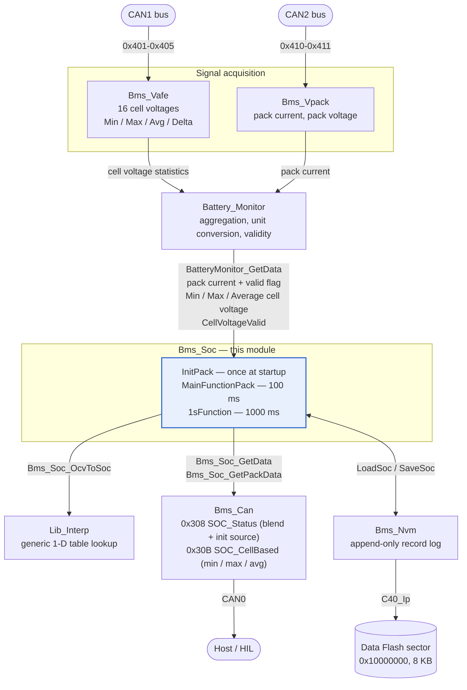
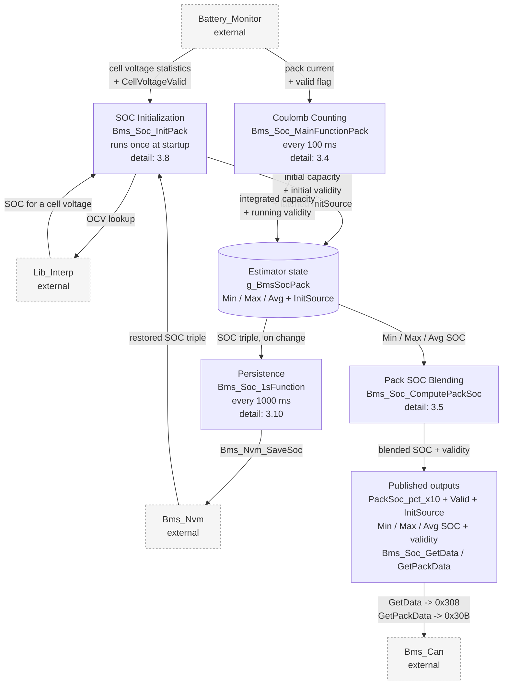
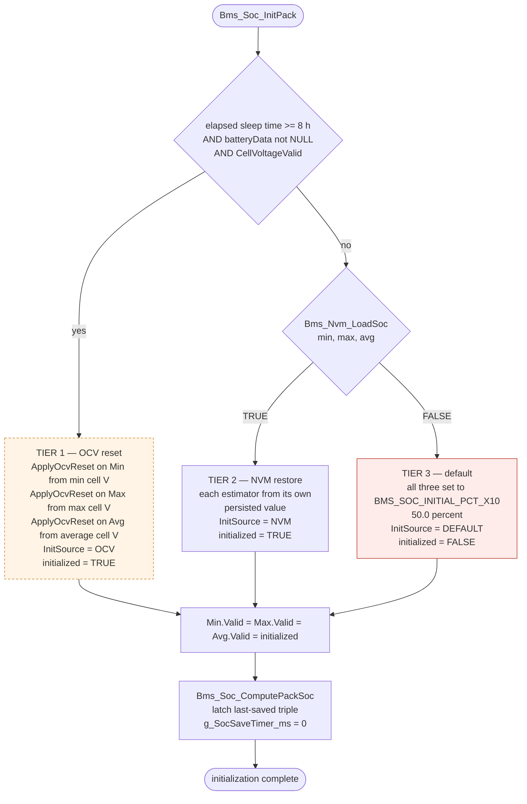
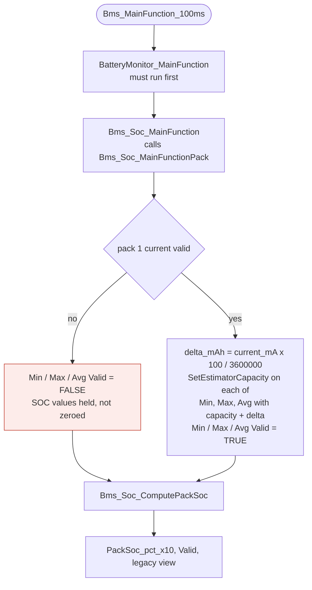
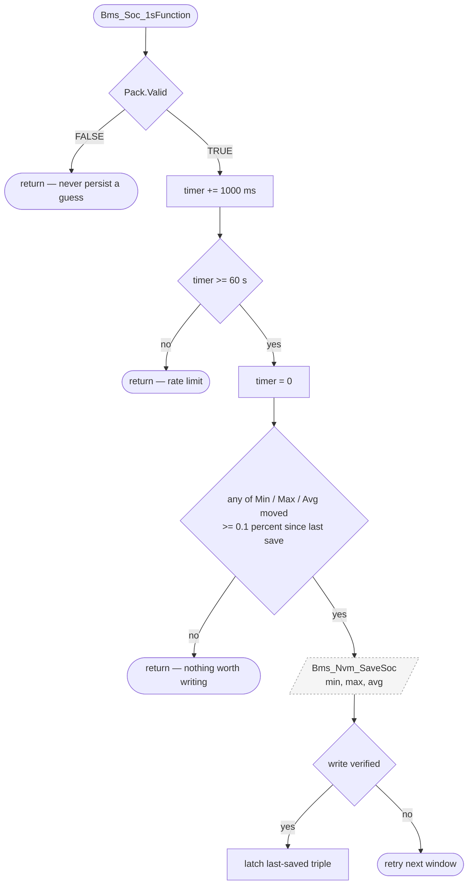

# SOC Estimation — Design Document

**Module:** `Bms_Soc` (Pack 1 State-of-Charge estimation)
**Target:** NXP S32K344, bare-metal, S32K3 RTD 7.0.1
**Status:** Implemented; validated in SIL (see §4). One open defect: §5.11
**Last updated:** 2026-09-05

---

## Contents

1. [Functional requirements](#1-functional-requirements)
2. [Functional architecture](#2-functional-architecture)
3. [Detailed design](#3-detailed-design)
4. [Validation results](#4-validation-results)
5. [Known limitations and future improvements](#5-known-limitations-and-future-improvements)
6. [Change log](#6-change-log)

---

## 1. Functional requirements

### 1.1 Scope

`Bms_Soc` estimates the state of charge of **Pack 1** and publishes a single pack-level SOC value plus three per-cell-extreme estimates. Packs 2 and 3 are out of scope: neither has current instrumentation today (`PackCurrent_mA[1]` and `[2]` are never populated).

### 1.2 Requirements

| ID | Requirement | Rationale |
|---|---|---|
| **SOC-FR-01** | The module shall estimate SOC by Coulomb counting, integrating Pack 1 current over time. | Simple, deterministic, no model identification needed. |
| **SOC-FR-02** | The module shall maintain three independent estimators — `Min` (weakest cell), `Max` (strongest cell), `Avg` (cell average). | Pack SOC must reflect cell spread, not just an aggregate. |
| **SOC-FR-03** | The module shall publish exactly one final pack SOC, `PackSoc_pct_x10`, as a weighted blend of `Min` and `Max`. | One authoritative output; no duplicate "raw vs blended" fields. |
| **SOC-FR-04** | The blend shall converge to `Min` as the pack approaches empty and to `Max` as it approaches full, with `Avg` setting the weight. | The weak cell hits the low cutoff first; the strong cell hits the high cutoff first. Reported SOC must be conservative at both ends. |
| **SOC-FR-05** | The module shall use no Kalman filter, observer, model-predictive logic, or parameterised battery model. | Matches the project's complexity budget and the available characterization data (none). |
| **SOC-FR-06** | At startup the module shall initialize the estimators from, in priority order: (1) an OCV lookup when the pack has rested long enough, (2) the last NVM-persisted values, (3) a compile-time default. | Best available reference wins; initialization must never be skipped. |
| **SOC-FR-07** | When neither OCV nor NVM is available, the estimates shall be flagged invalid. | Downstream consumers must be able to tell a real estimate from a blind guess. |
| **SOC-FR-08** | OCV correction shall be applied **only** at initialization, never during runtime operation. | Avoids a runtime rest-detector; keeps the runtime path to pure integration. |
| **SOC-FR-09** | The module shall persist the three estimator SOCs to Data Flash and restore them across a power cycle. | Coulomb counting has no absolute reference of its own. |
| **SOC-FR-10** | Persistence shall bound flash wear — the sector shall be erased at most once per full sector of records, not per write. | Data Flash endurance is a finite erase-cycle budget. |
| **SOC-FR-11** | SOC shall be reported as `uint16` in units of 0.1 %, range 0–1000, saturating at both ends. | Matches the existing CAN signal encoding. |
| **SOC-FR-12** | The estimates shall be marked invalid whenever the Pack 1 current measurement is invalid. | Integration cannot continue without a current input. |
| **SOC-FR-13** | The voltage-to-SOC interpolation shall be a reusable library function, not private to `Bms_Soc`. | Other curves (temperature derating, sensor linearization) need the same operation. |

### 1.3 Interface requirements

| ID | Requirement |
|---|---|
| **SOC-IR-01** | Pack current is consumed from `BatteryMonitor_GetData()->PackCurrent_mA[0]`, gated by `PackCurrentValid[0]`. Sign convention: **positive = charge, negative = discharge**. |
| **SOC-IR-02** | Cell voltage references are consumed from `BatteryMonitor_GetData()`: `MinCellVoltage`, `MaxCellVoltage`, `AverageCellVoltage` (float, volts), gated by `CellVoltageValid`. |
| **SOC-IR-03** | The blended pack SOC is published on CAN frame `0x308` via `Bms_Can_SendSocStatus()`, which reads `Bms_Soc_GetData()`. |
| **SOC-IR-05** | The three cell-based estimates are published on CAN frame `0x30B` via `Bms_Can_SendCellSoc()`, with a validity bit per estimator. |
| **SOC-IR-06** | The provenance of the SOC anchor is published on `0x308` as `Pack1SOCInitSource` (byte 2, bits 1-3): 0 = default/no reference, 1 = OCV reset, 2 = NVM restore. It is latched at initialization and not altered by runtime integration. |
| **SOC-IR-04** | Persistence uses `Bms_Nvm_LoadSoc()` / `Bms_Nvm_SaveSoc()`, each carrying the three SOC values. |

### 1.4 Timing requirements

| ID | Requirement |
|---|---|
| **SOC-TR-01** | The integration step shall run every 100 ms, from the scheduler's 100 ms slot, **after** `BatteryMonitor_MainFunction()`. The scheduler base tick is 10 ms (PIT0 CH0), so this is a period of 10 ticks. |
| **SOC-TR-02** | The persistence check shall run every 1000 ms (100 base ticks). |
| **SOC-TR-03** | A persistence write shall occur at most once per `BMS_SOC_SAVE_PERIOD_MS` (60 s) and only when some estimate moved by at least `BMS_SOC_SAVE_DELTA_X10` (0.1 %). |

---

## 2. Functional architecture

### 2.1 Context — external interfaces



### 2.2 Internal decomposition

Four major function blocks operate on one shared estimator state. Each block's internals are specified in §3; this level shows only the blocks and what passes between them.



| Block | Trigger | Consumes | Produces |
|---|---|---|---|
| **SOC Initialization** | once, at startup | cell voltage statistics, persisted SOC triple, OCV lookup | initial capacity and validity for all three estimators; latched `InitSource` |
| **Coulomb Counting** | 100 ms | pack current + valid flag | updated capacity and validity for all three estimators |
| **Pack SOC Blending** | after every state change | the three estimator SOCs | `PackSoc_pct_x10`, pack validity, legacy single-value view |
| **Persistence** | 1000 ms | the three estimator SOCs | a new NVM record, when rate and change gates both pass |

All four blocks reach the estimator state through a single commit function; that mechanism and the clamping it applies are described in §3.3.

### 2.3 Interface summary

**Provided (consumed by others):**

| Symbol | Type | Consumer |
|---|---|---|
| `Bms_Soc_Init()` | `void(void)` | `main.c` startup |
| `Bms_Soc_MainFunction()` | `void(void)` | scheduler, 100 ms slot |
| `Bms_Soc_1sFunction()` | `void(void)` | scheduler, 1000 ms slot |
| `Bms_Soc_GetData()` | `const Bms_Soc_DataType *` | `Bms_Can_SendSocStatus()` |
| `Bms_Soc_GetPackData()` | `const Bms_Soc_PackType *` | `Bms_Can_SendCellSoc()` (0x30B), `Bms_Can_SendSocStatus()` (init source), debug / XCP |
| `Bms_Soc_SetSoc_pct_x10()` | `void(uint16)` | external recalibration |
| `Bms_Soc_OcvToSoc()` | `uint16(uint16)` | exposed for test / debug |

**Required (consumed from others):**

| Symbol | Module | Use |
|---|---|---|
| `BatteryMonitor_GetData()` | `Battery_Monitor` | pack current + validity, cell-voltage statistics + validity |
| `Bms_Nvm_LoadSoc()` / `Bms_Nvm_SaveSoc()` | `Bms_Nvm` | persistence of the three SOCs |
| `Lib_Interp_Lookup_1D_uint16()` | `Lib_Interp` | OCV table interpolation |

### 2.4 Data ownership

| Datum | Owner | Notes |
|---|---|---|
| `CellVoltage_mV[16]`, `Min/Max/Delta/AverageCellVoltage_mV` | `Bms_Vafe` | All four statistics computed in one pass in `Bms_Vafe_UpdateStatistics()`, from one measurement snapshot. |
| `MinCellVoltage`, `MaxCellVoltage`, `AverageCellVoltage` (volts) | `Battery_Monitor` | Copied from `g_BmsVafeData` under `DataValid`; unit-converted mV → V. |
| `PackCurrent_mA[0]` | `Battery_Monitor` | Copied from `g_BmsVpackData` under `Valid`. |
| `g_BmsSocPack` (Min/Max/Avg + blend) | `Bms_Soc` | Only mutated through `Bms_Soc_SetEstimatorCapacity()`. |
| Persisted SOC record | `Bms_Nvm` | Append-only log in one Data Flash sector. |

---

## 3. Detailed design

### 3.1 Data structures

    /* One Coulomb-counting estimator. */
    typedef struct
    {
        float   RemainingCapacity_mAh;  /* integrated state                     */
        uint16  Soc_pct_x10;            /* derived, 0.1 % units, range 0-1000   */
        boolean Valid;                  /* TRUE while actively integrating      */
    } Bms_Soc_EstimatorType;

    /* Legacy single-value view; same shape, mirrors the blended pack result. */
    typedef Bms_Soc_EstimatorType Bms_Soc_DataType;

    /* Which reference the estimators were seeded from at startup.
     * Latched by Bms_Soc_InitPack(); never changed by runtime integration.
     * Published on CAN 0x308 as Pack1SOCInitSource (see 3.11). */
    typedef enum
    {
        BMS_SOC_INIT_SOURCE_DEFAULT = 0U,  /* tier 3: no reference, SOC is a guess */
        BMS_SOC_INIT_SOURCE_OCV     = 1U,  /* tier 1: relaxed cell voltage via OCV table */
        BMS_SOC_INIT_SOURCE_NVM     = 2U   /* tier 2: restored from Data Flash */
    } Bms_Soc_InitSourceType;

    /* The three estimators plus the single blended result. */
    typedef struct
    {
        Bms_Soc_EstimatorType Min;   /* seeded from the weakest cell   */
        Bms_Soc_EstimatorType Max;   /* seeded from the strongest cell */
        Bms_Soc_EstimatorType Avg;   /* seeded from the cell average   */

        uint16  PackSoc_pct_x10;         /* final blended output       */
        boolean Valid;                   /* AND of the three estimators */
        Bms_Soc_InitSourceType InitSource; /* latched at init (3.8)    */
    } Bms_Soc_PackType;

`RemainingCapacity_mAh` is the integrated state; total pack capacity is the fixed constant `BMS_SOC_PACK1_CAPACITY_MAH`. `Soc_pct_x10` is always derived from capacity, never integrated directly.

`InitSource` records which of the three initialization tiers (§3.8) seeded the estimators. It is set once, in `Bms_Soc_InitPack()`, and is deliberately not touched by the runtime path — it describes the provenance of the absolute anchor, not the current state. See §3.11 for how it is published and what `Valid == 1` combined with `InitSource == 0` means.

### 3.2 Configuration constants

| Constant | Value | Meaning |
|---|---|---|
| `BMS_SOC_PACK1_CAPACITY_MAH` | 100000 | Nominal Pack 1 capacity (100 Ah). **Placeholder** — tune to cell spec. |
| `BMS_SOC_SAMPLE_PERIOD_MS` | 100 | Integration period. Must match the scheduler slot. |
| `BMS_SOC_INITIAL_PCT_X10` | 500 | Default SOC (50.0 %) when no reference exists. |
| `BMS_SOC_MIN_PCT_X10` / `MAX` | 0 / 1000 | SOC saturation limits. |
| `BMS_SOC_SAVE_PERIOD_MS` | 60000 | Minimum interval between persistence writes. |
| `BMS_SOC_SAVE_DELTA_X10` | 1 | Minimum SOC movement (0.1 %) to justify a write. |
| `BMS_SOC_OCV_RESET_SLEEP_THRESHOLD_S` | 28800 | Off-time (8 h) above which cells are treated as relaxed. **Placeholder.** |

### 3.3 Subfunction: `Bms_Soc_SetEstimatorCapacity()`

The single point at which estimator state changes. Every other path — seeding from a known SOC, applying an OCV reset, integrating a current tick — reduces to "compute a new capacity, hand it here".

    static void Bms_Soc_SetEstimatorCapacity(
        Bms_Soc_EstimatorType *est,
        float capacity_mAh)
    {
        if (capacity_mAh < 0.0f)
        {
            capacity_mAh = 0.0f;
        }
        else if (capacity_mAh > (float)BMS_SOC_PACK1_CAPACITY_MAH)
        {
            capacity_mAh = (float)BMS_SOC_PACK1_CAPACITY_MAH;
        }
        else
        {
            /* Within range, no clamping needed. */
        }

        est->RemainingCapacity_mAh = capacity_mAh;

        est->Soc_pct_x10 = (uint16)(((capacity_mAh * 1000.0f)
                                     / (float)BMS_SOC_PACK1_CAPACITY_MAH) + 0.5f);
    }

Deliberately does **not** touch `Valid` — validity is a caller-level decision (initialization outcome vs. current availability).

The inverse direction is a one-liner used at the three SOC-seeding call sites:

    static float Bms_Soc_SocX10ToCapacity_mAh(uint16 soc_pct_x10)
    {
        return ((float)BMS_SOC_PACK1_CAPACITY_MAH * (float)soc_pct_x10) / 1000.0f;
    }

### 3.4 Subfunction: Coulomb counting (`Bms_Soc_MainFunctionPack`)

Integration law, applied identically to all three estimators:

    dt_h            = BMS_SOC_SAMPLE_PERIOD_MS / 3600000.0
    delta_mAh       = current_mA * dt_h
    capacity_mAh   += delta_mAh                  (clamped to [0, CAP])
    soc_pct_x10     = capacity_mAh * 1000 / CAP  (rounded)

    void Bms_Soc_MainFunctionPack(void)
    {
        const BatteryMonitor_DataType *batteryData = BatteryMonitor_GetData();
        sint32 current_mA;

        if ((batteryData == NULL_PTR) || (batteryData->PackCurrentValid[0] == FALSE))
        {
            g_BmsSocPack.Min.Valid = FALSE;
            g_BmsSocPack.Max.Valid = FALSE;
            g_BmsSocPack.Avg.Valid = FALSE;
            Bms_Soc_ComputePackSoc();
            return;
        }

        current_mA = batteryData->PackCurrent_mA[0];

        {
            float deltaCapacity_mAh = (float)current_mA *
                ((float)BMS_SOC_SAMPLE_PERIOD_MS / 3600000.0f);

            Bms_Soc_SetEstimatorCapacity(&g_BmsSocPack.Min,
                g_BmsSocPack.Min.RemainingCapacity_mAh + deltaCapacity_mAh);
            /* ... Max, Avg identically ... */
        }

        g_BmsSocPack.Min.Valid = TRUE;   /* ... Max, Avg ... */

        Bms_Soc_ComputePackSoc();
    }

**Sign convention** is positive = charge, negative = discharge. This is confirmed against the over-current fault thresholds in `Battery_Monitor.c` (`BMS_PACK_CHARGE_OC_SET_MA` = `+80000`, `BMS_PACK_DISCHARGE_OC_SET_MA` = `-100000`). The `PackCurrent_mA` field comment in `Battery_Monitor.h` previously stated the opposite; that stale comment was corrected — see §6.

### 3.5 Subfunction: pack blend (`Bms_Soc_ComputePackSoc`)

`Avg` is used **only to set the blend weight**, not as a value that is itself blended in. The result is a weighted average of `Min` and `Max` whose weights shift with overall charge level.

    weightMax_x10 = Avg.Soc_pct_x10;              /* 0..1000 */
    weightMin_x10 = 1000 - weightMax_x10;

    PackSoc_pct_x10 = (Min.Soc_pct_x10 * weightMin_x10 +
                       Max.Soc_pct_x10 * weightMax_x10) / 1000;

Equivalent continuous form, with `w = soc_avg / 100`:

    PackSoc = soc_min * (1 - w) + soc_max * w

Behaviour:

| Condition | Result |
|---|---|
| `Avg == 0` (empty) | `PackSoc == Min` — the weak cell governs |
| `Avg == 1000` (full) | `PackSoc == Max` — the strong cell governs |
| in between | straight-line blend |

Worked example: `Min = 30 %`, `Max = 80 %`, `Avg = 55 %` → `w = 0.55` →
`30 × 0.45 + 80 × 0.55 = 13.5 + 44.0 = 57.5 %`.

No division by `(Max − Min)` is involved, so there is no divide-by-zero case when the estimators coincide. Arithmetic worst case is `1000 × 1000 + 1000 × 1000 = 2 000 000`, well inside `uint32`.

The same function derives pack validity (`Min && Max && Avg`) and refreshes `g_BmsSocData`, the legacy single-value view the CAN frame reads.

### 3.6 Subfunction: OCV lookup

The OCV curve is a plain 2-column `uint16` array — column 0 is cell voltage in mV, column 1 is SOC in 0.1 % units. No dedicated point type is defined.

    static const uint16 g_BmsSocOcvTable[][2] =
    {
        { 3000U,    0U },
        { 3300U,  200U },
        { 3450U,  500U },
        { 3600U,  800U },
        { 3700U,  900U },
        { 3900U, 1000U }
    };

    uint16 Bms_Soc_OcvToSoc(uint16 voltage_mV)
    {
        return Lib_Interp_Lookup_1D_uint16(
            g_BmsSocOcvTable,
            (uint16)BMS_SOC_OCV_TABLE_SIZE,
            voltage_mV);
    }

> **This table is a placeholder.** It has not been characterized against the actual cell chemistry, and its resolution is coarse in the mid-range (3450 → 3600 mV spans 50 % → 80 % in one segment). For an LFP-like flat curve it would be unusable as-is. See §5.

Voltages outside the table are **clamped** to the nearest end point, not rejected: a cell sitting just past either end genuinely is near 0 % or 100 %.

### 3.7 Shared library: `Lib_Interp`

Located at `src/common/Lib_Interp.{h,c}` — a new module with no dependency on `Bms_Soc` or any battery concept.

    uint16 Lib_Interp_Lookup_1D_uint16(
        const uint16 table[][2],   /* [i][0] = X, [i][1] = Y, sorted ascending by X */
        uint16 tableSize,
        uint16 x);

Contract:

- The table must be sorted ascending by X and hold at least one row (caller responsibility; a `NULL` table or zero size returns 0).
- `x` at or below the first row returns that row's Y; at or above the last row returns that row's Y. **The function never extrapolates and never signals out-of-range** — callers needing that distinction must compare against the end points themselves.
- Otherwise the bracketing pair is found by linear scan and Y is linearly interpolated.
- Y is **not** required to increase with X (a derating or NTC curve falls), so the span is taken as a magnitude with the direction applied afterwards. Worst case `65535 × 65535` still fits `uint32`.

Linear scan rather than binary search is intentional — these tables hold single digits to low dozens of rows.

### 3.8 Flow: initialization sequence

`Bms_Soc_Init()` → `Bms_Soc_InitPack()`. Three sources are tried in strict priority; the first that succeeds wins and the rest are skipped.



> In the diagram, **TIER 1 is shown dashed because it is unreachable today** and **TIER 3 red because it produces an invalid estimate**.

Tiers 1 and 2 leave the estimates **valid**; only tier 3 flags them **invalid** (`Valid == FALSE`), so a blind 50 % start is distinguishable from a real reference.

> **Tier 1 does not fire today.** `Bms_Soc_GetElapsedSleepTime_s()` is hardcoded to `0` (§5.2), and independently `CellVoltageValid` is `FALSE` this early in startup because cell voltages arrive over CAN from the vAFE. Every boot therefore lands on tier 2, or tier 3 when flash holds nothing valid.

### 3.9 Flow: 100 ms update



On invalid current the last computed SOC values are **held** (not zeroed) and only the validity flags drop — matching the pre-existing behaviour.

### 3.10 Flow: persistence (1 s slot)



Because tier-3 initialization leaves `Pack.Valid == FALSE`, a blind 50 % start is never written to flash — persistence only resumes once the estimates are genuinely being tracked.

### 3.11 Published CAN signals

Two frames carry SOC on CAN0 (host bus), both sent from the 100 ms task.

**`0x308` SOC_Status** — the pack-level result:

| Bits | Signal | Encoding |
|---|---|---|
| 0-15 | `Pack1SOC` | uint16, 0.1 %/bit, 0-1000 |
| 16 | `Pack1SOCValid` | 1 = the estimate is being integrated |
| 17-19 | `Pack1SOCInitSource` | 0 = default/no reference, 1 = OCV reset, 2 = NVM restore |
| 20-55 | reserved | |
| 56-59 | `SOCAliveCounter` | 4-bit rolling |

`Pack1SOCInitSource` reports how the estimators were **seeded** (§3.8), not the
current state. It is latched once by `Bms_Soc_InitPack()` and deliberately not
recomputed as the counter integrates, because what a consumer needs is the
provenance of the absolute anchor. `0` means the SOC is anchored to a
compile-time guess with no reference behind it.

The two byte-2 signals must be read together:

| `Pack1SOCValid` | `Pack1SOCInitSource` | Meaning |
|---|---|---|
| 0 | 0 | tier-3 boot, no reference, not integrating — do not use |
| 1 | 1 or 2 | seeded from an OCV or NVM anchor and currently integrating — trust the absolute value |
| 0 | 1 or 2 | good anchor, but pack current is currently unreadable — last value is held (§3.9), still trustworthy as a recent absolute |
| 1 | 0 | integrating from a blind 50 % start (tier 3, then a valid current tick flipped `Valid`) — trust the trend, not the absolute value |

The `Valid == 1, InitSource == 0` row is reachable only on a device's first-ever
run before any record has been persisted, or after a full flash erase / record
corruption (§5.7). Every normal boot restores from NVM, so it is `InitSource == 2`.

**`0x30B` SOC_CellBased** — the three per-cell-extreme estimates:

| Bits | Signal | Encoding |
|---|---|---|
| 0-15 | `Pack1SOCMin` | weakest cell, uint16, 0.1 %/bit |
| 16-31 | `Pack1SOCMax` | strongest cell, uint16, 0.1 %/bit |
| 32-47 | `Pack1SOCAvg` | cell average, uint16, 0.1 %/bit |
| 48 / 49 / 50 | `Pack1SOCMin/Max/AvgValid` | per-estimator validity |
| 56-59 | `CellSOCAliveCounter` | 4-bit rolling |

A separate frame is used rather than extending `0x308` because three `uint16`
estimates need six bytes and `0x308` has only four whole bytes free. Adding
`Pack1SOCInitSource` in `0x308`'s spare byte-2 bits leaves every pre-existing
signal at its original bit position, so the change is backward compatible for
existing consumers.

> Until the estimators can diverge (§5.1), all three signals on `0x30B` carry the
> same value as `Pack1SOC`. The frame is the interface for when they can.

### 3.12 Persistence format (`Bms_Nvm`)

**Append-only log** in one 8 KB Data Flash sector at `0x10000000` (`C40_DATA_ARRAY_0_BLOCK_4_S000`). Each save writes a new 24-byte record into fresh erased space; nothing is overwritten in place, because NOR flash can only clear bits within already-erased space and erase granularity is a whole sector.

    typedef struct
    {
        uint32 Magic;             /* @0   "SOC2" = 0x534F4332            */
        uint32 Sequence;          /* @4   monotonic; highest = newest    */
        uint16 SocMin_pct_x10;    /* @8                                  */
        uint16 SocMax_pct_x10;    /* @10                                 */
        uint16 SocAvg_pct_x10;    /* @12                                 */
        uint16 Reserved;          /* @14                                 */
        uint32 Checksum;          /* @16  XOR of magic/seq/3 SOCs/salt   */
        uint32 Reserved2;         /* @20                                 */
    } Bms_NvmSocRecordType;       /* 24 bytes                            */

24 bytes is required to be a multiple of 8: `C40_Ip_MainInterfaceWrite` documents its length as "aligned with 8 bytes, maximum 128 bytes". 8192 / 24 = **341 records per sector fill**.

| Operation | Behaviour |
|---|---|
| `Bms_Nvm_Init()` | Scans records; first erased slot becomes the write pointer, highest sequence + 1 becomes the next sequence. No erased slot found ⇒ sector full, pointer set past the end. |
| `Bms_Nvm_LoadSoc()` | Scans and returns the three SOCs from the valid record with the highest sequence. |
| `Bms_Nvm_SaveSoc()` | If the next record would not fit, erases the sector and wraps to the base; then writes, polls to completion, and reads back to verify. |

**Erase-and-wrap.** The values being written at wrap time are by definition the newest (the caller only saves on a real change), so nothing from the old sector contents needs carrying over — erase, then write the incoming values at the base address. `Sequence` keeps climbing across the wrap, so the post-wrap record remains the highest and is still identified as newest on the next boot. `uint32` will not exhaust in any realistic lifetime.

**Wear.** One sector erase per 341 saves. Worst case is one save per 60 s under continuous load (0.1 % of 100 Ah = 100 mAh, which any current above ~6 A accumulates in 60 s), i.e. one erase per ~5.7 h. Against a ~100k erase-cycle rating that is on the order of **65 years** of nonstop worst-case writing.

---

## 4. Validation results

**Platform:** SIL — the application layer compiled natively (MinGW-w64 GCC 16.1.0,
same `-std=c99` dialect and warning set as the ARM build) and driven from Python
via ctypes. See [sil/README.md](../../sil/README.md).

**Status:** 41 passed, 1 skipped, 1 xfail (a live defect, see §5.11).
Full suite runs in ~1 s. Reproduce with:

```bash
python sil/build.py && cd sil && python -m pytest
```

**Per-case detail — objective, full procedure, result, duration, evidence and
requirement trace — is in the generated reports**, one per feature:

| Component | Test module | Report |
|---|---|---|
| **SOC** — estimation (SA-\*), initialization (IT-\*), signal chain (CH-\*) | `test_soc.py` | [reports/soc.md](../../sil/reports/soc.md) |
| `Bms_Nvm` — persistence (PS-\*) | `test_persistence.py` | [reports/persistence.md](../../sil/reports/persistence.md) |
| `Lib_Interp` — table interpolation (LI-\*) | `test_lib_interp.py` | [reports/lib_interp.md](../../sil/reports/lib_interp.md) |

Roll-up index: [sil/TEST_REPORT.md](../../sil/TEST_REPORT.md).

Those reports are regenerated from the executed tests on every run (procedure
extracted from the test source, results from the run itself), so they cannot
drift from what the suite actually does. They also record the execution
environment: host compiler version, library build timestamp and repo commit. The
tables below are a hand-maintained summary; the reports are the authoritative
record.

These are integration tests, not unit tests: stimulus enters as real CAN frames
through the production vAFE / vPACK decoders and flows through `Battery_Monitor`
into `Bms_Soc`, with persistence landing in a Data Flash model that enforces
genuine NOR semantics. A case named for a SOC behaviour will therefore also fail
if an upstream decoder or a downstream flash write regresses.

### 4.1 Unit-level — `Lib_Interp_Lookup_1D_uint16`

| ID | Case | Expected | Result |
|---|---|---|---|
| LI-01 | `x` below first row | returns first row's Y (clamped) | **PASS** |
| LI-02 | `x` above last row | returns last row's Y (clamped) | **PASS** |
| LI-03 | `x` exactly on a breakpoint | returns that row's Y exactly | **PASS** (all 6 breakpoints) |
| LI-04 | `x` midway between two rows | linear interpolation, correct rounding | **PASS** |
| LI-05 | Descending-Y table | interpolates downward without underflow | **PASS** |
| LI-06 | `tableSize == 1` | returns the single row's Y for any `x` | **PASS** |
| LI-07 | `NULL` table / `tableSize == 0` | returns 0, no fault | **PASS** |
| LI-08 | Max-span table (0 → 65535 both axes) | no `uint32` overflow | **PASS** |

### 4.2 Unit-level — SOC arithmetic

| ID | Case | Expected | Result |
|---|---|---|---|
| SA-01 | Blend with `Avg = 0` | `PackSoc == Min` | **PASS (formula only)** — see note |
| SA-02 | Blend with `Avg = 1000` | `PackSoc == Max` | **PASS (formula only)** — see note |
| SA-03 | Blend `Min=300, Max=800, Avg=550` | `PackSoc == 575` (57.5 %) | **PASS (formula only)** — see note |
| SA-04 | Blend with `Min == Max` | `PackSoc == Min`, no divide-by-zero | **PASS (formula only)** — see note |
| SA-05 | Capacity clamp low | saturates at 0 %, no wrap | **PASS** |
| SA-06 | Capacity clamp high | saturates at 100 % | **PASS** |
| SA-07 | `SetSoc_pct_x10(1500)` | clamps to 1000 | **PASS** |
| SA-08 | Charge/discharge sign | positive raises SOC, negative lowers | **PASS** |
| SA-09 | 1 C discharge for 1 h from 100 % | ends near 0 % | **PASS** (within 0.5 %) |
| — | Integrated charge vs. hand calculation | matches `I × dt` to 0.1 % | **PASS** |

> **Note on SA-01..04.** The blend's *non-degenerate* behaviour is not reachable
> end-to-end: `Min`, `Max` and `Avg` are identical in every reachable state
> (§5.1). Those four rows are therefore checked against a Python mirror of the
> §3.5 formula, and the degenerate path (`Min == Max == Avg`) is checked through
> the C. `test_blend_divergence_is_unreachable` asserts the estimators stay
> identical, so it fails — prompting real coverage — the moment divergence
> becomes possible.

### 4.3 Integration — initialization tiers

| ID | Case | Expected | Result |
|---|---|---|---|
| IT-01 | Flash holds a valid record | tier 2; three estimators restored individually; `Valid == TRUE` | **PASS** |
| IT-02 | Flash erased / no valid record | tier 3; all three at 50.0 %; `Valid == FALSE` | **PASS** |
| IT-03 | Flash holds old `"SOC1"` records | treated as no valid record ⇒ tier 3 for one boot | **PASS** |
| IT-04 | Tier 1 forced (OCV reset) | OCV reset applied; NVM skipped | **SKIPPED** — unreachable, §5.2 |
| IT-05 | Tier 3 then first valid current tick | `Valid` transitions to `TRUE` | **PASS** |
| IT-06 | Tier 3 start, no current | nothing written to flash | **PASS** |
| IT-07 | `InitSource` after 10 min of integration | still reports the seeding tier, not the running state | **PASS** |
| IT-08 | `InitSource` range | every value fits the 3-bit `Pack1SOCInitSource` field on `0x308` | **PASS** |

### 4.4 Integration — persistence

| ID | Case | Expected | Result |
|---|---|---|---|
| PS-01 | SOC static for 10 min | no flash write (delta gate) | **PASS** |
| PS-02 | SOC moving under load | one write per 60 s | **PASS** (5 writes in 5 min) |
| PS-03 | Power cycle after a write | restored values match what was saved | **PASS** |
| PS-04 | 341 writes | sector erases and wraps; newest record readable after | **PASS** |
| PS-05 | Read-back verify failure | `Bms_Nvm_SaveSoc()` returns `FALSE`; pointer not advanced | **PASS** |
| PS-06 | Power loss during erase→first-write window | next boot falls back cleanly, no torn record accepted | **PASS** |

### 4.5 Integration — signal chain / upstream coupling

| ID | Case | Expected | Result |
|---|---|---|---|
| CH-01 | `PackCurrentValid[0]` drops | all three `Valid` drop; SOC values held | **PASS** |
| CH-02 | Frame `0x308` payload | bytes 0–1 = `PackSoc_pct_x10`, byte 2 bit 0 = valid | *not covered* — `Bms_Can` outside the SOC slice |
| CH-03 | vAFE average vs. manual mean of 16 cells | matches within rounding | **PASS** |
| CH-04 | 100 ms task jitter | integration scale still matches wall-clock charge | *not covered* — harness time is exact by construction |
| — | Single alive-counter glitch | chain resyncs after one cycle | **PASS** |
| — | **Stuck alive counter** | stale current must be invalidated | **XFAIL — live defect, §5.11** |

### 4.6 Not covered by SIL

Cell-chemistry OCV accuracy, real capacity fade, and true flash endurance
require bench/HIL work on real hardware with characterized cells. Host floating
point is IEEE-754 single precision as on the Cortex-M7 FPU, but the two are not
bit-verified against each other; numeric assertions use tolerances where that
matters.

## 5. Known limitations and future improvements

### 5.1 The three estimators cannot currently diverge

**Limitation.** All three estimators integrate the *same* `PackCurrent_mA[0]` against the *same* `BMS_SOC_PACK1_CAPACITY_MAH`, so they receive identical increments. The only thing that can separate them is the OCV reset seeding them from different voltages at boot — and that path does not fire (§5.2). In the present configuration `soc_min == soc_avg == soc_max` at all times, and `PackSoc_pct_x10` equals the single value the pre-existing implementation produced.

The runtime path deliberately does not read cell voltages at all, so imbalance developing *during* operation never reaches the estimators. Even with OCV enabled, the three would differ only by a constant offset frozen at boot.

**This is intentional scaffolding** — the structure, the blend, and the OCV path become meaningful once a sleep-time source lands.

**Improvement.** Making them genuinely diverge under load requires per-estimator capacity constants (a weak cell holds less charge, so the same current moves its SOC faster): `dSOC = dQ / C_est` with `C_min < C_avg < C_max`. That needs per-cell capacity characterization data this project does not have.

### 5.2 OCV reset is unreachable — two independent blockers

**Blocker A — no sleep-time source.** `Bms_Soc_GetElapsedSleepTime_s()` is hardcoded to return `0`, so the threshold is never met. Nothing in the firmware measures off-time: the NVM record carries no timestamp and there is no RTC in use. Resolving this needs one of:

- an RTC (the S32K344 has one on-chip) on a supply that survives power-off, so elapsed time is `currentRtcTime − lastSavedTimestamp`. The record has a spare `Reserved` (16-bit) and `Reserved2` (32-bit) that could carry a seconds-resolution timestamp without regrowing it — though the magic would need bumping again.
- some other signal that at least separates "long off" from "brief reset" (supercap/keep-alive circuit, ignition-line timer, wake-reason register).

**Blocker B — cell voltages are not available at init time.** `Bms_Soc_Init()` runs during startup, but cell voltages arrive over CAN from the vAFE and only become valid after a complete measurement cycle. `CellVoltageValid` is `FALSE` at that point. Enabling OCV reset therefore also requires **deferring** it to the first complete vAFE measurement — e.g. a one-shot "OCV reset pending" flag consumed by `Bms_Soc_MainFunctionPack()` — not merely making the sleep-time function return a real value.

### 5.3 OCV table is not characterized

The six-point curve in §3.6 is a placeholder. It is coarse where it matters most (3450 → 3600 mV covers 50 % → 80 % in a single segment), and for a flat-curve chemistry such as LFP that region would be unusable for SOC inference. Replace with measured OCV-vs-SOC data, with denser breakpoints through the flat region, before trusting any OCV-derived value. Temperature dependence of OCV is not modelled at all.

### 5.4 Pack capacity is a placeholder

`BMS_SOC_PACK1_CAPACITY_MAH = 100000` (100 Ah) is a guess and directly scales every SOC number. It is also fixed — no capacity fade, no temperature or current derating.

### 5.5 Pack 1 only

Packs 2 and 3 have no current instrumentation (`PackCurrent_mA[1]`/`[2]` are read by the CAN layer but never written), and the cell-voltage set is a single flat 16-cell array with no per-pack decomposition. Extending SOC to packs 2 and 3 is blocked on sensing, not on this module.

### 5.6 Float precision floor at low current

`RemainingCapacity_mAh` is `float32`. Near full capacity (100 000 mAh) one ULP is ≈ 0.0078 mAh, while one 100 ms tick contributes `I × 2.78e-5` mAh. Currents below roughly **280 mA** therefore round to zero and are systematically lost rather than averaged in; near 50 % the floor is about 140 mA. Standby/quiescent drain is invisible to the counter. Mitigations if this matters: accumulate in `double`, accumulate a residual, or integrate at a coarser SOC scale.

### 5.7 Validity semantics after a tier-3 start

A tier-3 (blind default) start flags the estimates invalid, but the flag is not sticky: the first 100 ms tick with valid pack current sets all three back to `Valid == TRUE`, on the basis that coulomb counting is then tracking real charge movement even though the absolute starting point was a guess. If a blind start should stay flagged until a real OCV or NVM reference appears, `Bms_Soc_MainFunctionPack()` needs a separate "properly initialized" flag rather than setting `Valid = TRUE` unconditionally.

### 5.8 Flash erase blocks the caller

`Bms_Nvm_SaveSoc()` polls the sector erase to completion inline, stalling the 1 s task for tens of milliseconds on the one save in 341 that triggers a wrap. Consistent with the module's existing synchronous write path, but it is a scheduling spike. A non-blocking state machine would remove it.

### 5.9 Power loss during the erase→first-write window

If power is lost between the sector erase and the first record write, the sector is left empty and the next boot falls to tier 3. The counter re-converges, but the persisted history is gone. Inherent to a single-sector wrap; a two-sector ping-pong scheme would close it.

### 5.10 Other

- **Blend semantics are a design choice, not a derived result.** The `Min`/`Max` weighting by `Avg` is a defined behaviour (SOC-FR-04), not something validated against ground-truth SOC.
- **No SOC accuracy budget** has been stated. There is no requirement of the form "SOC shall be within ±X % under conditions Y" to validate against.
- **Blend is not rate-limited.** Nothing damps a step change in `PackSoc_pct_x10` if the estimators are re-seeded.

### 5.11 DEFECT: a stuck vPACK alive counter does not invalidate pack current

**Found by SIL, 2026-09-05.** Not a limitation of the design — a bug in the
implementation, in `Battery_Monitor`, surfaced by the SOC test suite.

[Battery_Monitor.c:286](Battery_Monitor.c:286) sets the validity flag
and copies the data under **different** gates:

```c
g_BatteryData.PackCurrentValid[0] = g_BmsVpackData.CurrentValid;   /* frame arrival only */

if (g_BmsVpackData.Valid == TRUE)        /* CurrentValid && VoltageValid && AliveValid */
{
    g_BatteryData.PackCurrent_mA[0] = g_BmsVpackData.PackCurrent_mA;
    ...
}
```

When the vPACK transmitter sticks — frames keep arriving, but the alive counter
stops advancing — `AliveValid` goes `FALSE`, so `Valid` goes `FALSE` and the
current is **never updated again**. But `CurrentValid` stays `TRUE` (frames *are*
arriving), so `PackCurrentValid[0]` stays `TRUE`, and `Bms_Soc_MainFunctionPack()`
keeps integrating the frozen value while advertising the SOC as valid.

Reproduced in SIL: pack discharging at 100 A when the counter sticks; frames then
report 0 A for a simulated hour. SOC fell 49.9 % → 0.0 % on a pack that was at
rest, `soc_valid` `TRUE` throughout.

The alive counter exists precisely to detect a stalled transmitter, so the
failure it is meant to catch is currently the one it does not act on.

Candidate fix — gate the flag on the same condition as the data:

```c
g_BatteryData.PackCurrentValid[0] = g_BmsVpackData.Valid;
```

That needs a deliberate decision rather than a blind edit: `VpackCurrentValid`
(line 271) and the pack-power validity (line 327) read the same signals, and
`Bms_Can` publishes some of them, so the blast radius should be reviewed. Covered
by `test_CH_stuck_alive_counter_must_invalidate_current`, marked `xfail(strict=True)`
so it flips to a failure the moment the defect is fixed.

---

## 6. Change log

| Date | Change | Rationale |
|---|---|---|
| 2026-09-05 | **Document restructured** into requirements / architecture / detailed design / validation / limitations / change log. | Previous structure was a linear design narrative that had accumulated revision history inline; it no longer matched the implementation. |
| 2026-09-05 | `Bms_Nvm` — added **erase-and-wrap** when the sector is full. | Previously `Bms_Nvm_SaveSoc()` simply returned `FALSE` forever once full (~341 writes, ≈5.7 h of active operation), silently ending persistence. |
| 2026-09-05 | `Bms_Nvm` — fixed sector-full boundary check to test whether the *next record fits* rather than whether the pointer is past the end. | With 24-byte records 8192 does not divide evenly; the old `>=` test would have allowed one write to run 16 bytes past the sector. Latent only after the record grew. |
| 2026-09-05 | `Bms_Nvm` — record now stores **three SOCs** (min/max/avg); grew 16 → 24 bytes; magic `"SOC1"` → `"SOC2"`. | Each estimator needs its own persisted value, otherwise the triple collapses on every power cycle. |
| 2026-09-05 | `Bms_Soc_InitPack()` restructured into a strict **3-tier priority chain** (OCV → NVM → default+invalid). | Replaces "seed from NVM, then override per-estimator with OCV"; makes the fallback order explicit and flags a blind start. |
| 2026-09-05 | `Bms_Soc_ApplyOcvReset()` now **clamps** an out-of-range voltage instead of rejecting it; returns `void`. | A cell just past either end of the table is genuinely near 0 % / 100 %; clamping is the correct answer, not a reason to fall back. |
| 2026-09-05 | Merged `Bms_Soc_SetEstimator_pct_x10()` and `Bms_Soc_UpdateEstimator()` into **`Bms_Soc_SetEstimatorCapacity()`**. | Both reduce to "commit a capacity value"; one commit point removes the duplicated clamp/derive logic. |
| 2026-09-05 | `Lib_Interp` — dropped `Lib_Interp_PointType`; the table is now a built-in `const uint16 [][2]`. | Avoids putting a type in a public header for what a 2-column array expresses directly. |
| 2026-09-05 | `Lib_Interp` — renamed `Bms_Interp_Lookup` → **`Lib_Interp_Lookup_1D_uint16`**. | House convention: `Lib` + function + dimension + datatype. |
| 2026-09-05 | Created **`src/common/Lib_Interp`** as a shared module; wired into both build configurations. | The bracket-and-interpolate operation is generic (SOC-FR-13); it does not belong inside `Bms_Soc.c`. |
| 2026-09-05 | Average cell voltage computed in **`Bms_Vafe_UpdateStatistics()`** alongside min/max, propagated through `Battery_Monitor`. | Keeps all three cell statistics on one measurement snapshot; a downstream re-derivation could observe a different vAFE cycle. |
| 2026-09-05 | Corrected the `PackCurrent_mA` sign-convention comment in `Battery_Monitor.h`. | It said "positive = discharge", contradicting both `Bms_Soc` and the over-current thresholds in `Battery_Monitor.c` (`CHARGE_OC = +80000`, `DISCHARGE_OC = -100000`). The comment was wrong, not the code. |
| 2026-09-05 | Blend formula corrected: weighted average of `Min`/`Max` weighted by `Avg`'s position in 0–100 %. | The original §8 C snippet added `soc_min_x10` to a normalized fraction and disagreed with the document's own worked example (produced 80 %, example claimed 50 %). The normalized-position formula it implied was also not a charge-level measure. |
| 2026-09-05 | Three-estimator structure (`Min`/`Max`/`Avg`) + blended `PackSoc_pct_x10` implemented; legacy `Bms_Soc_Init/MainFunction/1sFunction/GetData` preserved as the outer layer. | `Bms_Can.c` and `main.c` required no changes. |
| 2026-09-05 | **SIL platform brought up** (`sil/`): application layer compiled natively, driven from Python, 39 tests green. §4 replaced with real results. | Closes the validation gap that §4 previously only described. |
| 2026-09-05 | Added auto-generated per-case test reports covering procedure, result, evidence, environment and requirement trace. | §4's tables were hand-typed from a run and would drift; the reports are derived from the tests themselves. |
| 2026-09-05 | Added CAN `0x30B` (`SOC_CellBased`) carrying the min/max/avg estimates with per-estimator validity, and `Pack1SOCInitSource` on `0x308` byte 2 bits 1-3. DBC updated. | The cell-based estimates and the provenance of the SOC anchor were computed but never published. |
| 2026-09-05 | `Bms_Soc_PackType` gained `InitSource`, latched by `Bms_Soc_InitPack()` in all three tiers. | Required to publish SOC-IR-06; the module previously discarded which tier it took. |
| 2026-09-05 | Split the suite and its reports by component: `test_soc.py` (the SOC feature), `test_persistence.py` (`Bms_Nvm`) and `test_lib_interp.py` (`Lib_Interp`), one report each under `sil/reports/` with `sil/TEST_REPORT.md` as the index. | A single 500-line test file and 923-line report do not scale; splitting on component boundaries keeps SOC cases together while letting the two standalone components be read on their own. |
| 2026-09-05 | Recorded §5.11 — a stuck vPACK alive counter leaves pack current flagged valid while frozen. Found by the SIL suite, not yet fixed. | The alive counter's whole purpose is detecting a stalled transmitter; today that is the one failure it does not act on. |
| (earlier) | Initial SOC design document — single-estimator Coulomb counting with OCV reset. | Baseline. |
