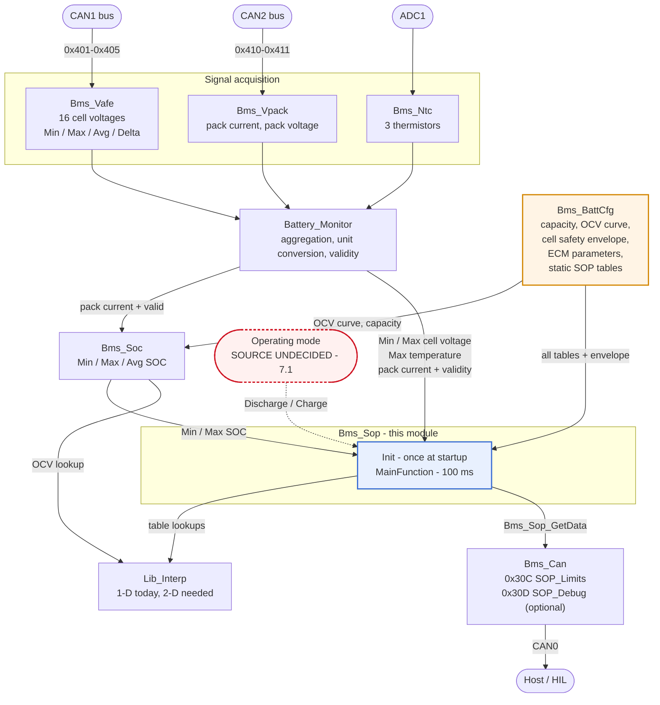
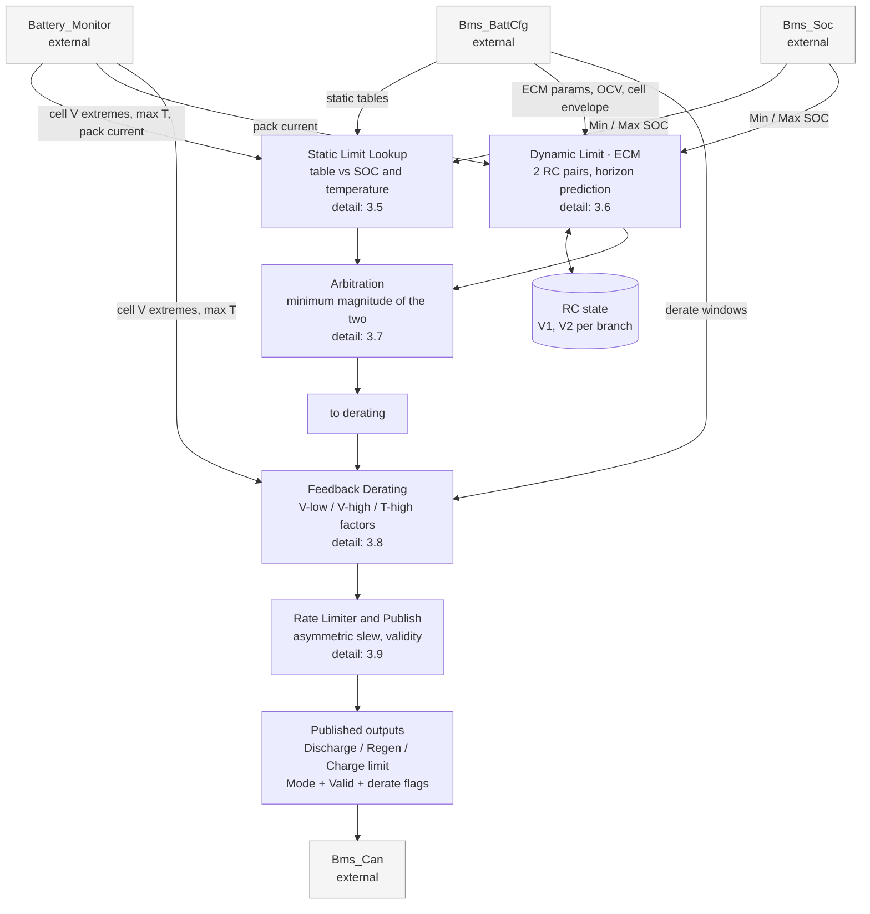
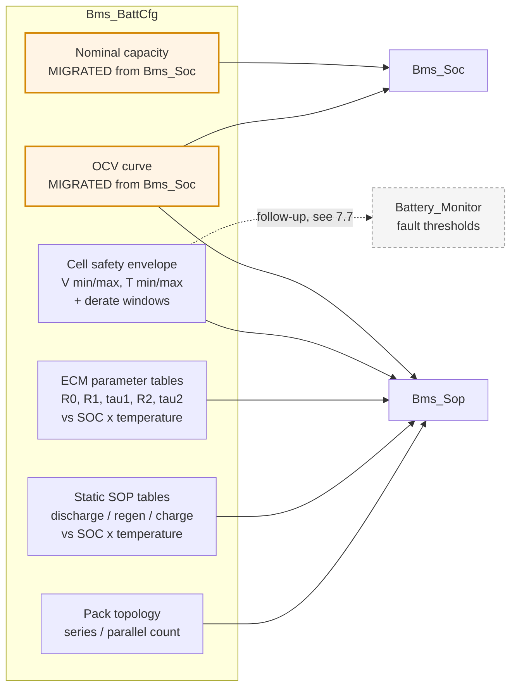
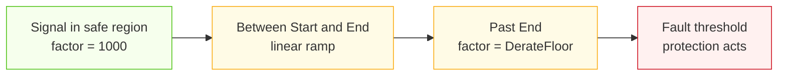
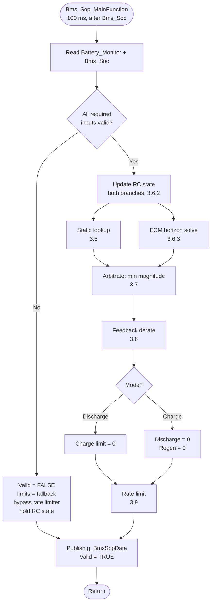
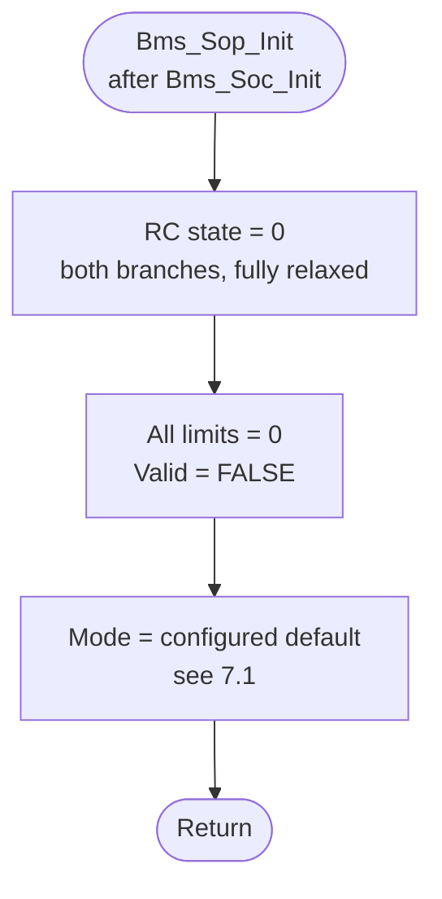

# SOP Estimation: Design Document

Modules: `Bms_Sop` (Pack 1 state of power, meaning the current limits), `Bms_BattCfg` (shared battery data configuration).
Target: NXP S32K344, bare metal, S32K3 RTD 7.0.1.
Status: Draft for review. Not implemented yet. Nine decisions need your answer before coding starts. See section 7.
Last updated: 2026-09-08.

State of power (SOP) is the largest current the pack can carry right now without breaking a cell limit.

This document follows the `simple-english` writing rules.

---

## Contents

1. [Functional requirements](#1-functional-requirements)
2. [Functional architecture](#2-functional-architecture)
3. [Detailed design](#3-detailed-design)
4. [Validation plan](#4-validation-plan)
5. [Known limitations and future improvements](#5-known-limitations-and-future-improvements)
6. [Change log](#6-change-log)
7. [Open questions for review](#7-open-questions-for-review)

---

## 1. Functional requirements

### 1.1 Scope

This design has two deliverables. The second one exists to serve the first.

`Bms_Sop` computes the current limits for Pack 1. It produces a discharge limit, a regenerative braking limit, and a charge limit. Regenerative braking is the mode where the motor pushes current back into the pack. Packs 2 and 3 are out of scope. They have no current sensor, so `PackCurrent_mA[1]` and `PackCurrent_mA[2]` are never written. This is the same limit that applies to `Bms_Soc`.

`Bms_BattCfg` is a new battery data configuration module. It is the single owner of every cell constant and pack constant in the firmware. That set is the capacity, the open-circuit-voltage curve, the cell safety envelope, the equivalent-circuit-model parameters, and the static SOP limit tables. Open-circuit voltage (OCV) is the cell voltage after a long rest. The equivalent circuit model (ECM) is a small electrical model of one cell. The cell safety envelope is the voltage band and temperature band the cell must stay inside. `Bms_BattCfg` holds data and read functions only. It has no algorithm, no state, and no runtime input.

The OCV table and the pack capacity live inside `Bms_Soc.c` today. They move into `Bms_BattCfg`. This move is a refactor that keeps behavior the same. The numbers do not change. The SOC results do not change. The current SIL test suite passes with no test edits. SIL means software in the loop, the host build that runs the firmware logic on a PC.

Out of scope:

- State of health.
- Capacity fade.
- Cell balancing.
- Power limits in watts.
- Any limit published in a unit other than current.
- Any limit for Pack 2 or Pack 3.

### 1.2 Requirements: `Bms_Sop`

| ID | Requirement | Rationale |
|---|---|---|
| SOP-FR-01 | The module shall compute current limits in two operating modes: Discharge (not charging) and Charge. | A charger attached and a load drawing current do not share one safe current band. |
| SOP-FR-02 | In Discharge mode the module shall produce a discharge limit and a regenerative braking limit. In Charge mode it shall produce a charge limit. | These are the three limits the consumer needs. |
| SOP-FR-03 | The module shall publish all three limit fields in every mode. It shall force the fields that do not apply to the active mode to zero. It shall publish an explicit mode signal. | A consumer must never guess which fields are live from the mode. A zero is clear. A stale value is not. |
| SOP-FR-04 | The module shall compute each limit by two independent paths: a static lookup table and a dynamic equivalent-circuit-model prediction. The published limit shall be the smaller of the two magnitudes. | The table holds datasheet and validation limits the model does not know. The model catches fast conditions the table cannot hold. The module trusts neither one alone. |
| SOP-FR-05 | The dynamic path shall use an equivalent circuit model with one series resistance and two parallel resistor-capacitor pairs. | Two pairs cover the fast charge-transfer response and the slow diffusion response over a horizon of several seconds. One pair reads the polarization too low and reads the limit too high. |
| SOP-FR-06 | The dynamic path shall predict the terminal voltage at the end of a fixed prediction horizon. It shall solve for the current that just reaches the cell voltage limit at that horizon. | A limit means nothing without a stated duration. An instant-only limit lets through a current the cell cannot hold. |
| SOP-FR-07 | The dynamic discharge limit shall run against the weakest cell. The dynamic charge limit and regenerative braking limit shall run against the strongest cell. | The weak cell reaches the low cutoff first under load. The strong cell reaches the high cutoff first under charge. The pack limit follows the cell that runs out first. |
| SOP-FR-08 | A feedback derating layer shall sit on top of SOP-FR-04. It shall watch the minimum cell voltage, the maximum cell voltage, and the maximum temperature. It shall reduce the limits as any of those three approaches its safety threshold. Derating means cutting the limit by a factor below one. | The table and the model both look forward and run open loop. Without a term that reads the measured state, model error walks the cell into the fault trip instead of backing off first. |
| SOP-FR-09 | Derating shall be continuous. It shall reach its floor at a threshold that sits inside the matching fault-trip threshold. | A step to zero at the trip point is a sudden loss of output and still trips the fault. Derating must finish before protection starts. |
| SOP-FR-10 | The derate factor for a limit shall be the minimum of the factors that apply to that limit direction. | Any one approaching limit governs. A product of two mildly active factors over-derates, so the factors must not multiply. |
| SOP-FR-11 | The module shall rate-limit the published limits. It shall allow a faster fall than rise. | If a limit jumps, the rate limit stops a torque step. The rates differ because a cut is always safe and a delay to a cut is not. |
| SOP-FR-12 | The module shall mark the limits invalid and drive them to the configured fallback whenever any required input is invalid. The required inputs are cell voltages, temperature summary, SOC, and pack current. | A limit from unknown state is not a limit. |
| SOP-FR-13 | The module shall hold no battery characterization data of its own. All tables and constants shall come from `Bms_BattCfg`. | This is the reason the configuration module exists. |
| SOP-FR-14 | The module shall publish limits as `uint16` magnitudes in units of 0.1 A. The values shall saturate at both ends. The field name shall imply the direction. | This removes sign confusion from the CAN interface. The sign convention lives once, inside the computation, not in the published signal. |
| SOP-FR-15 | The module shall use no Kalman filter, no observer, and no online parameter identification. The ECM parameters shall be a fixed calibration. | This matches the complexity budget of `Bms_Soc` (SOC-FR-05). There is also no characterization data to identify against. |

### 1.3 Requirements: `Bms_BattCfg`

| ID | Requirement | Rationale |
|---|---|---|
| CFG-FR-01 | The module shall be the one place that defines the battery constants: topology, capacity, OCV curve, cell safety envelope, ECM tables, and static SOP tables. | One number has one home. A constant defined twice will drift apart. |
| CFG-FR-02 | The module shall expose read-only functions that return `const` pointers to its tables. It shall not copy table data into a caller buffer. | The tables live in flash. A copy into RAM on every call of a 100 ms task is waste. |
| CFG-FR-03 | The module shall hold no state, no runtime input, and no algorithm. It shall hold constant data and the functions that return it. | This keeps the module easy to test. Any software component can call it from any task at any time. |
| CFG-FR-04 | The OCV table and the pack capacity shall move here from `Bms_Soc`. `Bms_Soc` shall then read them through the new functions. | Both are battery characterization data, not estimator logic. `Bms_Sop` needs the same OCV curve. |
| CFG-FR-05 | The move in CFG-FR-04 shall keep behavior the same: the same values, the same SOC results, and the current SIL suite passing with no edits. | A refactor that changes behavior is not a refactor. Reviewing the two changes together is harder than reviewing them apart. |
| CFG-FR-06 | The cell safety envelope shall be defined here once. Both the SOP derating layer and, as a later step, the `Battery_Monitor` fault thresholds shall read it. | SOP-FR-09 needs the derate window to sit inside the fault trip. One place must hold both numbers, so that a reviewer can check the relation. See section 7.7. |

### 1.4 Interface requirements

| ID | Requirement |
|---|---|
| SOP-IR-01 | Cell voltage extremes come from `BatteryMonitor_GetData()`: `MinCellVoltage` and `MaxCellVoltage`, in volts as `float`, gated by `CellVoltageValid`. |
| SOP-IR-02 | Temperature comes from `BatteryMonitor_GetData()->MaxPackTemperature_dC`, in units of 0.1 degC, gated by `TemperatureSummaryValid`. This is a thermistor reading on the pack, not a per-cell reading. See section 5.4. |
| SOP-IR-03 | Pack current comes from `BatteryMonitor_GetData()->PackCurrent_mA[0]`, gated by `PackCurrentValid[0]`. Internal sign convention: positive is charge, negative is discharge. This matches `Bms_Soc` and `Battery_Monitor`. |
| SOP-IR-04 | SOC comes from `Bms_Soc_GetPackData()`. `Min.Soc_pct_x10` seeds the discharge branch. `Max.Soc_pct_x10` seeds the charge branch. Each is gated by that estimator `Valid` flag. |
| SOP-IR-05 | The module publishes the limits on a new CAN frame, `0x30C SOP_Limits`, through `Bms_Can_SendSopLimits()`, which reads `Bms_Sop_GetData()`. |
| SOP-IR-06 | The module publishes calibration detail on an optional frame, `0x30D SOP_Debug`. That detail is the static limit, the dynamic limit, and the three derate factors, before the minimum and the rate limiter. See section 7.6. |
| SOP-IR-07 | The operating mode is an input to this module. The module does not decide it. See section 7.1. No mode source exists in the firmware today. |
| CFG-IR-01 | `Bms_Soc` calls `Bms_BattCfg_GetOcvTable()` and `Bms_BattCfg_GetOcvTableSize()` inside `Bms_Soc_OcvToSoc()`. It calls `Bms_BattCfg_GetNominalCapacity_mAh()` wherever `BMS_SOC_PACK1_CAPACITY_MAH` is used today. |
| CFG-IR-02 | The OCV lookup still runs through `Lib_Interp_Lookup_1D_uint16()`. Only the owner of the table changes. |

### 1.5 Timing requirements

| ID | Requirement |
|---|---|
| SOP-TR-01 | `Bms_Sop_MainFunction()` shall run every 100 ms from the 100 ms scheduler slot. It shall run after `BatteryMonitor_MainFunction()` and after `Bms_Soc_MainFunction()`. It reads the outputs of both. |
| SOP-TR-02 | The resistor-capacitor state update shall use a fixed period, `BMS_SOP_SAMPLE_PERIOD_MS` (100 ms). This matches SOP-TR-01 and matches how `Bms_Soc` treats its integration step. |
| SOP-TR-03 | The prediction horizon, `BMS_SOP_HORIZON_S`, is a calibration constant. It does not depend on the task period. The proposed default is 10 s. See section 7.3. |
| SOP-TR-04 | `Bms_Sop_Init()` shall run after `Bms_Soc_Init()` in the startup sequence. The resistor-capacitor states start at zero, which means a fully rested cell. |
| CFG-TR-01 | `Bms_BattCfg` has no task. If it has an init function at all, that function shall run first in the startup sequence, before any consumer. See section 7.8. |

---

## 2. Functional architecture

### 2.1 Context: external interfaces



### 2.2 Internal decomposition: `Bms_Sop`

`Bms_Sop` has five function blocks in a fixed pipeline. Section 3 gives the internals of each block. This level shows the blocks and what passes between them.



### 2.3 Internal decomposition: `Bms_BattCfg`

`Bms_BattCfg` is not a pipeline. It is a set of tables behind read functions. The diagram shows ownership, because that is the whole design.



### 2.4 Interface summary

| Producer | Consumer | Data | Gate |
|---|---|---|---|
| `Battery_Monitor` | `Bms_Sop` | `MinCellVoltage`, `MaxCellVoltage` (V) | `CellVoltageValid` |
| `Battery_Monitor` | `Bms_Sop` | `MaxPackTemperature_dC` (0.1 degC) | `TemperatureSummaryValid` |
| `Battery_Monitor` | `Bms_Sop` | `PackCurrent_mA[0]` | `PackCurrentValid[0]` |
| `Bms_Soc` | `Bms_Sop` | `Min.Soc_pct_x10`, `Max.Soc_pct_x10` | each estimator `Valid` |
| `Bms_BattCfg` | `Bms_Sop` | OCV curve, cell envelope, ECM tables, static SOP tables, topology | none (constant) |
| `Bms_BattCfg` | `Bms_Soc` | OCV curve, nominal capacity | none (constant) |
| `Bms_Sop` | `Bms_Can` | limits, mode, validity | `Bms_Sop_GetData()` |
| undecided | `Bms_Sop` | operating mode | section 7.1 |

### 2.5 Data ownership

| Datum | Owner today | Owner after this change |
|---|---|---|
| Pack nominal capacity | `Bms_Soc.h` (`BMS_SOC_PACK1_CAPACITY_MAH`) | `Bms_BattCfg` |
| OCV curve | `Bms_Soc.c` (`g_BmsSocOcvTable`, file-static) | `Bms_BattCfg` |
| Cell over-voltage, under-voltage, over-temperature, under-temperature thresholds | `Battery_Monitor.c` (private macros) | `Bms_BattCfg`, as a follow-up. See section 7.7. |
| ECM parameters | none | `Bms_BattCfg` (new) |
| Static SOP limit tables | none | `Bms_BattCfg` (new) |
| Derate windows | none | `Bms_BattCfg` (new) |
| Resistor-capacitor polarization state | none | `Bms_Sop` (runtime state, not configuration) |
| Published limits | none | `Bms_Sop` |

---

## 3. Detailed design

### 3.1 Sign and unit conventions

This table states the conventions once. Everything below follows it.

| Quantity | Convention |
|---|---|
| Pack current (internal) | `sint32` mA. Positive is charge. Negative is discharge. This matches `Battery_Monitor` and `Bms_Soc`. |
| Published limits | `uint16` magnitude, 0.1 A per bit. The field name gives the direction. There is no sign. |
| Cell voltage (internal) | `uint16` mV, converted from the `float` volts of `Battery_Monitor` on entry. |
| Temperature | `sint16`, 0.1 degC. This matches `Battery_Monitor`. |
| SOC | `uint16`, 0.1 percent, range 0 to 1000. This matches `Bms_Soc`. |
| Derate factor | `uint16`, 0.001 per bit, range 0 to 1000. A value of 1000 means no derate. It is an integer to keep `float` out of the pipeline where it does not add accuracy. |

A discharge limit of `750` means the pack can draw up to 75.0 A. That is a current no more negative than `-75000 mA`.

### 3.2 Data structures: `Bms_Sop`

```c
/** @brief Operating mode. Determines which limits are active. */
typedef enum
{
    BMS_SOP_MODE_DISCHARGE  = 0U,   /**< Not charging: discharge + regen limits active. */
    BMS_SOP_MODE_CHARGE = 1U    /**< Charger attached: charge limit active. */
} Bms_Sop_ModeType;

/** @brief One branch polarization state - the two RC pair voltages. Unit: mV. */
typedef struct
{
    float V1_mV;   /**< Fast pair (charge transfer). */
    float V2_mV;   /**< Slow pair (diffusion). */
} Bms_Sop_RcStateType;

/** @brief Intermediate results for one limit, kept for calibration visibility. */
typedef struct
{
    uint16 Static_dA;      /**< Static table result. Unit: 0.1 A. */
    uint16 Dynamic_dA;     /**< ECM prediction result. Unit: 0.1 A. */
    uint16 Arbitrated_dA;  /**< min(Static, Dynamic). */
    uint16 DerateFactor;   /**< Applied factor, 0-1000. */
    uint16 Final_dA;       /**< After derate and rate limit. Published value. */
} Bms_Sop_LimitType;

/** @brief Published SOP snapshot. */
typedef struct
{
    Bms_Sop_LimitType Discharge;   /**< Active in Discharge mode, else forced to 0. */
    Bms_Sop_LimitType Regen;       /**< Active in Discharge mode, else forced to 0. */
    Bms_Sop_LimitType Charge;      /**< Active in Charge mode, else forced to 0. */

    Bms_Sop_ModeType  Mode;
    boolean           Valid;       /**< FALSE when any required input is invalid. */

    /** @brief Which feedback term is currently governing. Diagnostic. */
    boolean DerateActiveVLow;
    boolean DerateActiveVHigh;
    boolean DerateActiveTHigh;
    boolean DerateActiveTLow;
} Bms_Sop_DataType;
```

The module keeps the resistor-capacitor state per branch, not per limit. The weak-cell branch and the strong-cell branch each carry their own `V1` and `V2`.

```c
static Bms_Sop_RcStateType g_SopRcWeakCell;    /**< Drives the discharge limit. */
static Bms_Sop_RcStateType g_SopRcStrongCell;  /**< Drives the regen / charge limits. */
```

### 3.3 Data structures: `Bms_BattCfg`

```c
/** @brief Cell safety envelope. Single source for SOP derating and (later) fault thresholds. */
typedef struct
{
    uint16 CellVoltageMax_mV;        /**< Hard ceiling. The ECM charge limit solves against this. */
    uint16 CellVoltageMin_mV;        /**< Hard floor. The ECM discharge limit solves against this. */

    uint16 DerateVHighStart_mV;      /**< Charge/regen derate begins here.   < CellVoltageMax_mV */
    uint16 DerateVHighEnd_mV;        /**< Derate floor reached here.         < CellVoltageMax_mV */
    uint16 DerateVLowStart_mV;       /**< Discharge derate begins here.      > CellVoltageMin_mV */
    uint16 DerateVLowEnd_mV;         /**< Derate floor reached here.         > CellVoltageMin_mV */

    sint16 TemperatureMax_dC;
    sint16 TemperatureMin_dC;
    sint16 DerateTHighStart_dC;
    sint16 DerateTHighEnd_dC;
    sint16 DerateTLowStart_dC;
    sint16 DerateTLowEnd_dC;

    uint16 DerateFloor;              /**< Lowest factor derating may reach, 0-1000. */
} Bms_BattCfg_CellLimitsType;

/**
 * @brief ECM parameters at one (SOC, temperature) breakpoint.
 *
 * Per cell, not per pack. Scaling to pack level is topology, applied in Bms_Sop (3.6.4).
 */
typedef struct
{
    uint16 R0_uOhm;    /**< Series/ohmic resistance. */
    uint16 R1_uOhm;    /**< Fast RC pair resistance. */
    uint16 Tau1_ms;    /**< Fast RC pair time constant (R1*C1). Stored as tau, not C. */
    uint16 R2_uOhm;    /**< Slow RC pair resistance. */
    uint16 Tau2_ms;    /**< Slow RC pair time constant (R2*C2). */
} Bms_BattCfg_EcmPointType;
```

The struct stores `tau`, not `C`. `tau` is the time constant of a resistor-capacitor pair, equal to `R` times `C`. Every use of the pair in section 3.6 needs `exp(-t/tau)`. Nothing needs `C` on its own. Storing `tau` removes a division from the 100 ms path. It also removes the question of what units `C` is in. If a report ever needs `C`, then `C = tau / R`.

Read functions:

```c
uint8  Bms_BattCfg_GetSeriesCount(void);
uint8  Bms_BattCfg_GetParallelCount(void);
uint32 Bms_BattCfg_GetNominalCapacity_mAh(void);

const uint16 (*Bms_BattCfg_GetOcvTable(void))[2];
uint16       Bms_BattCfg_GetOcvTableSize(void);

const Bms_BattCfg_CellLimitsType *Bms_BattCfg_GetCellLimits(void);

const Bms_BattCfg_EcmPointType *Bms_BattCfg_GetEcmPoint(uint16 soc_pct_x10, sint16 temp_dC);

uint16 Bms_BattCfg_GetStaticLimit_dA(Bms_Sop_ModeType    mode,
                                     Bms_Sop_LimitIdType limitId,
                                     uint16              soc_pct_x10,
                                     sint16              temp_dC);
```

The last two functions run a table lookup. That sits against the CFG-FR-03 rule of no algorithm. The other option is to expose the raw tables and put the two-dimensional lookup in `Bms_Sop`. See section 7.4.

### 3.4 Move of OCV and capacity out of `Bms_Soc`

This move keeps behavior the same. The table values do not change.

| Before (`Bms_Soc.c` and `Bms_Soc.h`) | After |
|---|---|
| `static const uint16 g_BmsSocOcvTable[][2]` | `Bms_BattCfg.c`, same values, read through `Bms_BattCfg_GetOcvTable()` |
| `BMS_SOC_OCV_TABLE_SIZE` (sizeof macro) | `Bms_BattCfg_GetOcvTableSize()` |
| `BMS_SOC_PACK1_CAPACITY_MAH` (`Bms_Soc.h`) | `Bms_BattCfg_GetNominalCapacity_mAh()` |

`Bms_Soc_OcvToSoc()` becomes:

```c
uint16 Bms_Soc_OcvToSoc(uint16 voltage_mV)
{
    return Lib_Interp_Lookup_1D_uint16(
        Bms_BattCfg_GetOcvTable(),
        Bms_BattCfg_GetOcvTableSize(),
        voltage_mV);
}
```

`Bms_Soc_SocX10ToCapacity_mAh()` and `Bms_Soc_SetEstimatorCapacity()` take the capacity from the read function instead of the macro. Nothing else in `Bms_Soc` changes.

Acceptance test: the current SIL suite (48 pass, 1 xfail) passes with no test edits. If a test needs an edit, that is proof the refactor changed behavior.

Order of work: land this move as its own commit, before any SOP code. A pure refactor with a green suite is a fast review. Folded into the SOP feature, it is not.

### 3.5 Subfunction: static limit lookup

The table holds the limits that come from the cell datasheet ratings, the contactor and fuse ratings, and the validation test results. It is the authority that the model does not have.

Each limit is a function of SOC and temperature:

```
staticLimit_dA = Table[mode][limitId](soc_pct_x10, temp_dC)
```

The discharge table is indexed by the SOC of the Min estimator. The regen table and the charge table are indexed by the SOC of the Max estimator. This is the same weak-cell and strong-cell logic as SOP-FR-07. The temperature axis is `MaxPackTemperature_dC` for the high-temperature roll-off. Cold behavior is on the same axis, so one two-dimensional table covers both ends. The lookup does a bilinear interpolation between breakpoints and clamps at all four edges.

This needs a two-dimensional interpolation that `Lib_Interp` does not have yet. See section 7.4.

Proposed breakpoints, as a calibration and not fixed by this design: SOC at 0, 10, 20, 40, 60, 80, 90, 100 percent. Temperature at -20, -10, 0, 10, 25, 40, 50, 60 degC.

### 3.6 Subfunction: dynamic limit from a two-pair equivalent circuit model

#### 3.6.1 The model


Terminal voltage, with positive current as charge:

```
V_terminal = OCV(SOC) + I*R0 + V1 + V2
```

`V1` and `V2` are the polarization voltages across the two resistor-capacitor pairs. Polarization voltage is the extra voltage a pair builds up under current. Each pair follows this rule:

```
dVk/dt = -Vk/tau_k + I*Rk/tau_k
```

#### 3.6.2 State update, every 100 ms, before the limit solve

This uses an exact discrete step under a zero-order hold on the current. Zero-order hold means the current is treated as constant across the step. This is not a forward Euler step. At a step of 100 ms against a `tau_1` of a few seconds, the Euler error is not small, and Euler is not cheaper here.

```c
alpha_k = expf(-dt_ms / tau_k_ms);
Vk      = (Vk * alpha_k) + ((I_mA * Rk_uOhm * 1e-6f) * (1.0f - alpha_k));
```

`alpha_k` depends only on `tau_k` and the fixed task period. If profiling shows `expf()` is too slow, the code can precompute `alpha_k` per ECM breakpoint. See section 5.6.

Both branches update with the same measured pack current, scaled to per cell in section 3.6.4. The branches differ only through their different OCV point and ECM point.

#### 3.6.3 Solve for the limit at the horizon

Over a horizon `T` with a constant current `I` from now, each polarization voltage relaxes from its present value and builds toward its steady state:

```
beta_k  = exp(-T / tau_k)
Vk(T)   = Vk_now * beta_k + I * Rk * (1 - beta_k)
```

Put that into the terminal-voltage equation and group the `I` terms:

```
V_terminal(T) = OCV + V1_now*beta_1 + V2_now*beta_2
                + I * [ R0 + R1*(1 - beta_1) + R2*(1 - beta_2) ]
                       \_____________________  _____________________/
                                             V
                                          Z_eff
```

Set `V_terminal(T)` to the cell limit and solve for `I`:

```
V_relax = OCV + V1_now*beta_1 + V2_now*beta_2

I_charge_max    = (CellVoltageMax_mV - V_relax) / Z_eff      /* positive, charge direction */
I_discharge_max = (V_relax - CellVoltageMin_mV) / Z_eff      /* magnitude, discharge direction */
```

Notes on the terms:

- `OCV` is the `Bms_BattCfg` curve at the branch SOC. This is the same curve `Bms_Soc` uses. That shared use is the reason the curve belongs in the configuration module.
- The `V_relax` term is why the second pair is worth having. A pack that just came off a hard load still carries residual `V1` and `V2`. It gets a lower limit than a rested pack at the same SOC, which is correct.
- Both results clamp at zero. If the cell is already outside its envelope, the expression goes negative. The correct limit is then zero, not a negative number.

#### 3.6.4 Pack scaling

The ECM is per cell. The measured current is per pack. With `S` cells in series and `P` cells in parallel:

```
I_cell       = I_pack / P
I_pack_limit = I_cell_limit * P
```

The series count does not enter the current relationship. It enters the voltage relationship, which the design already handles by working in per-cell voltages throughout. The present bench pack is 16 cells in series and 1 in parallel, so `P` is 1 and this is an identity. Writing it out now stops a silent error the first time a parallel string appears.

#### 3.6.5 Regen against charge

Regen and charge are both in the charge direction. Both solve against `CellVoltageMax_mV`. The dynamic result is therefore the same for the two. They differ in the static table, because regen is a short high-power burst and charge is sustained. They can also differ in the horizon. Section 7.3 asks whether they must share one horizon.

### 3.7 Subfunction: arbitration

```c
arbitrated_dA = (static_dA < dynamic_dA) ? static_dA : dynamic_dA;
```

Both inputs are magnitudes, so this is a plain minimum with no sign handling. The module applies it to each of the three limits on its own.

### 3.8 Subfunction: feedback derating

The table and the model both look forward. They predict from SOC, temperature, and a fixed model. Neither one reacts to the pack getting closer to a limit than the prediction said. Three things can walk the pack toward the fault trip while the limits still read healthy. They are model error, a weak cell that the pack-level SOC does not see, and a heat gradient across the pack. The derating layer closes that loop.

#### 3.8.1 Factor shape

Each watched signal makes one factor in the range `DerateFloor` to 1000 by a straight-line ramp:



The ramp is `Lib_Interp_Lookup_1D_uint16()` over a two-point table. That is the existing one-dimensional function, so there is no new code. The SOP-FR-09 rule is that `End` sits inside the fault threshold. A reviewer can check that because both numbers live in `Bms_BattCfg` (CFG-FR-06).

#### 3.8.2 Which factor applies to which limit

| Factor | Driven by | Applies to |
|---|---|---|
| `k_vLow` | `MinCellVoltage` falling | Discharge |
| `k_vHigh` | `MaxCellVoltage` rising | Regen, Charge |
| `k_tHigh` | `MaxPackTemperature_dC` rising | All three |
| `k_tLow` | `MaxPackTemperature_dC` falling | Regen, Charge. See below. |

```c
discharge.DerateFactor = MIN(k_vLow,  k_tHigh);
regen.DerateFactor     = MIN(k_vHigh, k_tHigh, k_tLow);
charge.DerateFactor    = MIN(k_vHigh, k_tHigh, k_tLow);
```

The rule is minimum, not product (SOP-FR-10). Two factors of 0.8 multiply to 0.64. With two factors mildly active, the product over-derates, and neither input asked for that. The minimum applies whichever one constraint is tightest.

`k_tLow` is a fourth factor that you did not list. You listed minimum cell voltage, maximum cell voltage, and maximum temperature. Charging a lithium cell below about 0 degC plates metal lithium on the anode. That is both a capacity loss and a safety problem, and it does not reverse. A cold pack can sit far from every voltage threshold and every high-temperature threshold. Its charge limit must still be reduced. The effect is one-sided: cold discharge is only less efficient, but cold charge causes damage. So `k_tLow` does not apply to the discharge limit. This is extra scope. Section 7.5 asks for your decision.

#### 3.8.3 Application

```c
final_dA = (uint16)(((uint32)arbitrated_dA * derateFactor) / 1000U);
```

### 3.9 Subfunction: rate limiting and publication

A limit that steps makes a torque step. The rate limiter is one-sided, because a fall and a rise carry different risk:

```c
if (target_dA < published_dA)        /* falling - safety direction */
{
    delta = published_dA - target_dA;
    if (delta > BMS_SOP_FALL_RATE_DA_PER_TICK) { delta = BMS_SOP_FALL_RATE_DA_PER_TICK; }
    published_dA -= delta;
}
else                                 /* rising - output-recovery direction */
{
    delta = target_dA - published_dA;
    if (delta > BMS_SOP_RISE_RATE_DA_PER_TICK) { delta = BMS_SOP_RISE_RATE_DA_PER_TICK; }
    published_dA += delta;
}
```

`FALL_RATE` is much larger than `RISE_RATE`. A delay to a cut is a safety problem. A delay to an increase is only a comfort problem.

If `Valid` goes `FALSE`, the code bypasses the rate limiter and applies the fallback at once. Lost measurements are the reason `Valid` drops. A slow ramp down to the fallback keeps letting through current that came from data known to be bad.

### 3.10 Flow: the 100 ms update



For an invalid input, the module holds the resistor-capacitor state. It does not reset it. The polarization is a physical property of the cell. It does not vanish because a CAN frame was missed. On recovery the state is stale by the length of the outage. That is acceptable for a short dropout. Section 5.5 records the case where it is not.

### 3.11 Flow: initialization



The module starts at zero, not at a table value. This is on purpose. The first `MainFunction` call sets real limits 100 ms later. A 100 ms window of zero limit is harmless. A plausible limit published before any measurement was checked is not harmless.

The init assumes a fully rested pack. That is wrong after a short reset. Section 5.3 covers it. It is the same class of problem as the OCV-reset blocker in `Bms_Soc` (`SOC_DESIGN.md` section 5.2). It has the same fix: a real source of elapsed power-off time behind `Bms_SleepTime`.

### 3.12 Configuration constants: `Bms_Sop`

| Constant | Proposed | Note |
|---|---|---|
| `BMS_SOP_SAMPLE_PERIOD_MS` | 100 | Must match the task slot (SOP-TR-02). |
| `BMS_SOP_HORIZON_S` | 10 | Section 7.3. |
| `BMS_SOP_FALL_RATE_DA_PER_TICK` | 200 (20 A per 100 ms) | Fast. |
| `BMS_SOP_RISE_RATE_DA_PER_TICK` | 20 (2 A per 100 ms) | Slow. |
| `BMS_SOP_FALLBACK_DISCHARGE_DA` | 0 | Section 7.2. |
| `BMS_SOP_FALLBACK_REGEN_DA` | 0 | Section 7.2. |
| `BMS_SOP_FALLBACK_CHARGE_DA` | 0 | Section 7.2. |
| `BMS_SOP_DEFAULT_MODE` | `DISCHARGE` | Section 7.1. |

### 3.13 Published CAN signals

`0x30C SOP_Limits`. New. 100 ms. CAN0.

| Bytes | Signal | Encoding |
|---|---|---|
| 0-1 | `Pack1DischargeLimit` | `uint16` LE, 0.1 A per bit, magnitude |
| 2-3 | `Pack1RegenLimit` | `uint16` LE, 0.1 A per bit, magnitude |
| 4-5 | `Pack1ChargeLimit` | `uint16` LE, 0.1 A per bit, magnitude |
| 6 bit 0 | `Pack1SOPValid` | 0 means invalid, fallback applied |
| 6 bit 1 | `Pack1SOPMode` | 0 means Discharge, 1 means Charge |
| 6 bits 2-5 | `Pack1SOPDerateActive` | one bit per factor: vLow, vHigh, tHigh, tLow |
| 7 bits 0-3 | `SOPAliveCounter` | 4-bit rolling counter, same style as `0x308` and `0x30B` |

`0x30D SOP_Debug`. Optional. Calibration only. It carries the static value, the dynamic value, and the derate factor for one limit. A mode byte picks the limit. All three fit one 8-byte frame across successive frames. Section 7.6 asks whether it is worth the cost.

Both frames need entries in `DBC/BMS_demo.dbc`. The file `DBC/BMS_demo.sym` is already out of date with the SOC frames. This design does not maintain it either.

---

## 4. Validation plan

This plan is not run yet. Nothing is implemented. This section states what the SIL suite must cover, so the test cases are agreed before the code is written, not after.

SOP is a good fit for SIL. It is computation over the outputs of `Battery_Monitor` and `Bms_Soc`. The current SIL setup drives both of those through real CAN frames.

### 4.1 Unit level: arbitration, derating, rate limiting

| ID | Case |
|---|---|
| SP-01 | Arbitration returns whichever of the two limits is smaller. |
| SP-02 | The derate factor is 1000 in the safe region, `DerateFloor` past the end point, and linear between the two. |
| SP-03 | The combined derate is the minimum of the applicable factors, never the product. |
| SP-04 | The rate limiter falls at `FALL_RATE` and rises at `RISE_RATE`. The two rates are visibly different. |
| SP-05 | The fallback bypasses the rate limiter. |
| SP-06 | All limits saturate at 0 and at the `uint16` maximum. There is no wrap. |

### 4.2 Unit level: ECM

| ID | Case |
|---|---|
| SP-07 | With `V1` and `V2` at zero and a rested pack, the dynamic limit reduces to `(V_limit - OCV) / Z_eff`. This is checkable by hand. |
| SP-08 | The resistor-capacitor state converges to `I*Rk` under a step current held for much longer than `tau_k`. |
| SP-09 | The resistor-capacitor state decays to `exp(-1)` of its start value after one `tau_k` at zero current. |
| SP-10 | A pack that carries residual polarization gets a lower limit than the same pack rested at the same SOC. This is the property that the second pair exists for. |
| SP-11 | A cell already outside its envelope gives a limit of exactly 0, never a negative number. |
| SP-12 | The discharge solve uses the Min SOC branch and the charge solve uses the Max SOC branch. To test, make the two SOCs differ and watch which limit moves. |

### 4.3 Integration: mode and validity

| ID | Case |
|---|---|
| SP-13 | Discharge mode forces the charge limit to zero. Charge mode forces the discharge limit and the regen limit to zero. |
| SP-14 | Each required input in turn going invalid drives `Valid` to false and applies the fallback. The inputs are cell voltage, temperature, SOC, and current. |
| SP-15 | Recovery from an invalid input rebuilds the limits and restarts the rate limiter. |
| SP-16 | The resistor-capacitor state is held, not zeroed, across an invalid-input window. |

### 4.4 Integration: signal chain

| ID | Case |
|---|---|
| SP-17 | A cell-voltage set sent over CAN1 that drives `MinCellVoltage` into the derate window reduces the discharge limit within one task cycle. |
| SP-18 | A rising thermistor reading sent through the ADC double reduces all three limits. |
| SP-19 | The `0x30C` frame encodes the limits, the mode, the validity, and the derate flags correctly. The alive counter rolls 0 to 15 to 0. |
| SP-20 | A sustained discharge at the published limit does not trip `FAULT_CELL_UV`. This is the end-to-end property that SOP-FR-09 exists to guarantee. |

### 4.5 Regression: the `Bms_BattCfg` move

| ID | Case |
|---|---|
| SP-21 | The full current SOC suite (48 pass, 1 xfail) passes with no edits after the OCV curve and the capacity move to `Bms_BattCfg`. No test edits are allowed. |
| SP-22 | `Bms_BattCfg_GetOcvTable()` returns the same curve `Bms_Soc` used before the move, point for point. |
| SP-23 | Every derate `End` threshold sits inside its matching fault threshold. This is a static check over the configuration, not a runtime test. |

### 4.6 Not coverable in SIL

- ECM parameter accuracy. SIL proves the math is what this document says. It cannot prove `R0` is right. That needs pulse characterization on real cells.
- Thermal behavior under a sustained load. There is no thermal model.
- Whether the derate windows are calibrated well enough to keep a real pack off its fault thresholds across the full temperature range.

---

## 5. Known limitations and future improvements

### 5.1 ECM parameters will be placeholders

This is the same state that `SOC_DESIGN.md` section 5.3 records for the OCV table, and it is worse. There are five parameters across a two-dimensional grid, not one curve. Until pulse characterization data exists, the dynamic path makes numbers with the right shape and an unproven size. Nothing in the design corrects for that. The static table is the backstop. While the ECM parameters are guesses, the static table does the real work.

### 5.2 No thermal prediction

The limits react to the measured temperature. They do not predict it. A sustained current can overheat the pack even at a temperature that is safe now. A full SOP puts a thermal model in the horizon solve. That is out of scope here. The temperature derating is a reaction, not a substitute.

### 5.3 The design assumes a rested pack at every boot

`Bms_Sop_Init()` sets `V1` and `V2` to zero. That claims a fully rested pack. After a short reset under load, that is wrong. The first limits after the reset will be too high until the resistor-capacitor states settle, which is a few `tau` values, so a few seconds.

This has the same root cause and the same fix as the OCV blocker in `Bms_Soc` (`SOC_DESIGN.md` section 5.2): a real source of elapsed power-off time behind `Bms_SleepTime`. With that source, the code can set the resistor-capacitor states from a saved value, decayed over the measured off-time. Without it, this is unavoidable.

### 5.4 "Max cell temperature" is really a pack thermistor reading

The requirement says maximum cell temperature. The signal on hand is `MaxPackTemperature_dC`, the maximum across three thermistors on the ADC. Those thermistors sit on the pack, not on single cells, and there are three of them for sixteen cells. The hottest cell is hotter than the hottest thermistor by an unknown margin. The derate windows must be calibrated with enough margin to absorb that gap. This document cannot say how large the gap is.

This is worth reading next to the existing F2 finding in `PROJECT_PLAN.md`. The over-temperature fault threshold is 200 degC. The thermistor path clamps and invalidates at 125 degC. So `FAULT_OVER_TEMP` cannot fire today. If the SOP derating is calibrated against that 200 degC number, it will never derate either.

### 5.5 The resistor-capacitor state goes stale across an input dropout

For an invalid input, section 3.10 holds the resistor-capacitor state. That is right for a short dropout. Across a long one, the held state is fiction. The pack relaxed during the outage and the model does not know. A time-aware decay during the outage fixes it. A dropout long enough to matter is arguably a fault condition anyway.

### 5.6 Two `expf()` calls per branch per 100 ms

The state update needs `exp(-dt/tau_k)` per pair per branch. The horizon solve needs `exp(-T/tau_k)`. `dt`, `T`, and `tau_k` are all fixed per ECM breakpoint, so every one of these is precomputable. The code can store `alpha_k` and `beta_k` next to the parameters. That turns eight `expf()` calls into eight table reads. This work waits until profiling shows it is needed. The M7 core has a hardware float unit. This is a 100 ms task. An early optimization hides a design that is already dense. It is recorded here so nobody has to find it again later.

### 5.7 Regen and charge share one dynamic limit

Section 3.6.5: both are in the charge direction against the same ceiling, so the ECM cannot tell them apart. Only the static table separates a 10-second regen burst from a 45-minute charge. If that split matters more than the table can hold, the two need different horizons. That makes the horizon a per-limit calibration instead of one constant, and it doubles the `beta_k` work.

### 5.8 One pack, one string

Pack 1 only, for the same sensor reason as `Bms_Soc` (`SOC_DESIGN.md` section 5.5). The `P` scaling in section 3.6.4 is written but only run at `P` equal to 1. So it is untested math until real parallel hardware exists.

### 5.9 There is no SOP accuracy requirement

SOC has the same gap (`SOC_DESIGN.md` section 5.10). There is no requirement that names a tolerance, such as plus or minus X percent of the true sustainable current. Validation can prove the code matches this document. It cannot prove the document is right.

### 5.10 Interaction with the open F12 defect

`PROJECT_PLAN.md` F12 and `SOC_DESIGN.md` section 5.11 describe a defect. A stuck vPACK alive counter leaves `PackCurrentValid[0]` at `TRUE` while the current value freezes. `Bms_Sop` reads that same flag. So it runs the resistor-capacitor state update with a frozen current and publishes limits from it, with `Valid` at `TRUE` the whole time. This is the same failure as SOC, now on a signal that sets how much current the pack is allowed to move. That raises the severity of F12. The defect must be fixed before SOP ships. That fix is not part of this design.

---

## 6. Change log

| Date | Change | Rationale |
|---|---|---|
| 2026-09-08 | First draft. `Bms_Sop` runs the limit computation. `Bms_BattCfg` holds the shared battery data and takes the OCV table and capacity from `Bms_Soc`. | New feature. |

---

## 7. Open questions for review

There are nine decisions this design cannot make on its own. They are numbered so you can answer by number.

### 7.1 Where does the operating mode come from?

Discharge against Charge is an input (SOP-IR-07). No source for it exists in the firmware. Candidates:

| Option | Note |
|---|---|
| CAN command. Add a mode sub-command to `0x201`. | This matches how Enable, Disable, and ClearFault already arrive. It is small. It trusts the host. |
| Infer from the current sign. Sustained positive current means charging. | No new interface. It is circular, because the mode sets the limit that shapes the current that sets the mode. It needs hysteresis and a dwell time, and it is wrong during regen. |
| Derive from `Bms_StateMachine`. | This needs a charging state that does not exist today. |
| A dedicated charger-detect input. | This is the right answer on real hardware. No pin is assigned. |

My suggestion: the CAN command, for the bench demo. It matches the existing control interface and keeps the mode explicit and easy to watch. It is your call. The answer changes section 3.2 and section 3.12.

### 7.2 What must the invalid-input fallback be?

Section 3.12 proposes zero for all three limits. That is the safest choice. It also means one lost CAN frame commands zero torque. The other option is a small non-zero limit that keeps the load powered on degraded data. Zero is right for a demonstrator. The small limit is what a production system usually does. Which one do you want?

### 7.3 What prediction horizon?

Section 3.12 proposes 10 s. That is the common choice for a discharge limit. But:

- Regen bursts last 1 to 3 s. A 10 s horizon reads the regen limit too low and wastes recovery energy.
- Charging is continuous. A 10 s horizon reads the sustainable charge limit much too high.

One horizon for all three is simple. It is wrong at both ends. A horizon per limit is correct. It costs what section 5.7 describes. I lean toward a horizon per limit. It is more calibration surface.

### 7.4 Who owns the two-dimensional lookup?

The static tables and the ECM tables are both two-dimensional, on SOC and temperature. `Lib_Interp` only does one dimension.

| Option | Note |
|---|---|
| Add `Lib_Interp_Lookup_2D_uint16()`. | This matches the naming rule and the SOC-FR-13 precedent. It is new shared code and needs its own tests. |
| Two chained one-dimensional lookups, `f(SOC)` times `g(T)`. | No new library code. It assumes the two axes are separable. For cell resistance against SOC and temperature, they are not. |
| Keep the two-dimensional interpolation private to `Bms_Sop`. | Smallest surface. The next module that needs it will copy it, which is the thing `Lib_Interp` exists to stop. |

My suggestion: `Lib_Interp_Lookup_2D_uint16()`. It also settles the tension in section 3.3 about whether `Bms_BattCfg` is allowed to hold a lookup. With the interpolation in `Lib_Interp`, the configuration read functions become thin wrappers and CFG-FR-03 holds cleanly.

This is new implementation work that you did not ask for. It needs your yes before I write it.

### 7.5 Must cold-charge derating (`k_tLow`) be in scope?

You listed three feedback signals: minimum cell voltage, maximum cell voltage, maximum temperature. I added a fourth. It is a low-temperature factor on the charge limit and the regen limit. The reason is that charging a cold lithium cell plates lithium, which does not reverse, and no other term in the design stops it.

It is real extra scope. Take it or leave it. The design works without it. If you leave it out, the table in section 3.8.2 drops one row.

### 7.6 Is the `0x30D` diagnostic frame worth a 19th blocking transmit?

The 100 ms task already makes 17 calls to `FlexCAN_Ip_SendBlocking()` on one mailbox. The `PROJECT_PLAN.md` F7 finding puts the worst case near 1.7 s of blocking on a bus-off. `0x30C` makes it 18. `0x30D` makes it 19.

The debug frame is useful for calibrating the derate windows. Without it, you cannot see whether the static path or the dynamic path is governing. Options:

- Ship it and accept the cost.
- Ship it behind a compile-time flag.
- Ship it at 1 Hz instead of 10 Hz.
- Drop it and read the values over XCP. XCP is the calibration protocol already running on CAN5.

My suggestion: drop `0x30D` and use XCP. It costs nothing on CAN0 and the data is already reachable.

### 7.7 Does `Battery_Monitor` move too?

CFG-FR-06 wants the cell safety envelope in `Bms_BattCfg` so a reviewer can check the SOP-FR-09 rule that the derate window sits inside the fault threshold. That means the private threshold macros in `Battery_Monitor` move as well. `BMS_CELL_OV_FAULT_SET_MV` and the rest.

Doing the move makes the rule checkable. Not doing it leaves two sets of thresholds that can drift apart. F2 already shows what that looks like: a 200 degC over-temperature threshold against a 125 degC thermistor ceiling.

But this touches the fault path, which is the safety-critical part of the firmware, and SOP does not need it to work. Same commit, a separate follow-up commit, or not at all?

### 7.8 Does `Bms_BattCfg` need an init at all?

If it is only `const` tables in flash behind read functions (CFG-FR-03), there is nothing to initialize and `Bms_BattCfg_Init()` must not exist. Every other `Bms_*` module has one. Adding it here for symmetry is tempting. It is also dead code.

My suggestion: no init function. Tell me that the asymmetry is fine with you.

### 7.9 One document or two?

`Bms_BattCfg` is a foundation module. `Bms_Soc`, `Bms_Sop`, and later `Battery_Monitor` all depend on it. Writing its spec inside the SOP document is convenient now. In six months the module serves three or four consumers and its spec still lives inside one of them. That is wrong.

Do you want it split into `src/battery/BATTCFG_DESIGN.md` now? The other option is to leave it here and split it once a third consumer appears.
