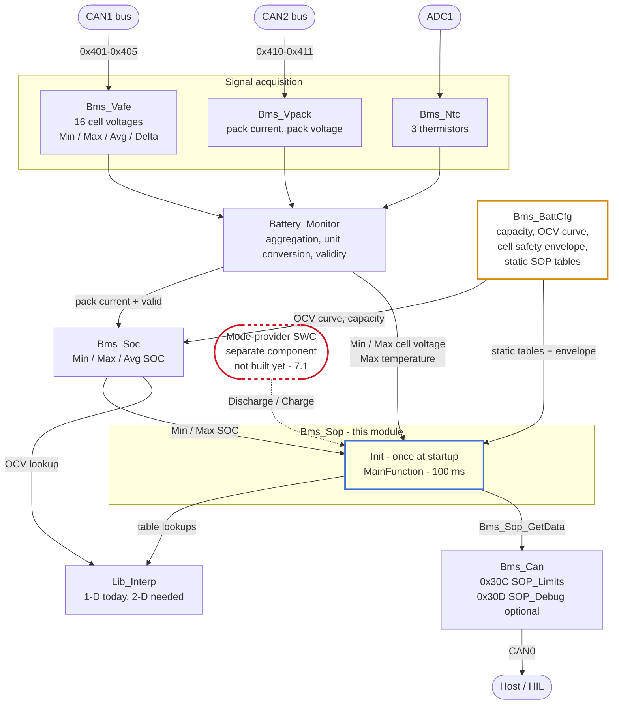
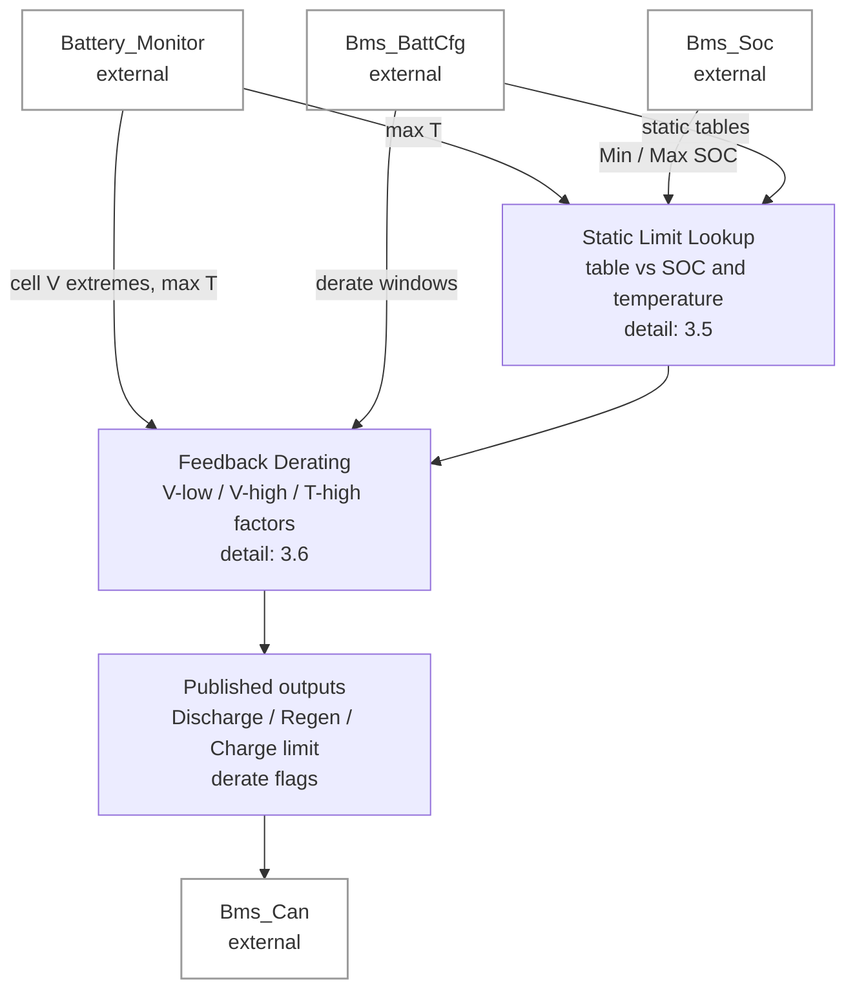
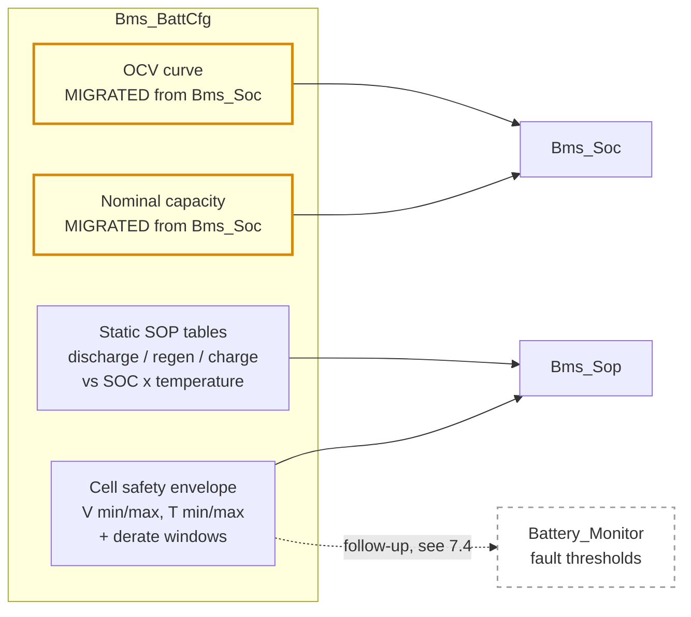
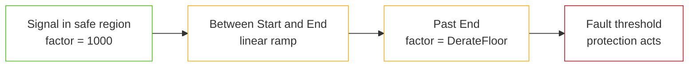
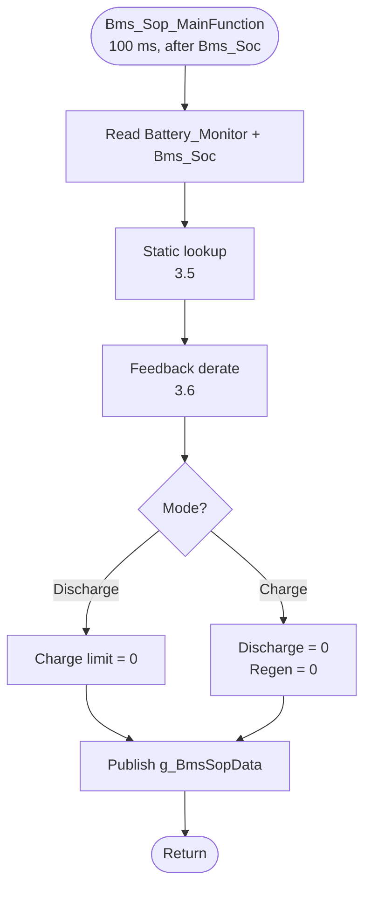
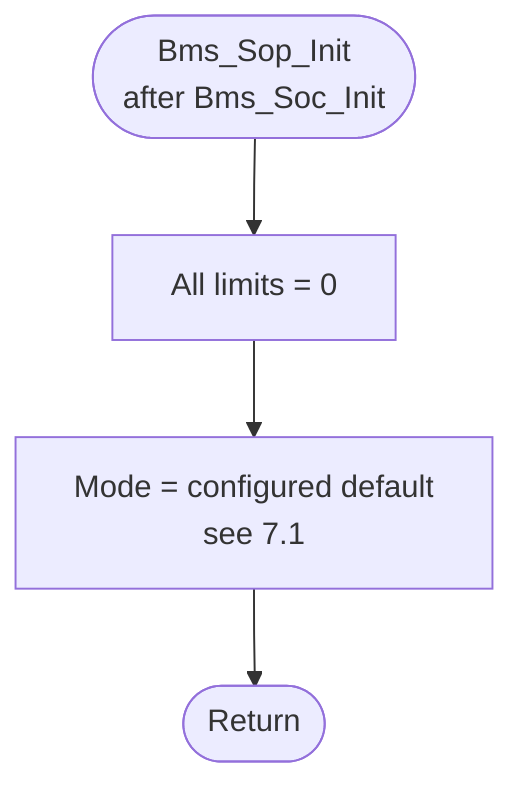

# SOP Estimation: Design Document

Modules: `Bms_Sop` (Pack 1 state of power, meaning the current limits), `Bms_BattCfg` (shared battery data configuration).
Target: NXP S32K344, bare metal, S32K3 RTD 7.0.1.
Status: Draft for review. Not implemented yet. Six decisions need your answer before coding starts. See section 7.
Last updated: 2026-09-10.

State of power (SOP) is the largest current the pack can carry right now without breaking a cell limit.

This document follows the `simple-english` writing rules.

---

## Contents

1. [Functional requirements](#1-functional-requirements)
2. [Functional architecture](#2-functional-architecture)
3. [Detailed design](#3-detailed-design)
4. [Validation plan](#4-validation-plan)
5. [Known limitations and future improvements](#5-known-limitations-and-future-improvements)
6. [Change log](#6-change-log)
7. [Open questions for review](#7-open-questions-for-review)

---

## 1. Functional requirements

### 1.1 Scope

This design has two deliverables. The second one exists to serve the first.

`Bms_Sop` computes the current limits for Pack 1. It produces a discharge limit, a regenerative braking limit, and a charge limit. Regenerative braking is the mode where the motor pushes current back into the pack. Each limit comes from one static lookup table, indexed by SOC and temperature, then trimmed by a feedback derate. Packs 2 and 3 are out of scope. They have no current sensor, so `PackCurrent_mA[1]` and `PackCurrent_mA[2]` are never written. This is the same limit that applies to `Bms_Soc`.

`Bms_BattCfg` is a new battery data configuration module. It is the single owner of every cell constant and pack constant in the firmware. That set is the capacity, the open-circuit-voltage curve, the cell safety envelope, and the static SOP limit tables. Open-circuit voltage (OCV) is the cell voltage after a long rest. The cell safety envelope is the voltage band and temperature band the cell must stay inside. `Bms_BattCfg` holds data and read functions only. It has no algorithm, no state, and no runtime input.

The OCV table and the pack capacity live inside `Bms_Soc.c` today. They move into `Bms_BattCfg`. This move is a refactor that keeps behavior the same. The numbers do not change. The SOC results do not change. The current SIL test suite passes with no test edits. SIL means software in the loop, the host build that runs the firmware logic on a PC.

Out of scope:

- State of health.
- Capacity fade.
- Cell balancing.
- Power limits in watts.
- Any limit published in a unit other than current.
- Any limit for Pack 2 or Pack 3.
- A dynamic, model-based prediction of the limit. Section 6 records why this was cut.
- Rate-limiting the output and checking whether the inputs are valid. Section 6 records why these were cut too.

### 1.2 Requirements: `Bms_Sop`

| ID | Requirement | Rationale |
|---|---|---|
| SOP-FR-01 | The module shall compute current limits in two operating modes: Discharge (not charging) and Charge. | A charger attached and a load drawing current do not share one safe current band. |
| SOP-FR-02 | In Discharge mode the module shall produce a discharge limit and a regenerative braking limit. In Charge mode it shall produce a charge limit. | These are the three limits the consumer needs. |
| SOP-FR-03 | The module shall publish all three limit fields in every mode. It shall force the fields that do not apply to the active mode to zero. | A consumer must never guess which fields are live. A zero is clear. A stale value is not. |
| SOP-FR-04 | The module shall compute each limit from one static lookup table indexed by SOC and temperature. The discharge table shall be indexed by the weakest cell's SOC. The regen and charge tables shall be indexed by the strongest cell's SOC. | The table holds datasheet, contactor, and fuse ratings. The weak cell reaches the low cutoff first under load. The strong cell reaches the high cutoff first under charge. The table must follow the cell that runs out first. |
| SOP-FR-05 | A feedback derating layer shall sit on top of SOP-FR-04. It shall watch the minimum cell voltage, the maximum cell voltage, and the maximum temperature. It shall reduce the limits as any of those three approaches its safety threshold. Derating means cutting the limit by a factor below one. | The table is feed-forward and open loop. Without a term that reads the measured state, a stale calibration walks the cell into the fault trip instead of backing off first. |
| SOP-FR-06 | Derating shall be continuous. It shall reach its floor at a threshold that sits inside the matching fault-trip threshold. | A step to zero at the trip point is a sudden loss of output and still trips the fault. Derating must finish before protection starts. |
| SOP-FR-07 | The derate factor for a limit shall be the minimum of the factors that apply to that limit direction. | Any one approaching limit governs. A product of two mildly active factors over-derates, so the factors must not multiply. |
| SOP-FR-08 | The module shall hold no battery characterization data of its own. All tables and constants shall come from `Bms_BattCfg`. | This is the reason the configuration module exists. |
| SOP-FR-09 | The module shall publish limits as `uint16` magnitudes in units of 0.1 A. The values shall saturate at both ends. The field name shall imply the direction. | This removes sign confusion from the CAN interface. The sign convention lives once, inside the computation, not in the published signal. |
| SOP-FR-10 | The module shall use no Kalman filter, no observer, and no online parameter identification. The static tables shall be a fixed calibration. | Same complexity budget as `Bms_Soc` (SOC-FR-05). A lookup table is the entire model, so there is nothing left to identify online. |
| SOP-FR-11 | The module shall take the operating mode as an input from a separate mode-provider component. It shall not derive the mode and shall not publish a mode signal of its own. | One component owns the mode. SOP is a consumer of it, like every other limit consumer. |

There is no requirement here for rate-limiting the output or for handling invalid inputs. Both were cut at your request. Section 5.6 records the cost of that.

### 1.3 Requirements: `Bms_BattCfg`

| ID | Requirement | Rationale |
|---|---|---|
| CFG-FR-01 | The module shall be the one place that defines the battery constants: capacity, OCV curve, cell safety envelope, and static SOP tables. | One number has one home. A constant defined twice will drift apart. |
| CFG-FR-02 | The module shall expose read-only functions that return `const` pointers to its tables. It shall not copy table data into a caller buffer. | The tables live in flash. A copy into RAM on every call of a 100 ms task is waste. |
| CFG-FR-03 | The module shall hold no state, no runtime input, and no algorithm. It shall hold constant data and the functions that return it. | This keeps the module easy to test. Any software component can call it from any task at any time. |
| CFG-FR-04 | The OCV table and the pack capacity shall move here from `Bms_Soc`. `Bms_Soc` shall then read them through the new functions. | Both are battery characterization data, not estimator logic. They belong with the pack's other configuration data, not inside an estimator. |
| CFG-FR-05 | The move in CFG-FR-04 shall keep behavior the same: the same values, the same SOC results, and the current SIL suite passing with no edits. | A refactor that changes behavior is not a refactor. Reviewing the two changes together is harder than reviewing them apart. |
| CFG-FR-06 | The cell safety envelope shall be defined here once. Both the SOP derating layer and, as a later step, the `Battery_Monitor` fault thresholds shall read it. | SOP-FR-06 needs the derate window to sit inside the fault trip. One place must hold both numbers, so that a reviewer can check the relation. See section 7.4. |

### 1.4 Interface requirements

| ID | Requirement |
|---|---|
| SOP-IR-01 | Cell voltage extremes come from `BatteryMonitor_GetData()`: `MinCellVoltage` and `MaxCellVoltage`, in volts as `float`. |
| SOP-IR-02 | Temperature comes from `BatteryMonitor_GetData()->MaxPackTemperature_dC`, in units of 0.1 degC. This is a thermistor reading on the pack, not a per-cell reading. See section 5.2. |
| SOP-IR-03 | SOC comes from `Bms_Soc_GetPackData()`. `Min.Soc_pct_x10` seeds the discharge lookup. `Max.Soc_pct_x10` seeds the charge and regen lookups. |
| SOP-IR-04 | The module publishes the limits on a new CAN frame, `0x30C SOP_Limits`, through `Bms_Can_SendSopLimits()`, which reads `Bms_Sop_GetData()`. |
| SOP-IR-05 | The module publishes calibration detail on an optional frame, `0x30D SOP_Debug`. That detail is the raw table value and the derate factor for one limit. See section 7.3. |
| SOP-IR-06 | The operating mode comes from a separate mode-provider component. The module consumes it and does not decide it. That component does not exist yet. Until it does, the module uses the compile-time default `BMS_SOP_DEFAULT_MODE`. See section 7.1. |
| CFG-IR-01 | `Bms_Soc` calls `Bms_BattCfg_GetOcvTable()` and `Bms_BattCfg_GetOcvTableSize()` inside `Bms_Soc_OcvToSoc()`. It calls `Bms_BattCfg_GetNominalCapacity_mAh()` wherever `BMS_SOC_PACK1_CAPACITY_MAH` is used today. |
| CFG-IR-02 | The OCV lookup still runs through `Lib_Interp_Lookup_1D_uint16()`. Only the owner of the table changes. |

Pack current is not an input to this module. The static table needs only SOC and temperature, and the derate layer needs only cell voltage and temperature. Section 5.5 explains what removing pack current is worth. The module also does not read the validity flag that comes with any of these inputs. Section 5.6 explains what that costs.

### 1.5 Timing requirements

| ID | Requirement |
|---|---|
| SOP-TR-01 | `Bms_Sop_MainFunction()` shall run every 100 ms from the 100 ms scheduler slot. It shall run after `BatteryMonitor_MainFunction()` and after `Bms_Soc_MainFunction()`. It reads the outputs of both. |
| SOP-TR-02 | `Bms_Sop_Init()` shall run after `Bms_Soc_Init()` in the startup sequence. All limits shall start at zero. |
| CFG-TR-01 | `Bms_BattCfg` has no task. If it has an init function at all, that function shall run first in the startup sequence, before any consumer. See section 7.5. |

---

## 2. Functional architecture

### 2.1 Context: external interfaces



### 2.2 Internal decomposition: `Bms_Sop`

`Bms_Sop` has two function blocks in a fixed pipeline. Section 3 gives the internals of each block. This level shows the blocks and what passes between them.



This is a two-block pipeline with no held state of its own. An earlier draft of this design added a third block: a dynamic equivalent-circuit model with its own polarization state. That block ran in parallel with the static lookup and fed an arbitration step. A later draft also dropped a rate limiter and an explicit invalid-input fallback that once followed this pipeline. Section 6 records why both changes were made.

### 2.3 Internal decomposition: `Bms_BattCfg`

`Bms_BattCfg` is not a pipeline. It is a set of tables behind read functions. The diagram shows ownership, because that is the whole design.



### 2.4 Interface summary

| Producer | Consumer | Data | Gate |
|---|---|---|---|
| `Battery_Monitor` | `Bms_Sop` | `MinCellVoltage`, `MaxCellVoltage` (V) | none, see section 5.6 |
| `Battery_Monitor` | `Bms_Sop` | `MaxPackTemperature_dC` (0.1 degC) | none, see section 5.6 |
| `Bms_Soc` | `Bms_Sop` | `Min.Soc_pct_x10`, `Max.Soc_pct_x10` | none, see section 5.6 |
| `Bms_BattCfg` | `Bms_Sop` | cell envelope, static SOP tables | none (constant) |
| `Bms_BattCfg` | `Bms_Soc` | OCV curve, nominal capacity | none (constant) |
| `Bms_Sop` | `Bms_Can` | limits, derate flags | `Bms_Sop_GetData()` |
| Mode-provider SWC (not built yet) | `Bms_Sop` | operating mode | section 7.1 |

### 2.5 Data ownership

| Datum | Owner today | Owner after this change |
|---|---|---|
| Pack nominal capacity | `Bms_Soc.h` (`BMS_SOC_PACK1_CAPACITY_MAH`) | `Bms_BattCfg` |
| OCV curve | `Bms_Soc.c` (`g_BmsSocOcvTable`, file-static) | `Bms_BattCfg` |
| Cell over-voltage, under-voltage, over-temperature, under-temperature thresholds | `Battery_Monitor.c` (private macros) | `Bms_BattCfg`, as a follow-up. See section 7.4. |
| Static SOP limit tables | none | `Bms_BattCfg` (new) |
| Derate windows | none | `Bms_BattCfg` (new) |
| Published limits | none | `Bms_Sop` |
| Operating mode | none | a separate mode-provider component (not built yet). `Bms_Sop` consumes it. |

---

## 3. Detailed design

### 3.1 Sign and unit conventions

This table states the conventions once. Everything below follows it.

| Quantity | Convention |
|---|---|
| Published limits | `uint16` magnitude, 0.1 A per bit. The field name gives the direction. There is no sign. |
| Cell voltage (internal) | `uint16` mV, converted from the `float` volts of `Battery_Monitor` on entry. |
| Temperature | `sint16`, 0.1 degC. This matches `Battery_Monitor`. |
| SOC | `uint16`, 0.1 percent, range 0 to 1000. This matches `Bms_Soc`. |
| Derate factor | `uint16`, 0.001 per bit, range 0 to 1000. A value of 1000 means no derate. It is an integer to keep `float` out of the pipeline where it does not add accuracy. |

A discharge limit of `750` means the pack can draw up to 75.0 A. That is a current no more negative than `-75000 mA`.

### 3.2 Data structures: `Bms_Sop`

```c
/** @brief Operating mode. Determines which limits are active. */
typedef enum
{
    BMS_SOP_MODE_DISCHARGE  = 0U,   /**< Not charging: discharge + regen limits active. */
    BMS_SOP_MODE_CHARGE = 1U    /**< Charger attached: charge limit active. */
} Bms_Sop_ModeType;

/** @brief Intermediate result for one limit, kept for calibration visibility. */
typedef struct
{
    uint16 Table_dA;       /**< Raw static-table result. Unit: 0.1 A. */
    uint16 DerateFactor;   /**< Applied factor, 0-1000. */
    uint16 Final_dA;       /**< After derate. Published value. */
} Bms_Sop_LimitType;

/** @brief Published SOP snapshot. */
typedef struct
{
    Bms_Sop_LimitType Discharge;   /**< Active in Discharge mode, else forced to 0. */
    Bms_Sop_LimitType Regen;       /**< Active in Discharge mode, else forced to 0. */
    Bms_Sop_LimitType Charge;      /**< Active in Charge mode, else forced to 0. */

    Bms_Sop_ModeType  Mode;        /**< The mode taken from the provider this cycle. Not published. */

    /** @brief Which feedback term is currently governing. Diagnostic. */
    boolean DerateActiveVLow;
    boolean DerateActiveVHigh;
    boolean DerateActiveTHigh;
} Bms_Sop_DataType;
```

The module holds no data of its own between calls. Every field above is computed fresh each cycle from the present inputs.

### 3.3 Data structures: `Bms_BattCfg`

```c
/** @brief Cell safety envelope. Single source for SOP derating and (later) fault thresholds. */
typedef struct
{
    uint16 CellVoltageMax_mV;        /**< Hard ceiling, for context. The fault path trips at this value. */
    uint16 CellVoltageMin_mV;        /**< Hard floor, for context. The fault path trips at this value. */

    uint16 DerateVHighStart_mV;      /**< Charge/regen derate begins here.   < CellVoltageMax_mV */
    uint16 DerateVHighEnd_mV;        /**< Derate floor reached here.         < CellVoltageMax_mV */
    uint16 DerateVLowStart_mV;       /**< Discharge derate begins here.      > CellVoltageMin_mV */
    uint16 DerateVLowEnd_mV;         /**< Derate floor reached here.         > CellVoltageMin_mV */

    sint16 TemperatureMax_dC;         /**< Hard ceiling, for context. The fault path trips at this value. */
    sint16 TemperatureMin_dC;         /**< Hard floor, for context. The fault path trips at this value. */
    sint16 DerateTHighStart_dC;
    sint16 DerateTHighEnd_dC;

    uint16 DerateFloor;              /**< Lowest factor derating may reach, 0-1000. */
} Bms_BattCfg_CellLimitsType;
```

Read functions:

```c
uint32 Bms_BattCfg_GetNominalCapacity_mAh(void);

const uint16 (*Bms_BattCfg_GetOcvTable(void))[2];
uint16       Bms_BattCfg_GetOcvTableSize(void);

const Bms_BattCfg_CellLimitsType *Bms_BattCfg_GetCellLimits(void);

uint16 Bms_BattCfg_GetStaticLimit_dA(Bms_Sop_ModeType    mode,
                                     Bms_Sop_LimitIdType limitId,
                                     uint16              soc_pct_x10,
                                     sint16              temp_dC);
```

The last function runs a table lookup. That sits against the CFG-FR-03 rule of no algorithm. The other option is to expose the raw table and put the two-dimensional lookup in `Bms_Sop`. See section 7.2.

### 3.4 Move of OCV and capacity out of `Bms_Soc`

This move keeps behavior the same. The table values do not change.

| Before (`Bms_Soc.c` and `Bms_Soc.h`) | After |
|---|---|
| `static const uint16 g_BmsSocOcvTable[][2]` | `Bms_BattCfg.c`, same values, read through `Bms_BattCfg_GetOcvTable()` |
| `BMS_SOC_OCV_TABLE_SIZE` (sizeof macro) | `Bms_BattCfg_GetOcvTableSize()` |
| `BMS_SOC_PACK1_CAPACITY_MAH` (`Bms_Soc.h`) | `Bms_BattCfg_GetNominalCapacity_mAh()` |

`Bms_Soc_OcvToSoc()` becomes:

```c
uint16 Bms_Soc_OcvToSoc(uint16 voltage_mV)
{
    return Lib_Interp_Lookup_1D_uint16(
        Bms_BattCfg_GetOcvTable(),
        Bms_BattCfg_GetOcvTableSize(),
        voltage_mV);
}
```

`Bms_Soc_SocX10ToCapacity_mAh()` and `Bms_Soc_SetEstimatorCapacity()` take the capacity from the read function instead of the macro. Nothing else in `Bms_Soc` changes.

Acceptance test: the current SIL suite (48 pass, 1 xfail) passes with no test edits. If a test needs an edit, that is proof the refactor changed behavior.

Order of work: land this move as its own commit, before any SOP code. A pure refactor with a green suite is a fast review. Folded into the SOP feature, it is not.

### 3.5 Subfunction: static limit lookup

The table holds the limits that come from the cell datasheet ratings, the contactor and fuse ratings, and the validation test results. It is the entire model: there is no second, model-based path to check it against.

Each limit is a function of SOC and temperature:

```
tableLimit_dA = Table[mode][limitId](soc_pct_x10, temp_dC)
```

The discharge table is indexed by the SOC of the Min estimator. The regen table and the charge table are indexed by the SOC of the Max estimator. This is the same weak-cell and strong-cell logic as SOP-FR-04. The temperature axis is `MaxPackTemperature_dC` for the high-temperature roll-off. Cold behavior is on the same axis, so one two-dimensional table covers both ends. The lookup does a bilinear interpolation between breakpoints and clamps at all four edges.

This needs a two-dimensional interpolation that `Lib_Interp` does not have yet. See section 7.2.

Proposed breakpoints, as a calibration and not fixed by this design: SOC at 0, 10, 20, 40, 60, 80, 90, 100 percent. Temperature at -20, -10, 0, 10, 25, 40, 50, 60 degC.

### 3.6 Subfunction: feedback derating

The static table looks forward. It predicts a limit from SOC and temperature against a fixed calibration. It does not react to the pack getting closer to a limit than the table said. Three things can walk the pack toward the fault trip while the limit still reads healthy. They are a stale calibration, a weak cell that the pack-level SOC does not see, and a heat gradient across the pack. The derating layer closes that loop.

#### 3.6.1 Factor shape

Each watched signal makes one factor in the range `DerateFloor` to 1000 by a straight-line ramp:



The ramp is `Lib_Interp_Lookup_1D_uint16()` over a two-point table. That is the existing one-dimensional function, so there is no new code. The SOP-FR-06 rule is that `End` sits inside the fault threshold. A reviewer can check that because both numbers live in `Bms_BattCfg` (CFG-FR-06).

#### 3.6.2 Which factor applies to which limit

| Factor | Driven by | Applies to |
|---|---|---|
| `k_vLow` | `MinCellVoltage` falling | Discharge |
| `k_vHigh` | `MaxCellVoltage` rising | Regen, Charge |
| `k_tHigh` | `MaxPackTemperature_dC` rising | All three |

```c
discharge.DerateFactor = MIN(k_vLow,  k_tHigh);
regen.DerateFactor     = MIN(k_vHigh, k_tHigh);
charge.DerateFactor    = MIN(k_vHigh, k_tHigh);
```

The rule is minimum, not product (SOP-FR-07). Two factors of 0.8 multiply to 0.64. With two factors mildly active, the product over-derates, and neither input asked for that. The minimum applies whichever one constraint is tightest.

There is no low-temperature factor here. Charging a lithium cell below about 0 degC plates metal lithium on the anode. That is a capacity loss and a safety problem, and it does not reverse. This design still guards against it. The static charge and regen tables in section 3.5 are already indexed by temperature. A breakpoint near 0 degC can roll the table limit down to a low value, or to zero, with no separate feedback factor needed. The feedback layer only needs to cover what the table cannot see coming, and cold is not one of those cases.

#### 3.6.3 Application

```c
final_dA = (uint16)(((uint32)table_dA * derateFactor) / 1000U);
```

`final_dA` is the value the module publishes. Nothing runs after it.

### 3.7 Flow: the 100 ms update



Every step in this pipeline is a function of the present inputs alone. The module carries no memory of an earlier cycle at all.

### 3.8 Flow: initialization



The module starts at zero, not at a table value. This is on purpose. The first `MainFunction` call sets real limits 100 ms later. A 100 ms window of zero limit is harmless. A plausible limit published before any measurement was checked is not harmless.

### 3.9 Configuration constants: `Bms_Sop`

| Constant | Proposed | Note |
|---|---|---|
| `BMS_SOP_SAMPLE_PERIOD_MS` | 100 | Must match the task slot (SOP-TR-01). |
| `BMS_SOP_DEFAULT_MODE` | `DISCHARGE` | Used until the mode-provider component exists. Section 7.1. |

### 3.10 Published CAN signals

`0x30C SOP_Limits`. New. 100 ms. CAN0.

| Bytes | Signal | Encoding |
|---|---|---|
| 0-1 | `Pack1DischargeLimit` | `uint16` LE, 0.1 A per bit, magnitude |
| 2-3 | `Pack1RegenLimit` | `uint16` LE, 0.1 A per bit, magnitude |
| 4-5 | `Pack1ChargeLimit` | `uint16` LE, 0.1 A per bit, magnitude |
| 6 bits 0-2 | `Pack1SOPDerateActive` | one bit per factor: vLow, vHigh, tHigh |
| 6 bits 3-7 | reserved | send as 0 |
| 7 bits 0-3 | `SOPAliveCounter` | 4-bit rolling counter, same style as `0x308` and `0x30B` |

The frame carries no mode signal and no validity signal. The mode-provider component publishes the mode, see SOP-IR-06. Nothing publishes validity, see section 5.6.

`0x30D SOP_Debug`. Optional. Calibration only. It carries the raw table value and the derate factor for one limit. A mode byte picks the limit. Both fit one 8-byte frame across successive frames. Section 7.3 asks whether it is worth the cost.

Both frames need entries in `DBC/BMS_demo.dbc`. The file `DBC/BMS_demo.sym` is already out of date with the SOC frames. This design does not maintain it either.

---

## 4. Validation plan

This plan is not run yet. Nothing is implemented. This section states what the SIL suite must cover, so the test cases are agreed before the code is written, not after.

SOP is a good fit for SIL. It is computation over the outputs of `Battery_Monitor` and `Bms_Soc`. The current SIL setup drives both of those through real CAN frames.

### 4.1 Unit level: static table and derating

| ID | Case |
|---|---|
| SP-01 | The table returns the exact value at a breakpoint and interpolates between breakpoints. It clamps at all four edges. |
| SP-02 | The discharge lookup uses the Min SOC branch and the charge and regen lookups use the Max SOC branch. To test, make the two SOCs differ and watch which limit moves. |
| SP-03 | The derate factor is 1000 in the safe region, `DerateFloor` past the end point, and linear between the two. |
| SP-04 | The combined derate is the minimum of the applicable factors, never the product. |

### 4.2 Integration: mode and signal chain

| ID | Case |
|---|---|
| SP-05 | Discharge mode forces the charge limit to zero. Charge mode forces the discharge limit and the regen limit to zero. |
| SP-06 | A cell-voltage set sent over CAN1 that drives `MinCellVoltage` into the derate window reduces the discharge limit within one task cycle. |
| SP-07 | A rising thermistor reading sent through the ADC double reduces all three limits. |
| SP-08 | The `0x30C` frame encodes the limits and the derate flags correctly. The alive counter rolls 0 to 15 to 0. |
| SP-09 | A sustained discharge at the published limit does not trip `FAULT_CELL_UV`. This is the end-to-end property that SOP-FR-06 exists to guarantee. |

### 4.3 Regression: the `Bms_BattCfg` move

| ID | Case |
|---|---|
| SP-10 | The full current SOC suite (48 pass, 1 xfail) passes with no edits after the OCV curve and the capacity move to `Bms_BattCfg`. No test edits are allowed. |
| SP-11 | `Bms_BattCfg_GetOcvTable()` returns the same curve `Bms_Soc` used before the move, point for point. |
| SP-12 | Every derate `End` threshold sits inside its matching fault threshold. This is a static check over the configuration, not a runtime test. |

### 4.4 Not coverable in SIL

- Whether the static table's current ratings match the cell, contactor, and fuse datasheets. SIL proves the lookup arithmetic, not the calibration data.
- Thermal behavior under a sustained load. There is no thermal model.
- Whether the derate windows are calibrated well enough to keep a real pack off its fault thresholds across the full temperature range.

---

## 5. Known limitations and future improvements

### 5.1 No thermal prediction

The limits react to the measured temperature. They do not predict it. A sustained current can overheat the pack even at a temperature that is safe now. A full SOP predicts the temperature rise ahead of time instead of only reacting to the present reading. That is out of scope here. The temperature derating is a reaction, not a substitute.

### 5.2 "Max cell temperature" is really a pack thermistor reading

The requirement says maximum cell temperature. The signal on hand is `MaxPackTemperature_dC`, the maximum across three thermistors on the ADC. Those thermistors sit on the pack, not on single cells, and there are three of them for sixteen cells. The hottest cell is hotter than the hottest thermistor by an unknown margin. The derate windows must be calibrated with enough margin to absorb that gap. This document cannot say how large the gap is.

This is worth reading next to the existing F2 finding in `PROJECT_PLAN.md`. The over-temperature fault threshold is 200 degC. The thermistor path clamps and invalidates at 125 degC. So `FAULT_OVER_TEMP` cannot fire today. If the SOP derating is calibrated against that 200 degC number, it will never derate either.

### 5.3 One pack, one string

Pack 1 only, for the same sensor reason as `Bms_Soc` (`SOC_DESIGN.md` section 5.5). Packs 2 and 3 have no current sensor and no per-pack cell-voltage split, so there is nothing to index a table with.

### 5.4 There is no SOP accuracy requirement

SOC has the same gap (`SOC_DESIGN.md` section 5.10). There is no requirement that names a tolerance, such as plus or minus X percent of the true sustainable current. Validation can prove the code matches this document. It cannot prove the document is right.

### 5.5 The F12 defect does not reach this module

`PROJECT_PLAN.md` F12 and `SOC_DESIGN.md` section 5.11 describe a stuck vPACK alive counter that leaves `PackCurrentValid[0]` at `TRUE` while the current value freezes. An earlier draft of this design read pack current directly, so that earlier draft was exposed to the same defect. The static-table design in this document does not read pack current at all. SOC, cell voltage, and temperature are its only inputs. F12 stays a real defect elsewhere in the firmware. It does not affect the limits this module publishes.

### 5.6 No handling for invalid inputs

The module does not check whether its inputs are valid. `Bms_Soc` can report `Min.Valid` or `Max.Valid` as `FALSE`. `Battery_Monitor` can report `CellVoltageValid` or `TemperatureSummaryValid` as `FALSE`. Either way, this module still runs the table lookup and the derate on whatever value it currently holds. There is no fallback, and no validity bit on the published frame.

One concrete case: `Bms_Soc` reports SOC as `500` (its blind default) during the pending-init window described in `SOC_DESIGN.md` section 3.8. This module has no way to tell that number apart from a real, measured 50 percent SOC. It publishes a limit computed from that guess, with no signal to the consumer that anything is uncertain.

This was cut at your request, along with the rate limiter (old SOP-FR-08) and the invalid-input fallback (old SOP-FR-09). It must be revisited before this design ships to real hardware.

---

## 6. Change log

| Date | Change | Rationale |
|---|---|---|
| 2026-09-10 | Removed `k_tLow`, the low-temperature derate factor, from section 3.6.2. Also removed its remaining traces: the `DerateActiveTLow` flag, the `DerateTLowStart_dC`/`DerateTLowEnd_dC` fields, and the `tLow` bit on `0x30C`. Resolved and removed the open question about it (old section 7.3). | The static charge and regen tables are already indexed by temperature, so a cold breakpoint can roll the table limit down on its own. A separate feedback factor for the same condition was not needed. |
| 2026-09-10 | Removed the rate limiter and the invalid-input fallback (old SOP-FR-08 and SOP-FR-09). The module now recomputes every field from scratch each cycle, with no state and no `Valid` flag. Dropped `Pack1SOPValid` from `0x30C`, the `FALL_RATE`/`RISE_RATE`/`FALLBACK_*` constants, the rate-limiting subsection, and the fallback-related test cases. Removed the fallback open question (old section 7.2). Added section 5.6 to record that invalid inputs are no longer handled at all. | Requested simplification, at your direction. |
| 2026-09-10 | Removed the dynamic equivalent-circuit-model path. `Bms_Sop` now computes each limit from the static table alone, then applies the same feedback derate. Deleted the ECM data structures, the resistor-capacitor state, the arbitration step, and the horizon requirements. Removed the ECM tables and the topology accessors from `Bms_BattCfg`. Pack current is no longer a required input, because the static table needs only SOC and temperature. | Requested simplification: a static-table-only design, with the dynamic path cut entirely. |
| 2026-09-09 | The operating mode is now an input from a separate mode-provider component. SOP does not publish a mode signal. Removed `Pack1SOPMode` from `0x30C`. Added a requirement for it. | One component owns the mode. Every limit consumer, SOP included, reads it. |
| 2026-09-08 | First draft. `Bms_Sop` runs the limit computation. `Bms_BattCfg` holds the shared battery data and takes the OCV table and capacity from `Bms_Soc`. | New feature. |

---

## 7. Open questions for review

There are six decisions this design cannot make on its own. They are numbered so you can answer by number.

### 7.1 How will the mode-provider component decide the mode?

The operating mode is an input (SOP-IR-06). A separate component owns it. That component does not exist yet, which is fine for this design. `Bms_Sop` only consumes the result, so none of the options below change the SOP design. The open question is the decision rule for that component. Candidates:

| Option | Note |
|---|---|
| CAN command. Add a mode sub-command to `0x201`. | This matches how Enable, Disable, and ClearFault already arrive. It is small. It trusts the host. |
| Infer from the current sign. Sustained positive current means charging. | No new interface. It is circular, because the mode sets the limit that shapes the current that sets the mode. It needs hysteresis and a dwell time, and it is wrong during regen. |
| Derive from `Bms_StateMachine`. | This needs a charging state that does not exist today. |
| A dedicated charger-detect input. | This is the right answer on real hardware. No pin is assigned. |

My suggestion: the CAN command, for the bench demo. It matches the existing control interface and keeps the mode explicit and easy to watch. It is your call, and it can be made later.

### 7.2 Who owns the two-dimensional lookup?

The static table is two-dimensional, on SOC and temperature. `Lib_Interp` only does one dimension.

| Option | Note |
|---|---|
| Add `Lib_Interp_Lookup_2D_uint16()`. | This matches the naming rule and the SOC-FR-13 precedent. It is new shared code and needs its own tests. |
| Two chained one-dimensional lookups, `f(SOC)` times `g(T)`. | No new library code. It assumes the two axes are separable. For cell current ratings against SOC and temperature, they are usually not. |
| Keep the two-dimensional interpolation private to `Bms_Sop`. | Smallest surface. The next module that needs it will copy it, which is the thing `Lib_Interp` exists to stop. |

My suggestion: `Lib_Interp_Lookup_2D_uint16()`. It also settles the tension in section 3.3 about whether `Bms_BattCfg` is allowed to hold a lookup. With the interpolation in `Lib_Interp`, the configuration read functions become thin wrappers and CFG-FR-03 holds cleanly.

This is new implementation work that you did not ask for. It needs your yes before I write it.

### 7.3 Is the `0x30D` diagnostic frame worth a 19th blocking transmit?

The 100 ms task already makes 17 calls to `FlexCAN_Ip_SendBlocking()` on one mailbox. The `PROJECT_PLAN.md` F7 finding puts the worst case near 1.7 s of blocking on a bus-off. `0x30C` makes it 18. `0x30D` makes it 19.

The debug frame is useful for calibrating the derate windows. Without it, you cannot see the raw table value or how far into the derate ramp the pack is. Options:

- Ship it and accept the cost.
- Ship it behind a compile-time flag.
- Ship it at 1 Hz instead of 10 Hz.
- Drop it and read the values over XCP. XCP is the calibration protocol already running on CAN5.

My suggestion: drop `0x30D` and use XCP. It costs nothing on CAN0 and the data is already reachable.

### 7.4 Does `Battery_Monitor` move too?

CFG-FR-06 wants the cell safety envelope in `Bms_BattCfg` so a reviewer can check the SOP-FR-06 rule that the derate window sits inside the fault threshold. That means the private threshold macros in `Battery_Monitor` move as well. `BMS_CELL_OV_FAULT_SET_MV` and the rest.

Doing the move makes the rule checkable. Not doing it leaves two sets of thresholds that can drift apart. F2 already shows what that looks like: a 200 degC over-temperature threshold against a 125 degC thermistor ceiling.

But this touches the fault path, which is the safety-critical part of the firmware, and SOP does not need it to work. Same commit, a separate follow-up commit, or not at all?

### 7.5 Does `Bms_BattCfg` need an init at all?

If it is only `const` tables in flash behind read functions (CFG-FR-03), there is nothing to initialize and `Bms_BattCfg_Init()` must not exist. Every other `Bms_*` module has one. Adding it here for symmetry is tempting. It is also dead code.

My suggestion: no init function. Tell me that the asymmetry is fine with you.

### 7.6 One document or two?

`Bms_BattCfg` is a foundation module. `Bms_Soc`, `Bms_Sop`, and later `Battery_Monitor` all depend on it. Writing its spec inside the SOP document is convenient now. In six months the module serves three or four consumers and its spec still lives inside one of them. That is wrong.

Do you want it split into `src/battery/BATTCFG_DESIGN.md` now? The other option is to leave it here and split it once a third consumer appears.
